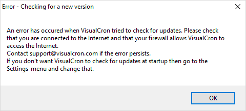

## Updates - Check for Updates

The main menu **File > Updates > Check for updates** option connects to the VisualCron web site i order to find if there is a later version available.

In case of this response, you should repeat the updates function at a later date until the official version is available.
 
If the VisualCron Client is off, the computer where the VisualCron Client runs is offline and the VisualCron Client is started, the below message is displayed. It is also shown when the computer where the VisualCron Client runs is offline and the **File > Updates > Check for updates** is clicked.

In **File > Settings > Client settings > Main settings** tab, uncheck Check for updates at startup if desired.

In this case you are encouraged to download the latest official version.