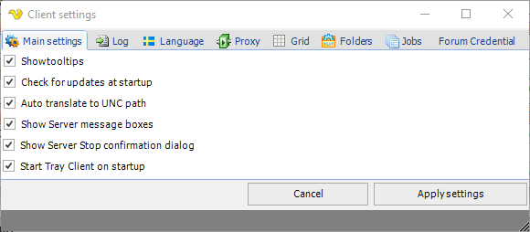
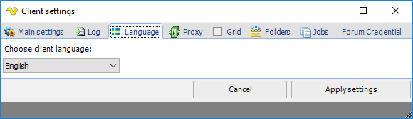
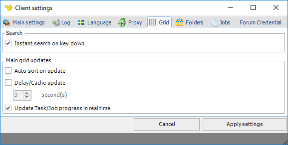

## Settings - Client Settings

Some general settings are available for the Client. These are located in the main menu **File > Settings > Client settings.**
 
**File > Settings > Client settings > Main settings** tab

**Show tooltips**

If this option is selected, an "Info" window is opened when the mouse points to some settings. The displayed text provides additional information related to the specific setting.
 
**Check for updates at startup**

If this option is selected, a connection to [visualcron.com](https://www.visualcron.com) is performed at VisualCron client startup in order to check for and notify the user of possible later VisualCron versions.
 
**Auto translate to UNC path**

When this is checked all logical drives (i.e. Z) is translated to the UNC path (\\servername\folder\file)
 
**Show Server message boxes**

If alerts should be displayed. Otherwise shown in log window.
 
**File > Settings > Client settings > Language tab**

**Choose client language**

Select language to be used in VisualCron client. In order for the new language to take effect, the client have to be restarted.
 
:::note 

The documentation, web, log and debug entries are in English, independently of the language setting. User entered texts, e.g. Job description, remains in the entered language.

:::

**File > Settings > Client settings > Proxy** tab
Enter specific proxy server data to be used for connection to a server. See description of Server proxy settings for more information.
 
**File > Settings > Client settings > Grid** tab

**Auto sort on update**

If VisualCron should sort all Jobs when updates are received. Checking this degrades Client performance. Default off.
 
**Delay/Cache update**

To improve performance you can delay row updates. Default off.