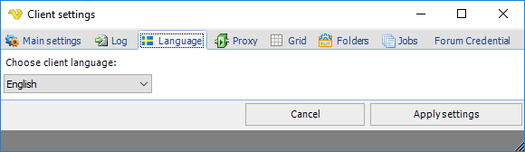
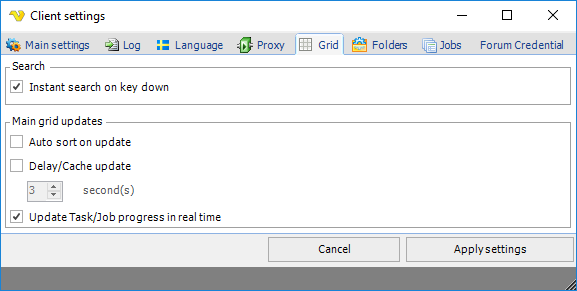

## Settings - Client Settings

Some general settings are available for the Client. These are located in the main menu **File > Settings > Client settings.** The window is divided into a number of tabs: **Main settings**, **Log**, **Language**, **Proxy**, **Grid**, **Folders**, **Jobs**, **Forum Credential**, **Client events** and **Features**. Click *Apply settings* to save your changes.
 
**File > Settings > Client settings > Main settings** tab

**Show tooltips**

If this option is selected, an "Info" window is opened when the mouse points to some settings. The displayed text provides additional information related to the specific setting.
 
**Check for updates at startup**

If this option is selected, a connection to [visualcron.com](https://www.visualcron.com) is performed at VisualCron client startup in order to check for and notify the user of possible later VisualCron versions.
 
**Auto translate to UNC path**

When this is checked all logical drives (i.e. Z) is translated to the UNC path (\\servername\folder\file)
 
**Show Server message boxes**

If alerts should be displayed. Otherwise shown in log window.

**Show Server Stop confirmation dialog**

If checked, a confirmation dialog is shown before the Server is stopped.

**Start Tray Client on startup**

Starts the VisualCron Tray Client when the Client starts.

**Auto scan for new servers in Manage servers**

If checked, the Manage servers window automatically scans the network for servers.

**Allow multiple Client instances at the same time**

If checked, more than one VisualCron Client can run at the same time.

**Do not show Trial tutorial wizard on startup**

If checked, the start guide / tutorial wizard is not shown when the Client starts.

**Font**

Selects the font used in the Client.

**File > Settings > Client settings > Log** tab

The Log tab controls what is shown in the log window and what is written to file.

* **Filters in log window** - choose which event types are shown in the log window: *Debug*, *Information*, *Error* and *Communication*.
* **Log to file** - *Client events* writes the Client events to file.
 
**File > Settings > Client settings > Language tab**

**Choose client language**

Select language to be used in VisualCron client. In order for the new language to take effect, the client have to be restarted.
 
:::note 

The documentation, web, log and debug entries are in English, independently of the language setting. User entered texts, e.g. Job description, remains in the entered language.

:::

**File > Settings > Client settings > Proxy** tab

Enter specific proxy server data to be used for connection to a server. See description of Server proxy settings for more information.
 
**File > Settings > Client settings > Grid** tab

**Show Job folders**

If checked, Jobs are organized in folders in the grid.

**Group Connections**

If checked, Connections are grouped in the Connections grid.

**Auto sort on update**

If VisualCron should sort all Jobs when updates are received. Checking this degrades Client performance. Default off.
 
**Delay/Cache update**

To improve performance you can delay row updates. Default off. When checked, you can set the delay in seconds.

**Update Task/Job progress in real time**

If checked, Task and Job progress is updated in the grid in real time.

**Instant search on key down**

If checked, the main grid filter searches as you type.

**File > Settings > Client settings > Folders** tab

Shows the **Backup folder**, **Settings folder** and **Log folder** paths. Each path has a browse button to change it and an *Open* button to open the folder. The *Reset to default* button restores the default paths.

**File > Settings > Client settings > Jobs** tab

**Days to track failed Jobs**

The number of days for which failed Jobs are tracked.

**File > Settings > Client settings > Forum Credential** tab

The VisualCron online forum Credential is used to access the Task repository. Enter your forum **Username** and **Password**. Links are provided to register an account and to reset your password.

**File > Settings > Client settings > Client events** tab

Configures the Client events that are recorded.

**File > Settings > Client settings > Features** tab

Lets you hide specific Client features from the user interface.
