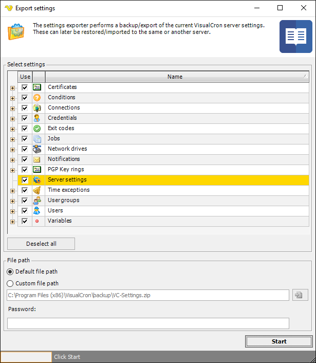

## Import/Export - Export Settings

The main menu **File > Import/Export > Export** settings option makes a backup of the the currently connected VisualCron server settings. The backup/export may also be used to import these settings to another VisualCron server or to be used as a part of a problem report or a in fault tracing activity. You may Export/Import across the Internet.
 
It is recommended to perform regular backups using the Export settings function. If a setting error occurs and a backup file exists in the default backup file path, VisualCron will use the backup file and automatically restore settings. It is a recommendation that you keep a backup file both in the default folder and in another place.
 
The exported settings consists of many files, but the Export settings function creates one VC-Settings.zip file.
 
**File > Import/Export > Export settings**

**Select settings**

Select the Server settings in the list which you want to export. If there are no specific reason for the export, it is strongly advised that you export all settings, you may later choose to import just some settings. Note that when importing settings again and using "Clear existing settings" only existing object types will be cleared. For example, if you only export your Jobs the Jobs will only be cleared when importing.
 
**Default file path**

The default file for Export is C:\Program Files (x86)\VisualCron\backup\VC-Settings.zip.
 
**Custom file path**

If you want to use another destination for the exported file than the default file path then specify another file path.
 
**Password**

If you want to password protect and encrypt the backup you enter a password here.
 
**Start**

Click on the Start button to begin the export.