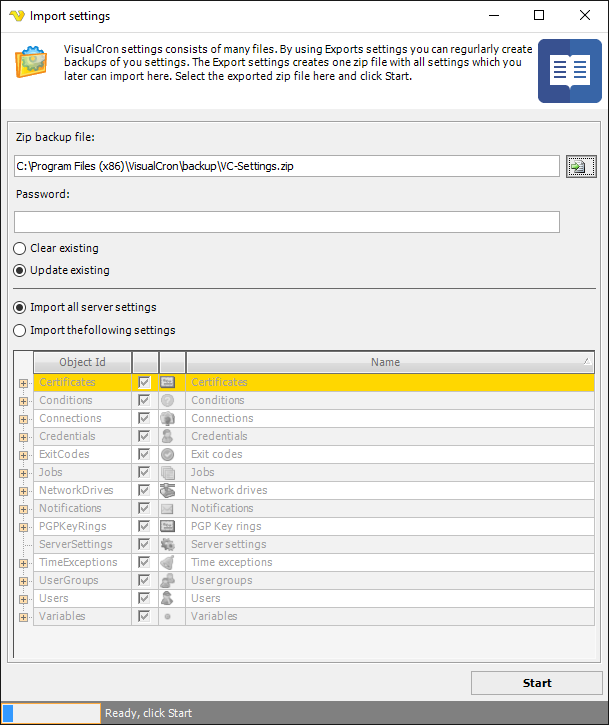

## Import/Export - Import Settings

The main menu **File > Import/Export > Import** settings option lets you import settings to the currently connected VisualCron server from a previous backup/export. You may import a settings file across the Internet.
 
VisualCron settings consists of many files. By using Export settings you can regularly create backups of your settings. The Export settings create one zip file with all settings which you later can import here. Select the exported zip file here and click start.
 
**File > Import/Export > Import settings**

**File to import**

Enter full file path or click the File icon to browse and select a previously exported settings file. The default file for Export settings is C:\Program Files (x86)\VisualCron\backup\VC-Settings.zip
 
**Password**

If the exported zip file was protected with password then enter the password here.
 
**Clear existing**

Clears all previous settings, then adds the new settings. A setting is only cleared if that setting exists in the exported file. For example, if only Jobs were exported, only the Jobs will be cleared when importing.
 
**Update existing**

Updates existing settings. For example, all previous Jobs will remain and updated, if a Job with the same id exists in the file.
 
**Import all server settings**

Imports all settings that exist in the file you import.
 
**Import the following settings**

Select the settings that you want to import. Note that the setting must exist in the file (must have been previously exported).
 
Start
Click on the Start button to begin the import.
 
### Troubleshooting
 
**Access denied**

This error is coming if the Client is not running as administrator. Close the Client and go to the installation folder. Then right click on "VisualCronClient.exe" and choose "Run as administrator".
 
**Workaround**

If you have problems importing settings and if you want to overwrite all settings on destination server you can perform the following steps:
1. stop the VisualCron service in the destination server
2. delete all files in the settings folder of installation except license.xml and server_settings.xml
3. copy all settings from source settings folder (except the files above) to destination settings folder
4. start the service