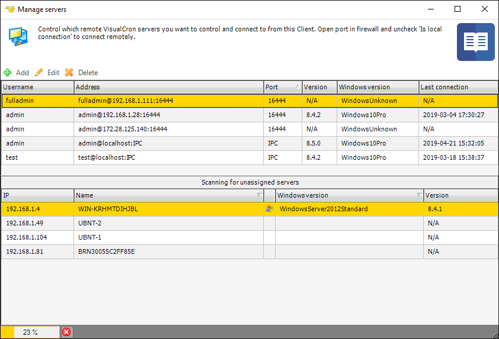
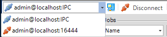
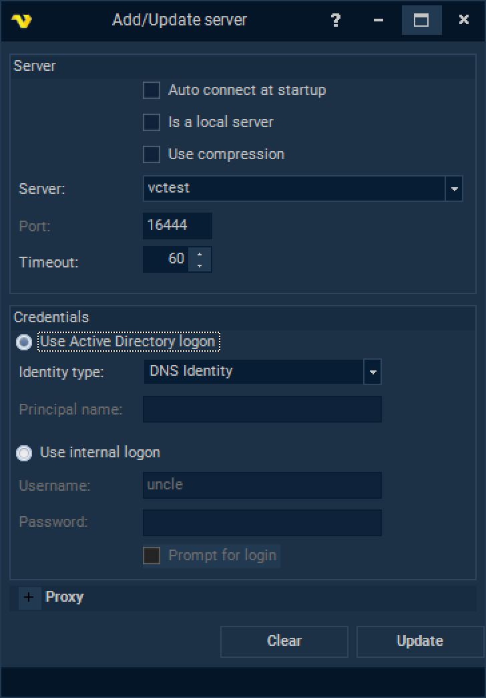

## Servers - Manage Servers

With the main menu **File > Servers > Manage servers** option, the currently connected server name is displayed in the main menu **Server ```[<server name>]```** tab, as a Server/Username entry in the Server/Jobs/Tasks grid and in the status bar.
 
By default, the VisualCron server is installed and started on the same computer as the client. Managing servers is a way to add/edit/delete connections to other VisualCron servers. Thus, it is easy to switch between different connections. It is in the login window you choose what server connection to use when you are connecting. All the server connections are displayed in the combo box at top of the login window.
 
### Manager servers window



:::info

In the Manage Servers window you can Add, Edit and Delete Servers that you want to connect to from the Client. You can add any number of Servers that you want the Client to connect to, either manually or automatically when the Client is starting up.
 
**Scanning for unassigned servers**

In the Manage servers window there is a built in function for scanning the network for Windows servers and any VisualCron servers. This way you can let VisualCron detect existing ones and then add the servers for connection based on what is found.

::: 

### Switching between servers

Also, when using the VisualCron client it is possible to switch to another server.
 
The easiest way to switch between servers is to click on a server in a Server/Username "track" in the Server/Job/Task grid. Clicking on another server than the currently connected, immediately updates all parts of the client window with information related the new server.
 
Switching may also be done by using the toolbar server connection control (Default: "admin@localhost:IPC"):



Use the drop down list in the leftmost part of the toolbar to select a new server. If the icon to the left of the server connection is disconnected,  all items in the main menu is "greyed out" and not accessible. Click the Connect icon immediately to the right of the drop down server list to connect to the new server. By this, the server name is updated in all parts of the VisualCron client and also all Jobs/Tasks related to the connected server are shown in the Server/Job/Task grid.
 
### Edit and add a server

Choose a server from the list in the **File > Servers > Manage servers** window if you want to edit or delete a server. If you click on Edit the connection information will be shown in the text boxes. Edit any value and click _Update_.
 
To add a connection, click the _Add_ icon (or the _Clear_ button if you are in edit mode). Enter the values and click on the _Add_ button to add the connection.



**Auto connect at startup**

If you want the Client to automatically connect to this Server at startup you should check this option.
 
**Is a local server**

VisualCron can connect to local and remote Servers. Choose Is a local server if you are connecting to a computer on the same machine,  this will increase the login speed to the server significantly.
 
**Server**

This can be a server name, or IP number. VisualCron will try to resolve or names. Default: "localhost" (your computer).
 
**Port**

Default: "16444". You can only change the port number (which the server is listening to) while you are logged in. If you change the port here, remember to change it in the server. Also, be sure to check that, if you use a firewall, that the port is you enter is opened on that computer for incoming traffic.
 
**Use Active Directory logon/Use internal logon**

VisualCron has two different authentication systems; one internal and one that is extended by Active Directory. If you want to allow Active directory logon you need to do that in [user logon settings](../server/settings-users-logon).
 
We have updated security settings for AD authentication, so now negotiation is handled by native WCF service API.
Update involves providing some explicit WCF endpoint settings like Identity type and Principal name. Those applies when VisualCron Server starts on AD environment only.
 
**Identity type:**
 
**DNS Identity** 

Left for backwards compatibility, all messages between client and server are protected by VC certificate encryption. Used when internal authentication is being used.
Windows default: Default option for AD authentication when negotionation attempt is made without any explicit settings.

**UPN Identity** 

This identity type is used when VisualCron Service starts as custom AD user account, so client need to know this information explicitly. Please provide Principal Name value as well.

**SPN identity** 

This identity type is used when VisualCron Service starts as SystemService\LocalService\NetworkService, so client need to know this information explicitly. Please provide Principal Name value as well.
 
**Principal Name:**
 
Applies for UPN and SPN identity types only, should contain explicit principal name when negotiating during AD authentication.

**UPN identity type:** 

Principal Name should look like username@FQDN

**SPN identity type:** 
Principal Name might look like HOST/serverDNSname.FQDN or serverDNSname.FQDN. In order to check for possible SPN values please run the following command setspn -l serverDNSname in Windows CommandLine utility.
 
Sample values used to start VisualCron service could be found at [user logon settings](../server/settings-users-logon).
 
**Username**

Default: "admin". This is the user name the server uses. Be sure to change this after the initial login.
 
**Password**

By default it is blank. This is the password that the server uses. Be sure to change this after the initial login.
 
**Prompt for login**

If you want to enter Username and/or password at connection then you should check this box.
 
**Proxy**

Proxy settings concerns checking for update, http Job type and activation. The Proxy setup does not apply to the SSL connection between the VisualCron Client and the VisualCron Server.
 
If you are using a proxy to connect to the Internet and can't connect, uncheck the Autodetect checkbox and enter your settings or contact the network administrator.
 
 
### Troubleshooting
 
_The client and server cannot communicate_, because they do not process a common algorithm
You might have disabled TLS 1.2 on the machine. Install .NET 4.7.x or greater and reboot.