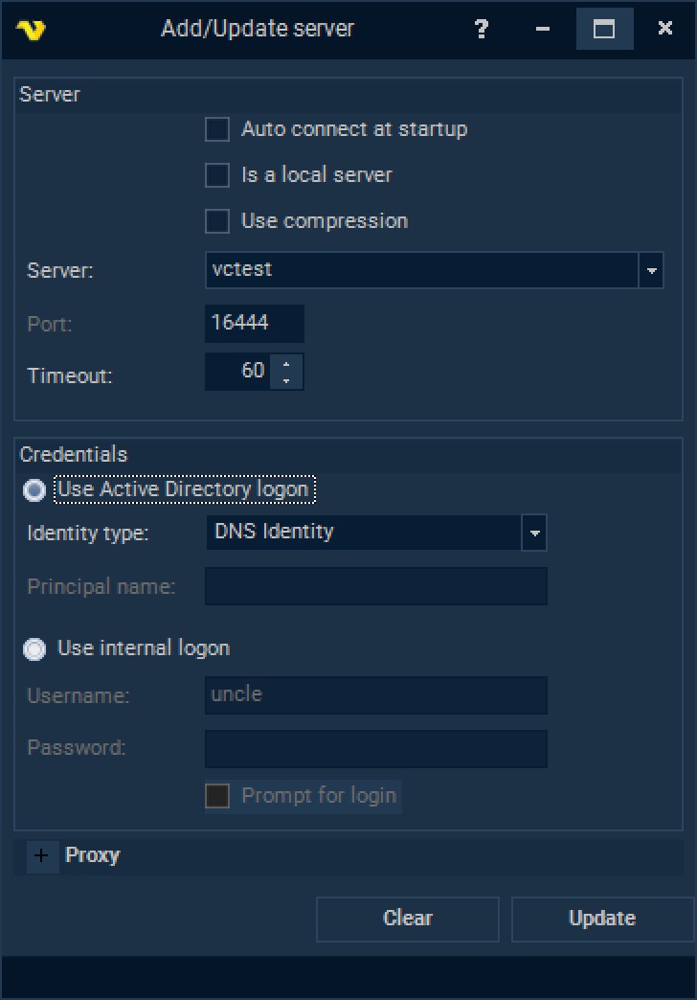

## Servers - Manage Servers

With the main menu **File > Servers > Manage servers** option, the currently connected server name is displayed in the main menu **Server ```[<server name>]```** tab, as a Server/Username entry in the Server/Jobs/Tasks grid and in the status bar.
 
By default, the VisualCron server is installed and started on the same computer as the client. Managing servers is a way to add/edit/delete connections to other VisualCron servers. Thus, it is easy to switch between different connections. It is in the login window you choose what server connection to use when you are connecting. All the server connections are displayed in the combo box at top of the login window.
 
### Manager servers window


:::info

In the Manage Servers window you can Add, Edit and Delete Servers that you want to connect to from the Client. You can add any number of Servers that you want the Client to connect to, either manually or automatically when the Client is starting up.
 
**Scanning for unassigned servers**

In the Manage servers window there is a built in function for scanning the network for Windows servers and any VisualCron servers. This way you can let VisualCron detect existing ones and then add the servers for connection based on what is found.

::: 

### Switching between servers

Also, when using the VisualCron client it is possible to switch to another server.
 
The easiest way to switch between servers is to click on a server in a Server/Username "track" in the Server/Job/Task grid. Clicking on another server than the currently connected, immediately updates all parts of the client window with information related the new server.
 
Switching may also be done by using the toolbar server connection control (Default: "admin@localhost:IPC"):


Use the drop down list in the leftmost part of the toolbar to select a new server. If the icon to the left of the server connection is disconnected,  all items in the main menu is "greyed out" and not accessible. Click the Connect icon immediately to the right of the drop down server list to connect to the new server. By this, the server name is updated in all parts of the VisualCron client and also all Jobs/Tasks related to the connected server are shown in the Server/Job/Task grid.
 
### Edit and add a server

Choose a server from the list in the **File > Servers > Manage servers** window if you want to edit or delete a server. If you click on Edit the connection information will be shown in the text boxes. Edit any value and click _Update_.
 
To add a connection, click the _Add_ icon (or the _Clear_ button if you are in edit mode). Enter the values and click on the _Add_ button to add the connection.



**Auto connect at startup**

If you want the Client to automatically connect to this Server at startup you should check this option.
 
**Is a local server**

VisualCron can connect to local and remote Servers. Choose Is a local server if you are connecting to a computer on the same machine,  this will increase the login speed to the server significantly.
 
**Server**

This can be a server name, or IP number. VisualCron will try to resolve or names. Default: "localhost" (your computer).
 
**Port**

Default: "16444". You can only change the port number (which the server is listening to) while you are logged in. If you change the port here, remember to change it in the server. Also, be sure to check that, if you use a firewall, that the port is you enter is opened on that computer for incoming traffic.
 
**Use Active Directory logon/Use internal logon**

VisualCron has two different authentication systems; one internal and one that is extended by Active Directory. If you want to allow Active directory logon you need to do that in [user logon settings](../server/settings-users-logon).
 
The **Identity type** and **Principal name** settings tell the Client how to authenticate against the Server. They apply only when **Use Active Directory logon** is selected and the connection is to a remote Server. If **Is a local server** is checked, both settings are ignored.
 
**Identity type:**

**Automatic (recommended)** is the default for new connections. The Client works out the identity itself: it derives the SPN `HOST/<server FQDN>` from the Server name you entered, and once it has connected to a Server that runs under a domain user account it remembers that account's UPN and uses it from then on. Select one of the other types only when you need to override this.

| VisualCron Service runs as | Identity type | Principal name |
|---|---|---|
| Any account | **Automatic (recommended)** | Derived automatically, leave empty |
| Local System | **SPN identity** | `HOST/<server FQDN>`, for example `HOST/server.contoso.com` |
| A domain user account, for example `DOMAIN\username` | **UPN identity** | `username@domain`, for example `username@contoso.com` |
| Internal logon only, no Active Directory | **DNS Identity** | Not used |

To check the service account, open the Windows Services console on the Server computer, open the properties of **VisualCron Service** and look at the **Log On** tab. The values the Server derives for itself are shown in **Server > Settings > Users/Logon** as **SPN** and **UPN**.

:::caution

The Server publishes only one of the two Windows-authentication endpoints: the SPN endpoint when the service runs as Local System, the UPN endpoint otherwise. A connection that asks for the other one fails with a "Server not running" message and a hint naming the identity type to switch to. Automatic asks for the SPN endpoint until it knows the Server's UPN, so for a Server running under a domain user account, select **UPN identity** and enter the UPN once. After that first successful connection, Automatic remembers it.

:::

**Automatic (recommended)**

Derives `HOST/<server FQDN>` for the Server name, or uses the Server's service-account UPN once it is known. The **Server** field must be a host name that resolves to the Server's fully qualified domain name; an IP address cannot be turned into an SPN. Existing connections keep the identity type they were saved with, so after upgrading, edit each connection that uses Active Directory logon and select Automatic.

**DNS Identity**

Kept for backwards compatibility. All messages between Client and Server are still protected by the VisualCron certificate encryption, but this identity type carries no Windows credentials to a remote Server, so an Active Directory logon over it is refused. Use it for internal logon only.

**Windows Default**

Not supported for connections to a remote Server. Select **Automatic** instead.

**UPN identity**

Use when the VisualCron Service runs under a domain user account. Enter that account's UPN in **Principal name**.

**SPN identity**

Use when the VisualCron Service runs as Local System and you want to state the SPN yourself. Enter it in **Principal name**.

**Principal name:**

Applies to UPN identity and SPN identity only. A value is required for both, and the Client checks its form when you save:

- **UPN identity:** `username@domain`, for example `username@contoso.com`.
- **SPN identity:** `service/host`, for example `HOST/server.contoso.com`. A bare host name such as `server.contoso.com` is not an SPN. Windows cannot issue a Kerberos ticket for it, so authentication silently falls back to NTLM, which a domain that enforces Kerberos refuses. A connection saved with a bare host name in an earlier release still connects where NTLM is allowed, but the next time you edit it, save is refused until you correct the value or select Automatic. To list the SPNs registered for the Server computer, run `setspn -L <server name>` at a command prompt.

:::caution

A connection saved with **Automatic** cannot be read by a Client from an earlier release. That older Client fails to load the whole server list and then overwrites the file with a default entry. Back up `servers.xml` (in the Client's settings folder) before running an older Client with the same Windows profile.

:::

**Username**

Default: "admin". This is the user name the server uses. Be sure to change this after the initial login.
 
**Password**

By default it is blank. This is the password that the server uses. Be sure to change this after the initial login.
 
**Prompt for login**

If you want to enter Username and/or password at connection then you should check this box.
 
**Proxy**

Proxy settings concerns checking for update, http Job type and activation. The Proxy setup does not apply to the SSL connection between the VisualCron Client and the VisualCron Server.
 
If you are using a proxy to connect to the Internet and can't connect, uncheck the Autodetect checkbox and enter your settings or contact the network administrator.
 
 
### Troubleshooting
 
_The client and server cannot communicate_, because they do not process a common algorithm
You might have disabled TLS 1.2 on the machine. Install .NET 4.7.x or greater and reboot.

_The requested upgrade is not supported by 'net.tcp://servername:16444/'. This could be due to mismatched bindings (for example security enabled on the client and not on the server)._

The **Identity type** on the connection does not match how the VisualCron Service is started on the Server. Set **Identity type** to **Automatic**. If the Service runs under a domain user account and this is the first connection to it, set **UPN identity** and enter the account's UPN from **Server > Settings > Users/Logon**.

To regain access to the Client while resolving this, add a connection that uses **Use internal logon** with an internal VisualCron account.

_Connection failed to '...'. This may indicate that the Server has not been fully started ... If the Server is running, it did not offer the Windows-authentication endpoint this connection asked for._

The Server is running but publishes the other Windows-authentication endpoint. The message names the identity type to switch to: **UPN identity** with the service account's UPN for a Server running under a domain user account, **Automatic** for a Server running as Local System.

_Connection failed with error: 'The logon attempt failed' ... The Server rejected the Windows authentication handshake before login was attempted._

Windows could not obtain a Kerberos ticket for the principal name in use, and the Server refused the NTLM fallback, which is what a domain that enforces Kerberos does, for example through the **Protected Users** group. The message names the identity type in use and what to correct. For **SPN identity** that is usually a principal name that is not in `service/host` form; for **Automatic** it is a **Server** field that is an IP address or does not resolve to the Server's fully qualified domain name. Select **Automatic** and enter the Server by host name.

_Login failed, reason: the Server did not receive a Windows identity from this connection, so Active Directory logon cannot proceed._

The connection reached the Server, but its **Identity type** is **DNS Identity**, which carries no Windows credentials to a remote Server. Edit the connection and select **Automatic**. In earlier releases this failure was not reported and the Client appeared connected although no logon had taken place.
