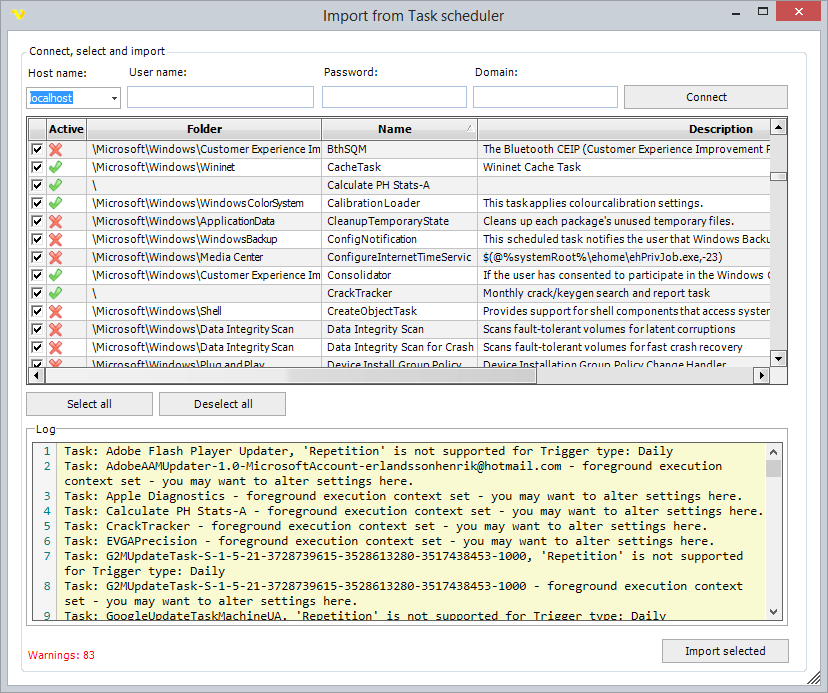

## Import/Export - Task Scheduler

With the main menu File > Import/Export > Task scheduler option it is possible to import tasks from the built in Task scheduler. There are some limitations as VisualCron uses different Trigger types and different Tasks. Also, you might need to update information after importing. See more information below in sections Limitations and Manual update.
 
### Connecting

To connect to an existing Task scheduler instance you enter information below and the click Connect.
 
**Host name**

This is the IP/host name of the local or remote server.
 
**User name**

This is the username - used for authenticating against the remote server.
 
**Password**

This is the password - used for authenticating against the remote server.
 
**Domain**

This is the domain name - used for authenticating against the remote server.

**Grid information**

The grid displays all Tasks, if they are active or not, the folder they reside in, the name, description and any warnings during the import.
 
Actual Actions or Triggers within the Task are not visible in the grid but they will be imported.
 
**Task selection**

Select the Task you want to import into VisualCron. You can choose to select each one by one, select all or deselect all.
 
**Importing**

Click Import selected to start the import. Usually, this goes very fast as tasks are already converted and just needs to be sent to VisualCron Server. Jobs that are created will get the Folder property of the task as group name.
 
**Limitations**

_Task/Action limitations_
* One difference is that currently VisualCron does not fall back to background execution when foreground execution fails.
_Trigger limitations_
* There are properties that cannot be directly transferred into VisualCron like the repetition property.
* There are some Trigger types that is not supported like "Registration","Idle"
 
**Warnings**

Any warnings, mostly related to limitations, will be displayed in the Warnings column next to each task and also in the log textbox.
 
**Manual update**

Manual updates of imported tasks might be required. Some manual changes are stated in the log. These type of changes concern two things:
 
_Credentials_ - update of password. After import go to Manage Credentials and update the password of any new, imported Credentials.
Connections - update of SMTP server information. After import go to Manage Connections and update SMTP server details.
 
Other types of changes might be to update existing Execute Task. VisualCron does not execute the same way as the Task Scheduler and manual alterations might be needed. For example, if you use cmd.exe you should instead call the full path to the executable/script in the command line instead. This is because VisualCron needs that to be able to capture exit code and output.