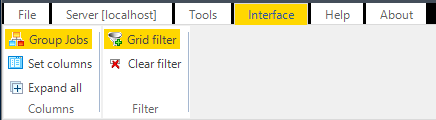

## Overview

The Interface tab is a part of the main menu.

The current servers, Jobs and Tasks are listed in the Server/Job/Task grid.
 
The format of the Job/Task listing is controlled from the main menu *List* tab. The Job/Task list can be customized by filtering a specific column and setting the columns to be visible/invisible.
 
A view filter can be defined for one column by a match criteria.
 
The number and the order of columns to view in the Job list can be modified.

