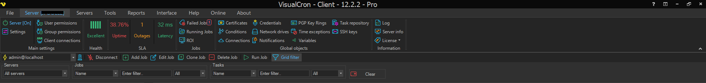

## Main Menu

The main menu is the ribbon at the top of the VisualCron client window. It is organized into the following tabs:

* [File](file/file.md) - import/export, updates, settings, manage servers and translation.
* [Server](server/server.md) - server status, settings, user permissions, health, SLA and ROI.
* [Tools](tools/overview) - explore, objects, calendar, flow chart and gantt chart.
* [Reports](reports) - reports for Jobs, Tasks, logs, notifications, connections and the server.
* [Interface](interface/overview) - column, filter and theme options for the grid.
* **Help** - help and support options.

