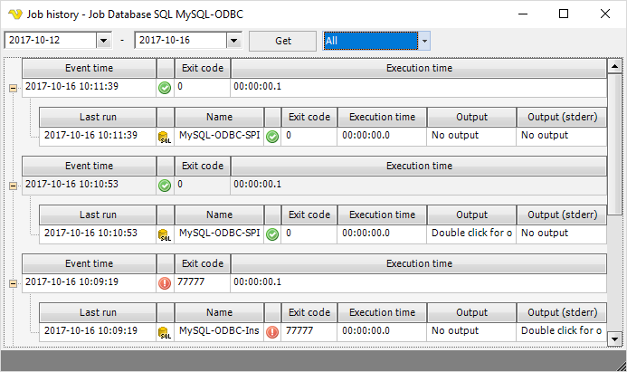

## Job Log

When a Job is defined, right-click on the Job or Task in the Server/Group/Job/Task grid and select *Job log* to open the log window.
 
The data in this window is based on the local database file. The number of entries in this file is limited by the *Job Log* settings in **Server > Settings > Log settings  > Database settings**.
 
The dates you see is the From date and To date. These are the minimum and maximum values from the local database. Press the *Get* button to fetch the matching Job Job entries.
 
The Job log is always updated in real time, i.e. scheduled Tasks within the Job will show up while executing.
 
**Job right-click > Job log**

**Filter**

You are able to filter between All, Failed and Success job execution results.