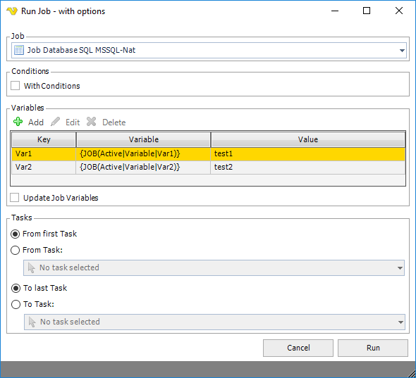

## Run Job With Options

By right-click on a Job, the Run Job with options menu item lets you start the Job with certain parameters.
 
In the window that opens you can control the following:

* If it should start with or without Conditions
* If it should override Variables or use new ones
* If it should update current Job Variables with new ones or not
* If it should start from a certain Task on complete with a certain Task
 
**Run Job with options**

**With Conditions**

This controls if the Job should be started by checking Conditions before or not. Default is false.
 
**Variables**

Existing Job Variables will be listed here. It is possible to add new, delete or update Job Variables.
 
**Update Job Variables**

When checked, it will update existing Job Variables. If unchecked it will use the once specified when clicking Run but never update existing.
 
**Tasks**

You can choose to start from first Task or a certain Task and run to last Task or a certain Task.