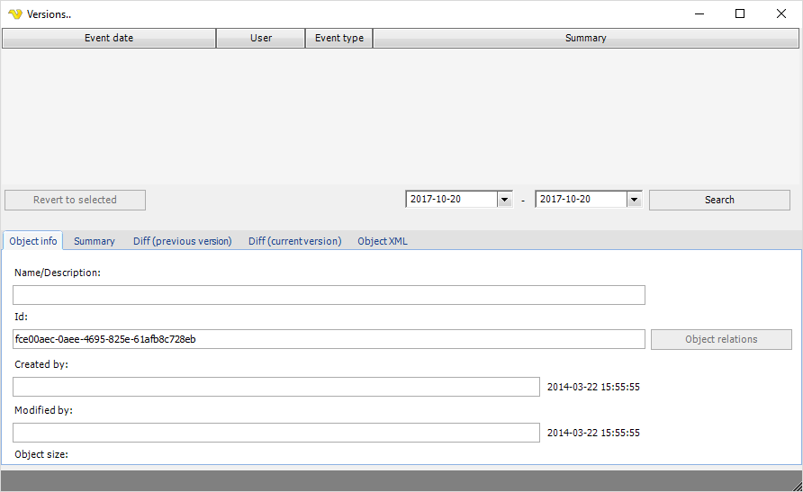

## Versions

When a Job is defined, right-click on the Job or Task in the Server/Group/Job/Task grid and select Version to open the versions window.
 
This window uses the same structure as the main menu **Tools > Objects > Audit log > Versions** option. See [here](../../tools/audit-log-versions) for more information.
 
Job > Versions

