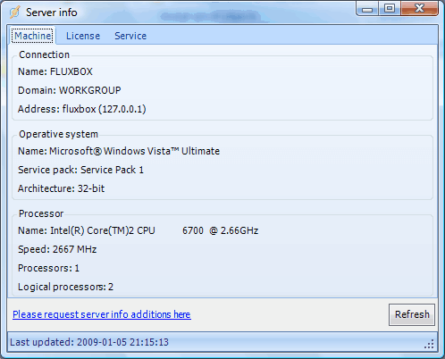
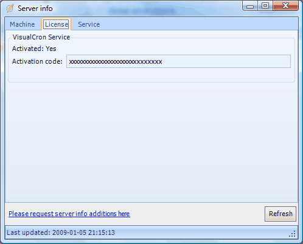
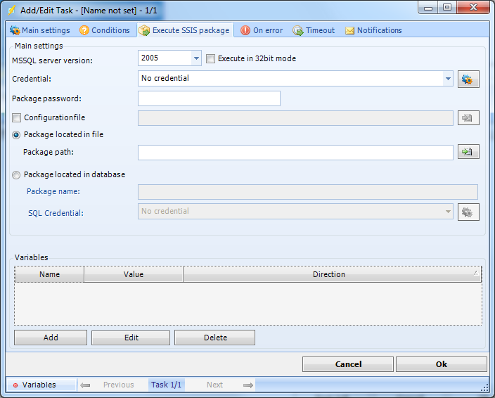

## Server Heading/Server Info

### Server Heading

Each defined server (connection) is presented in the Server/Job/Task grid as a group with a server/username heading followed by a set of child tracks with one row for each defined Job. All Tasks defined for a Job is finally presented 
as child tracks under each of these Jobs.

### Server Info

Server info window lets you view various information about the machine hosting VisualCron. You access Server info from the **Server -> Server info** tab or mouse right-click on a server heading in the Server/Job/Task grid.

