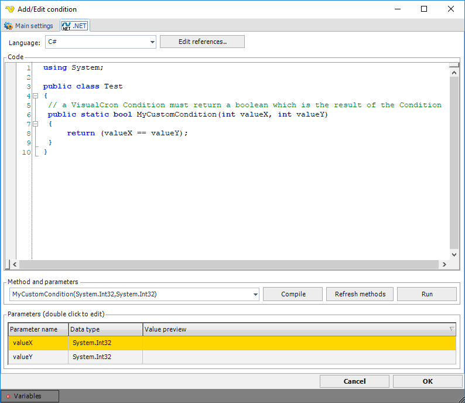

## Condition - .NET

The .NET Condition was created to provide a Condition with almost no limits at all. The idea is that you create a method in the .NET languages c# or VB.NET. This method must:
* Be located within a class
* Be static
* Return a boolean

**Global > Conditions > Condition set Add > Conditions Add > .NET select > .NET** tab

**Language**

Select either C# or VB.NET language. The syntax editor and compile methods will alter depending on selected language.
 
**Edit references..**

Add/remove any dll that you want to use as a reference to make our code work or be more compact.
 
**Code**

In this text box you insert your code. It is important that:
* The code exists in a class
* That you use static/shared methods only
 
Any return value will be converted to string.
 
**Method selection**

Select the method you want to use. After you have added new code, press the Refresh methods button.
 
**Compile**

This button tests if the code can compile and will return a popup message with error if not.
 
**Refresh methods**

This button compiles the codes and add all existing static methods into the method combo box.
 
**Run**

This button compiles and runs the code so you can test it.
 
**Parameters**

If the selected method contains any parameter, you can double click on the row to add your own parameter value.