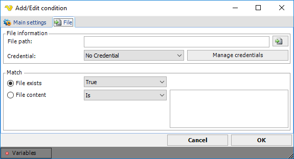

## Condition - File

The _File_ condition lets you check information about a certain file before running your Task or Job.
 
**Global > Conditions > Condition set Add > Conditions Add > File select > File** tab

**File path**

First you have to select a file. Write the full UNC path to the file, or select it by clicking on the File browser icon to the right.
 
**Credentials**

If your file is located at a network resource or any other protected area, it may require some "credentials" to access that file. Select a credential from the list. The credentials are stored globally, which lets you create new credentials that can be accessed in different levels and functions in VisualCron. Click on Manage credentials to add a credential that you may require.
 
**File exists**

Checks whether a file exists or not. Select true or false.
 
**File content**

This check type tries to read the content of a file and compare it, depending on your match type "Is", "Is not", "Contains", to the string you specify in the text box to the right.