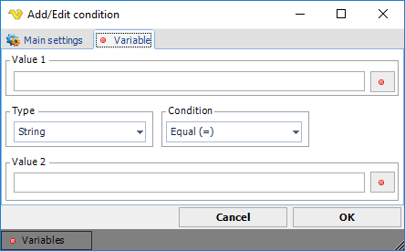

## Condition - Variable

The Variable Condition is able to compare two Variables or values. The values are compared differently depending which data type you select.
 
**Global > Conditions > Condition set Add > Conditions Add > Variable select > Variable** tab

**Value 1**

This is the first value you want to compare. Click the Variables icon to open up the Variable browser.
 
**Type**

The data type of the values. Values are converted and compared against the selected data type.
 
**Condition**

How the values should be compared. This affects the result of the Condition and Action in Condition set.
 
**Value 2**

The second value you want to compare. Click the Variables icon to open up the Variable browser.

