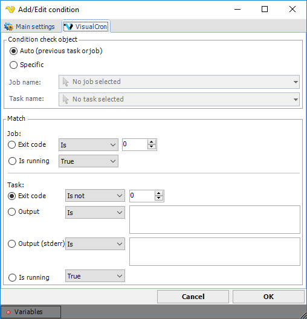

## Condition - VisualCron

The _VisualCron_ condition lets you check internal values within VisualCron.
 
**Global > Conditions > Condition set Add > Conditions Add > VisualCron select > VisualCron** tab

First you have to select a Task or a Job that you want to check. Remember that conditions needs the setting _Run Task in order_ if you want to check a Task.
 
**Auto**

VisualCron will check the previous Task values. This is only applicable for Tasks that have an internal relation within a Job contrary to Jobs which are independent on each other.
 
**Specific**

Use this setting to check a Task from another Job.
 
**Match**

The following match types exist:
* **Job Exit code** - A successful run of a Job returns exit code 0. If any of the Tasks return a non-zero value, the Job exit code will be inherited by the failing Task exit code.
* **Job Is running** - If the selected Job is currently running.
* **Task Exit code** - A successful run of a Task returns exit code 0. So, if you only want to run the next Task if the previous Task returned "Success" you select "Task exit code" - "Is" - "0". In the condition set where this condition belong, you select "Continue" in "MatchAll" and "Exit" in "MatchNone". Thus, if the exit code is "0" you will have one match and the action for "MatchAll" will be run. The action was continue which runs the Task it was supposed to run. If the exit code is not "0" (failure) it will not match your condition and therefore the action of "MatchNone" will be run. The action you specified was "Exit", which will terminate the current run of your Job.
* **Task Output** - This match type will check an output of a Task. The ordinary standard output for a Task is used and stored at a Task level. You can watch the previous output by double-click at the Task output row in the main window of VisualCron. In this condition you can compare the output in three ways. Exact match "Is" or "Is not" or if it "Contains" a certain string or character. Enter the desired match value in the text box to the right.
* **Task Is running **- If the selected Task is currently running.