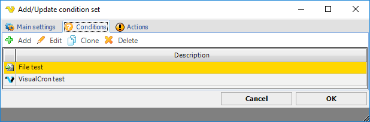
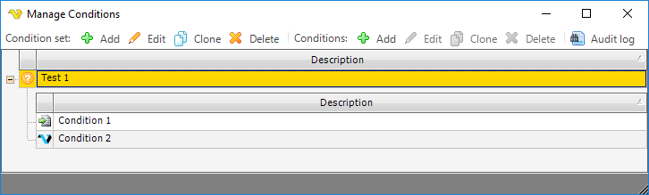

## Conditions - Conditions

A condition set is defined from the main menu **Global > Conditions** dialog.
 
**Global > Conditions > Add/Update Condition set > Main settings** tab

See [Conditions Main settings](global-main-settings) for details.
 
**Global > Conditions > Add/Update Condition set > Conditions** tab

Use _Conditions > Add_ to include conditions in the current condition set.
 
**Global > Conditions > Add/Update Condition set > Actions** tab

See [Conditions Actions](conditions-actions) for details.
 
**Global > Conditions**  

By clicking on the _Conditions_ toolbar or by mouse right-click on a condition set, you are able to _Add/Edit/Clone_ or Delete a condition set. In the _Add/Edit condition set_ -> **Conditions** tab, the condition set and condition settings are handled.
 
The condition set includes the following settings:
* Description
* A set of conditions
* Actions based on different condition matching options
 
A condition uses the following settings:
* Condition type
* Description
* Condition Active
* Condition type parameters (dependent of the selected condition type)
 
Each condition type uses specific associated parameters. The following condition types exist:
* [VisualCron](condition-visualcron)
* [File](condition-file)
* [Folder](condition-folder)
* [Process](condition-process)
* [Variable](condition-variable)
* [.NET](condition-dot-net)
