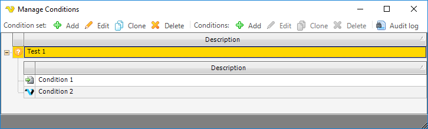

## Conditions - Conditions

A condition set is defined from the main menu **Global > Conditions** dialog.

**Global > Conditions > Add/Update Condition set > Main settings** tab

See [Conditions Main settings](global-main-settings) for details.

**Global > Conditions > Add/Update Condition set > Conditions** tab

Use *Conditions > Add* to include conditions in the current condition set.

**Global > Conditions > Add/Update Condition set > Actions** tab

See [Conditions Actions](conditions-actions) for details.

**Global > Conditions**

Click the *Conditions* toolbar buttons or right-click on a condition set to *Add*, *Edit*, *Clone* or *Delete* it. The condition set and its included conditions are managed in the *Add/Edit condition set* dialog on the **Conditions** tab.

The condition set includes the following settings:

* Description
* A set of conditions
* Actions based on different condition matching options

Each condition uses the following settings:

* Condition type
* Description
* Active flag
* Parameters specific to the selected condition type

The following condition types exist:

* [VisualCron](condition-visualcron)
* [File](condition-file)
* [Folder](condition-folder)
* [Process](condition-process)
* Service - check whether a local or remote Windows service is in a specific state
* [Variable](condition-variable)
* [.NET](condition-dot-net)
