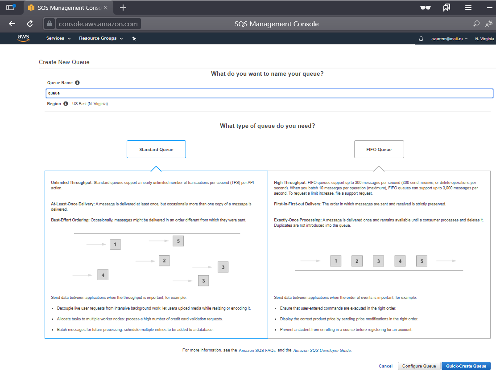
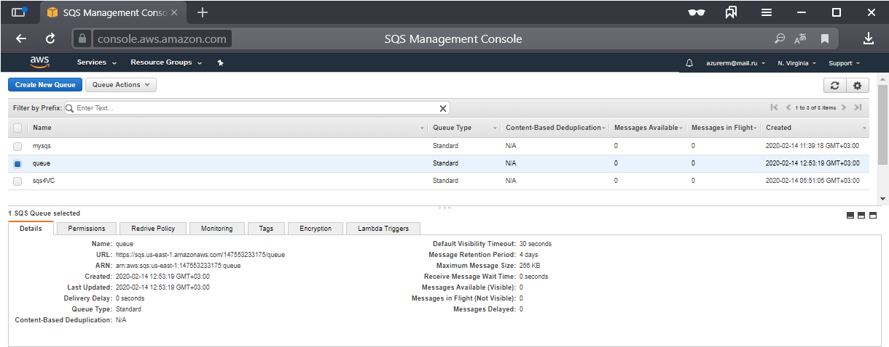

## Connection - Amazon

The Amazon Connection stores connect and logon properties for the Amazon cloud services.
 
The Amazon Connection is currently used in the Cloud (S3) and Amazon EC2 Tasks that are accessing the Amazon Cloud services.
 
The Amazon Connection is used in the following Tasks:
* [Cloud - Upload file(s)](../../client-user-interface/server/job-tasks/cloud-transfer-tasks/upload-file)
* [Cloud - List item(s)](../../client-user-interface/server/job-tasks/cloud-transfer-tasks/list-item)
* [Cloud - Download file(s)](../../client-user-interface/server/job-tasks/cloud-transfer-tasks/download-file)
* [Cloud - Create folder](../../client-user-interface/server/job-tasks/cloud-transfer-tasks/create-folder)
* [Cloud - Delete item(s)](../../client-user-interface/server/job-tasks/cloud-transfer-tasks/delete-item)
* [Messaging - SNS - Publish message](../../client-user-interface/server/job-tasks/messaging-tasks/sns-publish-message)
* All Amazon EC Tasks
* All Amazon DynamoDB Tasks
 
 
And the following Triggers
* [Amazon SQS Trigger](event-trigger-sqs)
 
**Manage Connections > Add > Amazon > Common settings** tab

**Name**

The unique name for the Connection

**Group**

The group that the connection is a part of
 
**Timeout**

The connection timeout in seconds. Connection will fail after this time period.
 
**Code page**

Code page being used.
 
**Manage Connections > Add > Amazon > Connection Settings** tab

**Address**

This field is not used.

**Authentication type**

Select password or public key authentication.
 
**Access Key ID**

The Access Key ID for the account.
 
**Secret Access key**

The Secret Access key for the account.
 
**Private key**

If public key authentication has been selected the select the path to the private key file and any password if used.

**Region**

Once authentication details have been filled you can click the refresh button to list available regions.
 
**Use version 4 signatures**

Signature Version 4 is the process to add authentication information to Amazon Web Services requests.
 
### Amazon SQS

#### Create SQS queue

#### List SQS queus
 
### Troubleshooting

**General**

Test the S3 explorer if it is working there.
 
**HTTP request failed with code 403 (Forbidden)**

Test with S3 explorer and look for error message. Generally this error comes if you do not have listing permissions on Buckets for the user. Please add permission - otherwise Tasks will not work properly.
 
**SignatureDoesNotMatch**

Uncheck/Check Use version 4 signatures.
 
**Connection lost (error code is 100353)**

Most likely a proxy error. You need to define a Proxy in the Proxy tab of the Connection.
 
**The hostname could not be parsed**

Make sure you have selected a Amazon region.
 
**HTTP request failed with code 400 (Bad Request). Erroc code: AuthorizationHeaderMalformed.**

The Amazon user is lacking "List buckets" permission.