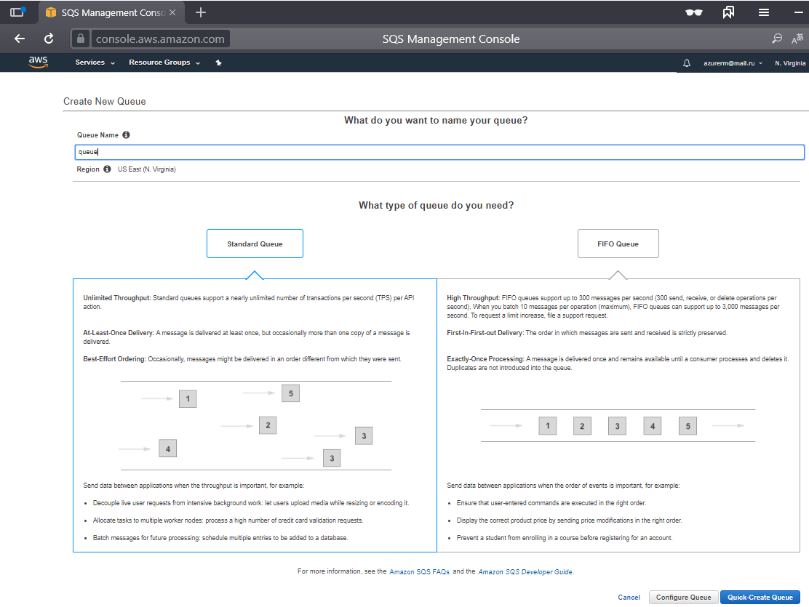
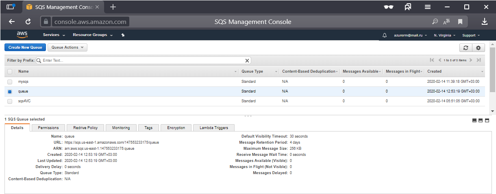

## Connection - Amazon

The Amazon Connection stores connect and logon properties for Amazon cloud services including Amazon S3, EC2, SNS, SQS, and DynamoDB.

The Amazon Connection is used in the following Tasks:

* [Cloud - Upload file(s)](../../client-user-interface/server/job-tasks/cloud-transfer-tasks/upload-file)
* [Cloud - List item(s)](../../client-user-interface/server/job-tasks/cloud-transfer-tasks/list-item)
* [Cloud - Download file(s)](../../client-user-interface/server/job-tasks/cloud-transfer-tasks/download-file)
* [Cloud - Create folder](../../client-user-interface/server/job-tasks/cloud-transfer-tasks/create-folder)
* [Cloud - Delete item(s)](../../client-user-interface/server/job-tasks/cloud-transfer-tasks/delete-item)
* [Messaging - SNS - Publish message](../../client-user-interface/server/job-tasks/messaging-tasks/sns-publish-message)
* All Amazon EC2 Tasks
* All Amazon DynamoDB Tasks
 
And the following Triggers

* [Amazon SQS Trigger](event-trigger-sqs)
 
**Manage Connections > Add > Amazon > Common settings** tab

**Name**

The unique name for the Connection

**Group**

The group that the connection is a part of.
 
**Timeout**

The connection timeout in seconds. Connection will fail after this time period.
 
**Code page**

Code page being used.
 
**Manage Connections > Add > Amazon > Connection settings** tab

**Address**

The endpoint address for S3-compatible storage services. Leave empty when connecting to standard Amazon S3.

**Authentication type**

The authentication method to use. Available options:

* _Password_ - authenticate using an Access Key ID and Secret Access Key
* _Public key_ - authenticate using a certificate; the Access Key ID and Secret Access Key fields are hidden and a certificate selector is shown instead
 
**Access Key ID** _(Password authentication only)_

The AWS Access Key ID for the account.

**Secret Access Key** _(Password authentication only)_

The AWS Secret Access Key for the account.
 
**Certificate** _(Public key authentication only)_

Select the certificate to use for authentication.

**Region**

The AWS region endpoint to connect to. Select from the list of available regions (e.g. `us-east-1`, `eu-west-1`).

**Default bucket**

The default S3 bucket to use when no bucket is specified in a Task.

**Multipart upload threshold**

The file size threshold in bytes above which uploads are performed using multipart upload. Default: 104857600 (100 MB).
 
**Use version 4 signatures**

When checked, uses AWS Signature Version 4 to sign requests. This is required by most AWS regions. Uncheck only if connecting to a region or S3-compatible service that requires Signature Version 2.

**Use HEAD requests**

When checked, VisualCron uses HTTP HEAD requests to retrieve object metadata. Enable this if the S3-compatible service requires it.

**Auto-accept server certificates**

When checked, VisualCron automatically accepts server certificates without prompting. Enabled by default.

**Use URL encoding**

When checked, VisualCron applies URL encoding to object keys. Enabled by default.

**Manage Connections > Add > Amazon > Proxy** tab

**Proxy type**

Select the proxy type to be used.

**Address**

The host name or IP address of the proxy server.

**Port**

The port of the proxy server.

**Use credentials**

Enable to provide credentials for authenticating with the proxy server.

**Domain**

The domain of the proxy server.

**Username**

The user name to access the proxy server.

**Password**

The password to access the proxy server.
 
### Amazon SQS

#### Create SQS queue

#### List SQS queus
 
### Troubleshooting

**General**

Test the S3 explorer if it is working there.
 
**HTTP request failed with code 403 (Forbidden)**

Test with the S3 Connection Explorer and look for the error message. This error typically occurs when the AWS user does not have listing permissions on S3 buckets. Add the required bucket listing permission — Tasks will not work properly without it.

**SignatureDoesNotMatch**

Uncheck or check **Use version 4 signatures** to toggle the signature version used.

**Connection lost (error code is 100353)**

Most likely a proxy error. Define a proxy in the **Proxy** tab of the Connection.

**The hostname could not be parsed**

Ensure that an Amazon region has been selected in the **Region** field.

**HTTP request failed with code 400 (Bad Request). Error code: AuthorizationHeaderMalformed.**

The AWS user is missing the "List buckets" permission.
