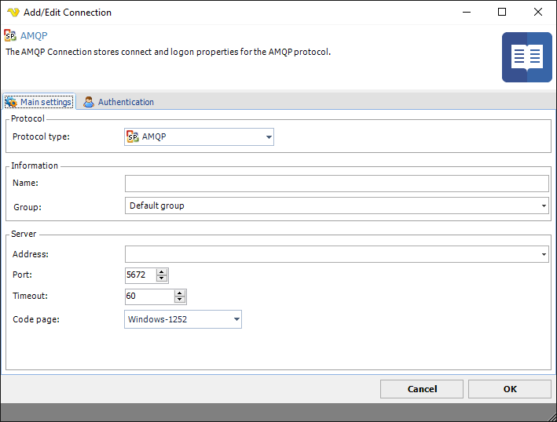
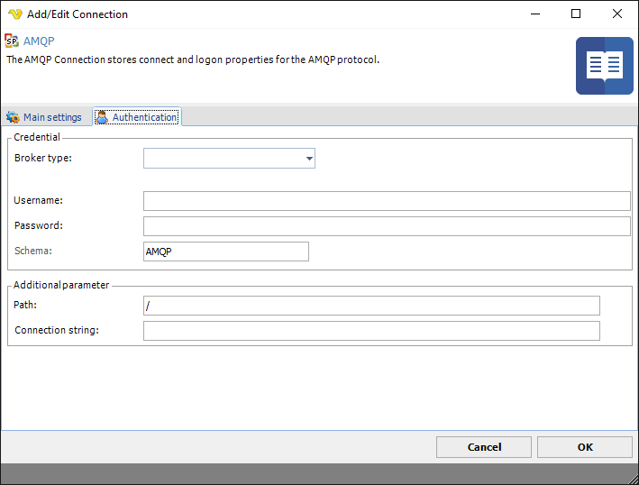

## Connection - AMQP

The AMQP Connection is used in:
 
* [AMQP - Send message Task](../../client-user-interface/server/job-tasks/messaging-tasks/amqp-send-message)
* [AMQP - Trigger](../../client-user-interface/server/event-trigger-amqp)
 
 
 
The Advanced Message Queuing Protocol (AMQP) is an open standard application layer protocol for message-oriented middleware. The defining features of AMQP are message orientation, queuing, routing (including point-to-point and publish-and-subscribe), reliability and security. AMQP defines a self-describing encoding scheme allowing interoperable representation of a wide range of commonly used types. It also allows typed data to be annotated with additional meaning,[17] for example a particular string value might be annotated so that it could be understood as a URL. Likewise a map value containing key-value pairs for 'name', 'address' etc., might be annotated as being a representation of a 'customer' type.
 
 
Currently, the following protocols are supported:
 
* Azure Service Bus
* Rabbit MQ
 
 
VisualCron supports AMQP version 1.0 or later.

**Broker type**

Select one of the two supported:

* Azure Service Bus
* Rabbit MQ
 
**Username**

Username for the service.
 
**Password**

Username for the service.
 
**Schema**

"AMQP" (port 5672) or "AMQPS" (port 5672). Azure Service Bus - have only AMQPS (port 5671)
 
**Path**

May be important for RabbitMQ - VirtualHost, the default is "/" in Azure Service Bus
 
**Connection string**

This property is used for administrative purposes - getting a list of queues, in RabbitMQ, here you need to specify the administrative port or path, for example, for local server installation - "http://localhost:15672/api/queues", for Azure Service Bus this is the Connnection String in the format: "Endpoint=sb://xxx.servicebus.windows.net/;SharedAccessKeyName=yyy;SharedAccessKey=zzz" and this default address is formed from the connection parameters: host (in the example, this is xxx.servicebus.microsoft.net/), username (yyy) and password (zzz).