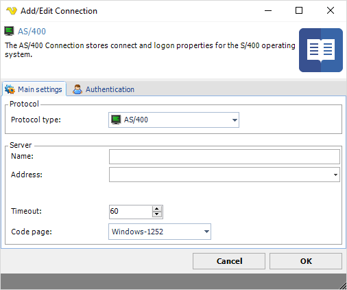
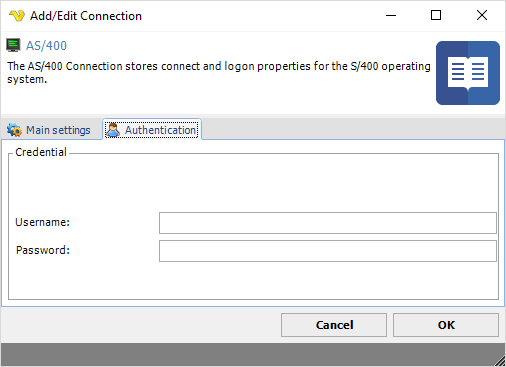

## Connection - AS/400

The AS/400 Connection stores connect and logon properties for the AS/400 operating system.
 
The AS/400 Connection is used in the AS/400 Task:

* [Process - AS/400 Command](processas400command).
 
**Manage Connections > Add > AS/400 > Main settings** tab

**Name**

The unique name for the Connection
 
**Address**

The address to the AS/400 server.
 
**Timeout**

The connection timeout in seconds. Connection will fail after this time period.
 
**Codepage**

Code page being used.
 
**Manage Connections > Add > AS/400 > Authentication** tab

**Username**

The username for the server.
 
**Password**

The password for the server.

