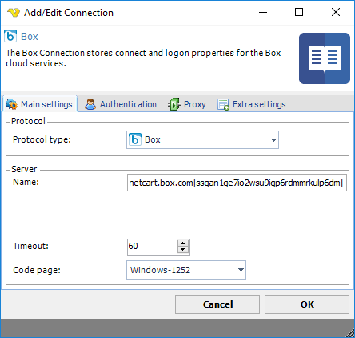
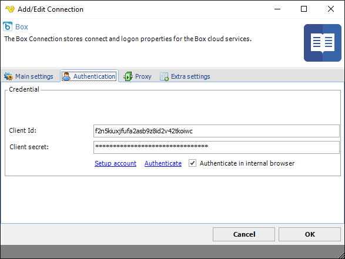
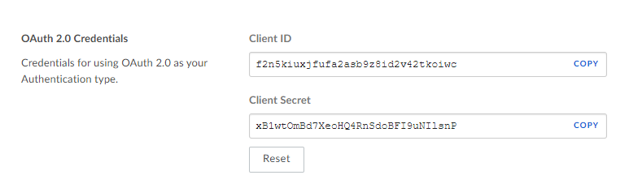
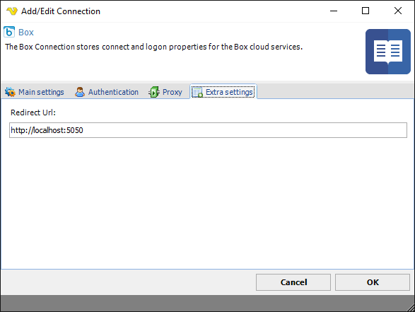
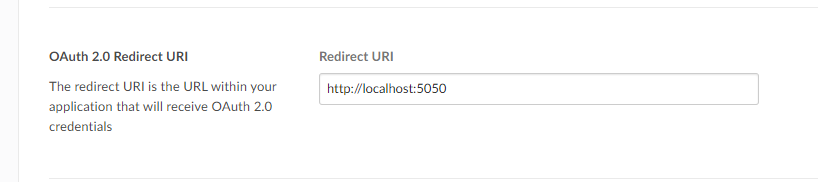

## Connection - Box

The Box Connection stores connect and logon properties for the Box cloud services.
 
Box is a cloud service from Google that you have to pay for. You can use VisualCron to sync files between that service and a local folder.
 
The GoogleDrive Connection is used in the Cloud Tasks:

* [Cloud - Upload file(s)](clouduploadfiles)
* [Cloud - List item(s)](cloudlistitems)
* [Cloud - Download file(s)](clouddownloadfiles)
* [Cloud - Create folder](cloudcreatefolder)
* [Cloud - Delete item(s)](clouddeleteitems)
 
**Manage Connections > Add > Box > Main settings** tab

**Name**

The name of the Connection to uniquely identifying it.
 
**Timeout**

The connection timeout in seconds. Connection will fail after this time period.
 
**Code page**

Code page being used.
 
**Manage Connections > Add > Box > Authentication** tab

**Client Id**

Client Id which you gets when registering application at [Box](https://www.box.com/platform). See sample below:

**Client secret**

Client secret which you gets when registering application at [Box](https://www.box.com/platform).
 
**Authenticate**

Click on the Authenticate link to start authentication.
 
**Authenticate in internal browser**

You can choose to authenticate in your own browser or externally by checking the *Authenticate in internal browser* box (default). Click the *Authenticate* link.
 
**Manage Connections > Add > Box > Extra settings** tab

**Redirect Url**

Please note that this url need to match url on Box web site like this:

