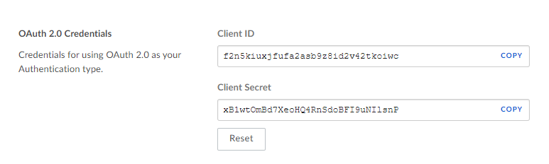
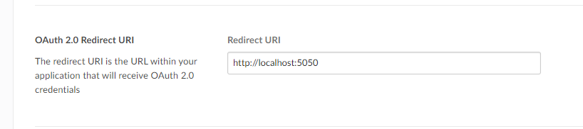

## Connection - Box

TThe Box Connection stores connect and login properties for the Box cloud storage service. You can use VisualCron to transfer files between Box and a local folder, or between Box and other cloud services.

The Box Connection is used in the following Cloud Tasks:

* [Cloud - Upload file(s)](../../client-user-interface/server/job-tasks/cloud-transfer-tasks/upload-file)
* [Cloud - List item(s)](../../client-user-interface/server/job-tasks/cloud-transfer-tasks/list-item)
* [Cloud - Download file(s)](../../client-user-interface/server/job-tasks/cloud-transfer-tasks/download-file)
* [Cloud - Create folder](../../client-user-interface/server/job-tasks/cloud-transfer-tasks/create-folder)
* [Cloud - Delete item(s)](../../client-user-interface/server/job-tasks/cloud-transfer-tasks/delete-item)
 
**Manage Connections > Add > Box > Common settings** tab

**Name**

The name of the Connection to uniquely identify it.

**Group**

The group that the connection is a part of.
 
**Timeout**

The connection timeout in seconds. Connection will fail after this time period.
 
**Code page**

Code page being used.
 
**Manage Connections > Add > Box > Connection Settings** tab

**Client Id**

Client Id which you gets when registering your application at the Box Developer Console - [Box](https://www.box.com/platform). See sample below:

**Client secret**

The Client Secret obtained when registering your application at the Box Developer Console.

**Redirect Url**

The OAuth redirect URI used during authentication. This value must match exactly the redirect URI configured for your app in the Box Developer Console.

**Auto-accept server certificates**

When checked, VisualCron automatically accepts server certificates without prompting. Enabled by default.

**Create an account**

Click this link to open the Box Developer Console to register or manage your Box application: [https://app.box.com/developers/services](https://app.box.com/developers/services)

**Authenticate**

Click this link to initiate the OAuth authentication flow. A browser window will open for you to sign in with your Box account and grant VisualCron access. Once authentication is complete, click OK to save the connection.

**Manage Connections > Add > Box > Proxy** tab

**Proxy type**

Select the proxy type to be used.

**Address**

The host name or IP address of the proxy server.

**Port**

The port of the proxy server.

**Use credentials**

Enable to provide credentials for authenticating with the proxy server.

**Domain**

The domain of the proxy server.

**Username**

The user name to access the proxy server.

**Password**

The password to access the proxy server.
