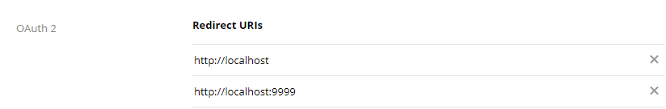
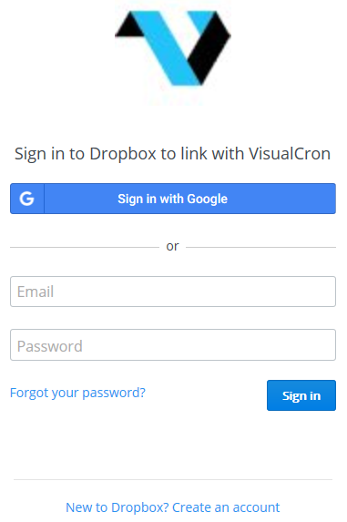

## Connection - Dropbox

The Dropbox Connection stores connect and login properties for the Dropbox cloud services. VisualCron supports Personal and Business service of Dropbox.
 
Dropbox is a [file hosting service](https://en.wikipedia.org/wiki/File_hosting_service). Dropbox allows users to create a special folder on their computers, which Dropbox then synchronizes so that it appears to be the same folder (with the same contents) regardless of which device is used to view it. Files placed in this folder are also accessible via the Dropbox website and mobile apps. Dropbox uses a [freemium](https://en.wikipedia.org/wiki/Freemium) business model, wherein users are offered a free account with a set storage size and paid subscriptions for accounts with more capacity
 
The Dropbox Connection is used in the following Cloud Tasks:

* [Cloud - Upload file(s)](../../client-user-interface/server/job-tasks/cloud-transfer-tasks/upload-file)
* [Cloud - List item(s)](../../client-user-interface/server/job-tasks/cloud-transfer-tasks/list-item)
* [Cloud - Download file(s)](../../client-user-interface/server/job-tasks/cloud-transfer-tasks/download-file)
* [Cloud - Create folder](../../client-user-interface/server/job-tasks/cloud-transfer-tasks/create-folder)
* [Cloud - Delete item(s)](../../client-user-interface/server/job-tasks/cloud-transfer-tasks/delete-item)
 
**Manage Connections > Add > Dropbox > Common settings** tab

**Name**

The name of the Connection to uniquely identifying it.

**Group**

The group that the connection is a part of

**Timeout**

The connection timeout in seconds. Connection will fail after this time period.
 
**Code page**

Code page being used.

**Manage Connections > Add > Dropbox > Connection Settings** tab

**Use VisualCron registered app**

If you use your own application, you need to uncheck the Use VisualCron registered app box (checked as default). If you want to use your own app, then click the Setup account link to create or enter in your own App key and App secret information.
 
**App key**

App key which you gets when registering application at [Dropbox](https://www.dropbox.com/login?cont=https%3A%2F%2Fwww.dropbox.com%2Fdevelopers%2Fapps).
 
**App secret**

App secret which you gets when registering application at [Dropbox](https://www.dropbox.com/login?cont=https%3A%2F%2Fwww.dropbox.com%2Fdevelopers%2Fapps).
 
**How to create a connection using the VisualCron app**

Check the *Use VisualCron registered app* box. Proceed to the **How to connect your account to an app (Authentication)** chapter below.
 
**How to create a connection using your own Dropbox app**

If you e.g. want your own logo and/or use your own permissions, you may choose to use your own app.

1. If you have not yet created your own app then click *Setup account* or go to: [https://www.dropbox.com/developers/apps](https://www.dropbox.com/developers/apps)
2. Set and verify Redirect URI. When setting up Redirect URI you also need to match the Redirect URL in the **Extra settings** tab. The Redirect URI is used for authentication.

3. Insert the App key and App secret data in the **Authentication** tab.
 
**How to connect your account to an app (Authentication)**

1. You can choose to authenticate in your own browser or external by checking the Authenticate in internal browser box. Click on the Authenticate link.

2. Enter your Dropbox login credentials in order to allow the use of the VisualCron application to handle files in your Dropbox account.
 
**Manage Connections > Add > Dropbox > Proxy** tab

**Proxy type**

Select the proxy type to be used.
 
**Address**

The host name or IP address of the proxy server.
 
**Port**

The port of the proxy server.
 
**Use credentials**

The credentials that are associated with the account.
 
**Domain**

The name of the domain to be created.
 
**Username**

The user name to access the proxy server.
 
**Password**

The password to access the proxy server.

### Troubleshooting

**400 Invalid Redirect URI**

Please use [http://localhost](http://localhost) and [http://localhost:9999](http://localhost:9999) for your redirect URI in your app on Dropbox.