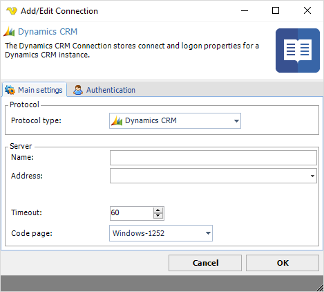
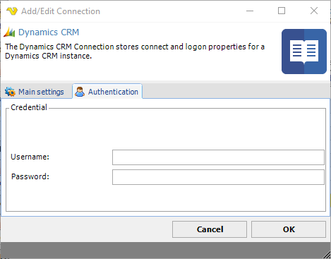

## Connection - Dynamics CRM

The Dynamics CRM Connection stores connect and logon properties for a Dynamics CRM instance.
 
The Dynamics CRM Connection is used in the Dynamics CRM Tasks:

* [Dynamics CRM - Get entity](../../client-user-interface/server/job-tasks/dynamics-crm-tasks/get-entity)
* [Dynamics CRM - Create entity](../../client-user-interface/server/job-tasks/dynamics-crm-tasks/create-entity)
* [Dynamics CRM - Update entity](../../client-user-interface/server/job-tasks/dynamics-crm-tasks/update-entity)
* [Dynamics CRM - Delete entity](../../client-user-interface/server/job-tasks/dynamics-crm-tasks/delete-entity)
* [Dynamics CRM - List entity](../../client-user-interface/server/job-tasks/dynamics-crm-tasks/list-entity)
* [Dynamics CRM - Get audit data](../../client-user-interface/server/job-tasks/dynamics-crm-tasks/get-audit-data)
* [Dynamics CRM - Set audit status](../../client-user-interface/server/job-tasks/dynamics-crm-tasks/set-audit-status)
* [Dynamics CRM - Start work flow](../../client-user-interface/server/job-tasks/dynamics-crm-tasks/start-work-flow)
* [Dynamics CRM - Download attachment](../../client-user-interface/server/job-tasks/dynamics-crm-tasks/download-attachments)
* [Dynamics CRM - Upload attachment](../../client-user-interface/server/job-tasks/dynamics-crm-tasks/upload-attachment)
 
**Manage Connections > Add > Dynamics CRM > Main settings** tab

**Name**

The unique name for the Connection
 
**Address**

The address to the Dynamics CRM server.
 
**Timeout**

The connection timeout in seconds. Connection will fail after this time period.
 
**Code page**

Code page being used.
 
**Manage Connections > Add > Dynamics CRM > Authentication** tab

**Username**

The username for the server.
 
**Password**

The password for the server.