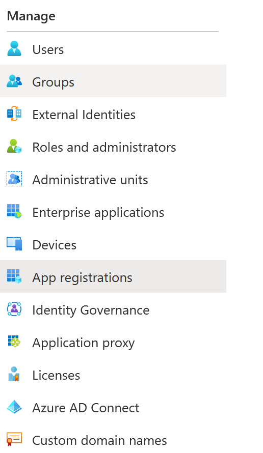

## Connection - Exchange EWS

The Exchange EWS Connection uses the Exchange Web Service protocol which is similar to the IMAP protocol - but have more Exchange options in general. Select this protocol if it is implemented by the Exchange server.
 
**Manage Connections > Add > Exchange EWS > Main settings** tab

**Test**

It is possible to test the connection once you have set all settings. Click the Test button to start the test.
 
**Name**

The unique name for the Connection.
 
**Address**

The url to the Exchange EWS service. Here is how you can obtain it:
 
**For Microsoft Exchange Online / Office 365**

* Access your journaling mailbox account using Outlook Web App (OWA)
* Click Options > See All Options > Account > My Account > Settings for POP, IMAP, and SMTP access
* In the list of entries, locate the server name. The URL of exchange web service for the mailbox is the URL: https://<ONLINE_URL>/EWS/Exchange.asmx
 
**For Microsoft Exchange (on premise)**

The URL can be composed using the following syntax: https://<EXCHANGE_SERVER_HOSTNAME>/EWS/Exchange.asmx
 
**Using Microsoft Exchange Management Shell**

* Open Exchange Management Shell and run the following command.
* Get-WebServicesVirtualDirectory |Select name, *url* | fl
* The output will be similar to the following:
* Name                 : EWS (Default Web Site)
* InternalNLBBypassUrl : https://server name/ews/exchange.asmx
* InternalUrl          : https://server name/EWS/Exchange.asmx
* ExternalUrl          : https://mail.domain.com/ews/exchange.asmx
 
**Timeout**

The connection timeout in seconds. Connection will fail after this time is passed.
 
**Code page**

The table of values that describes the desired character set. Currently this is overridden by the code page in the Task.
 
**Manage Connections > Add > Exchange EWS > Authentication** tab
 
### Default

**Username**

The user name for the email account.
 
**Password**

The password for the email account.
 
**Alias**

A string value indicating the shared mailbox. Only Exchange Web Service/WebDAV protocol supports this feature.
 
### Oauth

**Use VisualCron registered app**

You can choose to register your own app in Azure or use the pre-registerd one in VisualCron. You just need to authenticate once. See later down about Azure setup.
 
**Application Id**

The application Id in Azure. See later down about Azure setup.
 
**Application password**

The application password/secred in Azure. See later down about Azure setup.
 
**Email**

The email you want to work with.
 
**Manage Connections > Add > Exchange EWS > Encryption** tab

**Cryptographic protocol**

Encryption protocol to use; No encryption, SSL or TLS. We recommend that you select TLS.
 
**Allowed SSL/TLS versions**

Some Exchange EWS servers require certain versions of SSL/TLS. Check the versions that are allowed. Sometimes it is necessary to specify the specific allowed version. We recommend that you use TLS 1.2.
 
**Manage Connections > Add > Exchange EWS > Proxy** tab

**Proxy type**

Select the proxy type to be used.
 
**Address**

The host name or IP address of the proxy server.
 
**Port**

The port of the proxy server.
 
**Use credentials**

Text ...
 
**Domain**

The name of the domain to be created.
 
**Username**

The user name to access the proxy server.
 
**Password**

The password to access the proxy server.
 
**Manage Connections > Add > Exchange EWS > Extra settings** tab

### How to setup EWS application in Azure
 
1. Log into MS Azure portal
2. Navigate to Azure Active Directory blade

Choose **App Registrations** menu item…

and choose **New registration**

3. Setup your application common properties

Supported account types short info:

a. If you have your Active Directory connected to EWS and you need to allow this directory’s users to access their EWS accounts – choose “Accounts in this organizational directory only” (Single tenant)

b. If you have your EWS connected to another directory or you need to give access to different directories - choose “Accounts in any organizational directory” (Multi-tenant). **Please note, that you will need to get your app approved by Microsoft in this way**.

c. If you have your EWS connected to another directory or you need to give access to different directories and allow personal accounts to access their accounts - choose “Accounts in any organizational directory and personal accounts” (Multi-tenant). **Please note, that you will need to get your app approved by Microsoft in this way**.

d. If you want to handle personal accounts only -  choose “Personal Microsoft accounts only”.

**Redirect URI**

That should be set as web and URI should be like [http://localhost:9999](http://localhost:9999)

4. Application details

Navigate to application registration page and note application details: you will need Application Id, Tenant Id to set up a connection.

5. Navigate to Certificates and Secrets to set up secrets for your application.

You will need to set up an application password (secret) prior to using it.

6. App secret

Hit “New client secret” and create new secret. **Please note, that secret’s value would be available on web-page only after creating. You will not be able to reveal it after. If you miss or forget it – new secret should be created**.

7. Permissions

Set permissions for your application. **Please note that permissions from Office 365 Exchange Online are required for the connection to work properly. Microsoft Graph permissions do not affect possible 4xx errors**.

You can start with **full_access_as_app** permissions which allows all actions to be performed as default.

