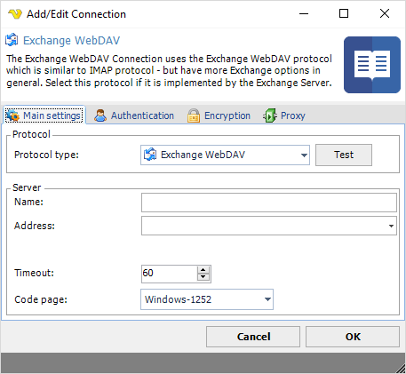
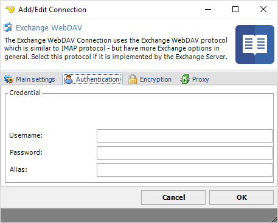
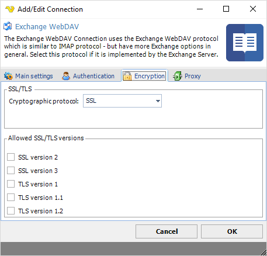
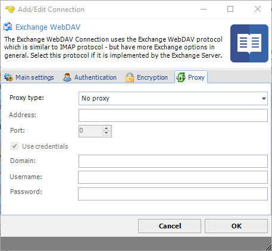

## Connection - Exchange WebDAV

The Exchange WebDAV Connection uses the Exchange WebDAV protocol which is similar to the IMAP protocol - but have more Exchange options in general. Select this protocol it it is implemented by the Exchange Server.
 
For MS Exchange interoperability, WebDAV can be used for reading/updating/deleting items in a mailbox or public folder. WebDAV for Exchange has been extended by Microsoft to accommodate working with messaging data. Exchange Server version 2000, 2003, and 2007 support WebDAV. However, WebDAV support has been discontinued in Exchange 2010 in favor of Exchange Web Services (EWS), a SOAP/XML based API.
 
**Manage Connections > Add > Exchange WebDAV > Main settings** tab

**Test**

It is possible to test the connection once you have set all settings. Click the Test button to start the test.
 
**Name**

The unique name for the Connection.
 
**Address**

The DNS name or IP address of the email server.
 
**Timeout**

The connection timeout in seconds. Connection will fail after this time is passed.
 
**Code page**

The table of values that describes the desired character set. Currently this is overridden by the code page in the Task.
 
**Manage Connections > Add > Exchange WebDAV > Authentication** tab

**Username**

The user name for the email account.
 
**Password**

The password for the email account.
 
**Alias**

Text ...
 
**Manage Connections > Add > Exchange WebDAV > Encryption** tab

**Cryptographic protocol**

Encryption protocol to use; No encryption, SSL or TLS.
 
**Allowed SSL/TLS versions**

Some Exchange WebDAV servers require certain versions of SSL/TLS. Check the versions that are allowed. Sometimes it is necessary to specify the specific allowed version.
 
**Manage Connections > Add > Exchange WebDAV > Proxy** tab

**Proxy type**

Select the proxy type to be used.
 
**Address**

The host name or IP address of the proxy server.
 
**Port**

The port of the proxy server.
 
**Use credentials**

Text ...
 
**Domain**

The name of the domain to be created.
 
**Username**

The user name to access the proxy server.
 
**Password**

The password to access the proxy server.