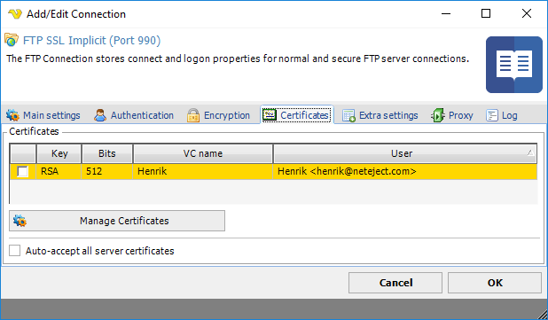
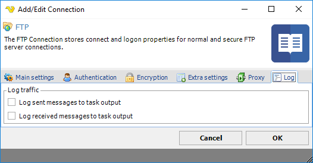

## Connection - FTP

The FTP Connection stores connect and logon properties for normal and secure FTP server connections.
 
### About FTP

File Transfer Protocol (FTP) is a standard network protocol used to transfer files from one host to another host over a TCP-based network, such as the Internet.
 
FTP is built on a client-server architecture and uses separate control and data connections between the client and the server. FTP users may authenticate themselves using a clear-text sign-in protocol, normally in the form of a username and password, but can connect anonymously if the server is configured to allow it. For secure transmission that hides (encrypts) the username and password, and encrypts the content, FTP is often secured with SSL/TLS ("FTPS"). SSH File Transfer Protocol ("SFTP") is sometimes also used instead, but is technologically different.
 
The first FTP client applications were command-line applications developed before operating systems had graphical user interfaces, and are still shipped with most Windows, Unix, and Linux operating systems. Dozens of FTP clients and automation utilities have since been developed for desktops, servers, mobile devices, and hardware, and FTP has been incorporated into hundreds of productivity applications, such as Web page editors.
 
_"Implicit SSL" versus "explicit SSL" (per RFC 2228)_
 
Connecting securely and authenticating are two distinct methods of establishing a secure connection with a FTP server. In the first case, the Secure FTP server may first require a SSL connection to be established, before the initial welcome message is sent. This is called an implicit SSL connection. In the second case, the connection is established in clear text and a special FTP command must be sent to the Secure FTP server to change the connection into a secure connection. This is called an explicit SSL connection.
 
In most cases, FTP servers that support SSL authentication will accept a normal connection on port 21. Once the connection is established, it is necessary to authenticate before logging in, using the Authenticate method. When explicitly securing the connection, it is also possible to secure data connections using the overload of the Authenticate method which requires a DataChannelProtection ENUM as a parameter.
 
Servers that require an implicit SSL connection usually listen on port 990 rather than 21
 
### Protocol variants

* FTP
* FTP SSL Explicit
* FTP SSL Implicit
* FTP TLS Explicit
* FTP TLS Implicit
 
The FTP Connection stores connect and logon properties for normal and secure FTP server connections.
 
**Manage Connections > Add > FTP > Common settings** tab

**Protocol type**

VisualCron is able to connect using regular FTP and FTPS (with implicit and explicit encryption). Regular FTP offer no security and information is not encrypted. VisualCron supports both SSL 3.0 and TLS (SSL 3.1). SSL and TLS are protocols layered above connection protocols (such as TCP/IP) but beneath application protocols (such as FTP) that provide encrypted, authenticated communications between a client and a server.
 
**Brute force test**

When using FTP and you are unsure of connection properties you can use the Brute force test tool to test all connection combinations. Note, brute force test option is only available for FTP protocol.

**Name**

This is a descriptive name of the connection to distinguish from other connections.

**Group**

The group that the connection is a part of
 
**Timeout**

The connection timeout in seconds. Connection will fail after this time is passed.
 
**Code page**

The table of values that describes the desired character set.
 
**Manage Connections > Add > FTP > Connection Settings** tab

**Address**

This is the host address to the server. It could be a DNS name or IP number.
 
**Port**

This is the remote connection port. Default port for regular FTP is 21. Default port for Implicit FTPS is 990.

**Authentication type**

Authentication type can either by _Password_ or _Public key_. For the FTP protocol only password authentication is available. When using SFTP together with public key authentication you have to specify a path to a private key file.
 
**Anonymous**

If your connection does not require a user name and password this box should be checked.
 
**Username**

The user name for the connection.
 
**Password**

The password for the connection.
 
**ACCT**

This property is only for some proxies that require ACCT value. FTP protocol only.
 
**Manage Connections > Add > FTP > Encryption** tab

**Cryptographic protocol**

Select between No encryption, SSL or TLS.
 
**Security mode**

Select between Explicit or Implicit mode type.
 
**Use data channel encryption (PROT P)**

If this property value is True the channel used for data transfer (files, directory listings) will be encrypted, otherwise only command channel will be encrypted.
 
**Use command channel encryption**

If this property value is True the command channel will be encrypted.
 
**Use SSL session resumption**

Specifices if SSL session resumption should be used.
 
For the FTP SSL/TLS connection types, an extra **Certificates** tab is provided.
 
**Manage Connections > Add > FTP SSL/TLS > Certificates** tab

**Client certificates**

Client certificates can be sent to the FTP server when connecting (implicit SSL) or when authenticating (explicit SSL). If the client certificate should be rejected by the server, an exception will be issued and the Task can not continue.
 
To add a client certificate, you need to click on [Global Certificates](../server/global-certificates). VisualCron is able to store certificates within itself. These certificates can be created by VisualCron or imported from other source. When you have create a Certificate you need to select it in the list of Certificates in the Certificates tab of the Connection properties.
 
**Server certificates**

The certificate that is received from the FTP server is verified against the VerificationFlags provided at connection or authentication. By default, if a certificate received from an FTP server contains anomalies, it will be rejected. If no anomalies are detected, it will be accepted. This behavior can be overridden by checking the Auto-accept server certificates checkbox. If not checked and a certificate anomaly is detected, a popup will be shown (if the client is logged in). The popup message will show why the server certificate was initially connected. You can choose to "Accept" or "Deny" the certificate. If accepted, it will be saved and you will not be asked again unless the server certificate has changed.
 
**Manage Connections > Add > FTP > Extra settings** tab

**Transfer type**

Select if you want to transfer through binary (default) or ASCII mode.
 
**Sync data channel**

This option specifies whether to synchronize data channel. Switch it on if component hangs when trying to establish data connection, i.e., on using commands list, upload, download.
 
**Data connection type**

This value is indicating if the FTP client should initiate the data connection rather than the FTP server.
 
If set to PASV, the PASV command will be sent to the FTP server rather than the PORT command. This results in that the FTP server will listen on a data port (other than its default) and wait for a data connection to be established by the FTP client. The reply to the PASV command includes the host and port address the FTP server is listening on.
 
If set to PORT, the PORT command will be sent and the FTP client will listen for an incoming data connection.
 
The FTP server will establish the data connection upon receipt of a transfer command.
 
:::tip Note 

If you are having problems with connecting or sending/receiving files to/from a server, try the PASV setting.

:::

**Automatically adjust passive mode addres for NAT'ed servers**

If this property is set to True, in passive mode data transfer, VisualCron will automatically set the address of the remote host to that from the control connection.
 
**Override date format**

VisualCron is trying to interpret the dateformat of files when listing files. In some situations there is a compatibility or a FTP server not behaving according to standard. In these cases you will see an error in the log file which contains the incoming date format. By overriding and using the same format as in the log you will force VisualCron to use this specific date format.
 
### Proxy tab

Proxy servers allow a client to make indirect network connections. The client connects to the proxy, makes a request for a connection, file, etc. The proxy server then provides this resource by getting it from the requested address or by retrieving it from its cache. The advantages of using a proxy server can include filtering, connection sharing, increased speed and decreased bandwidth use. HTTP proxy servers are web servers that relay requests from a client to an external FTP server.

**Proxy type**

Select the proxy type to be used.The FTP implementation supports the HTTP proxy type and the SFTP implementation supports the SOCKS4 and SOCKS5 proxy types.

**Address**

The host name or IP address of the proxy server.
 
**Port**

The port of the proxy server.
 
**Use credentials**

The credentials that are associated with the account.
 
**Domain**

The name of the domain to be created.
 
**Username**

The user name to access the proxy server.
 
**Password**

The password to access the proxy server.
 
**Use proxy for data channel**

By default, proxy is used for the data (sending channel). Uncheck this to circumvent proxy.
 
**Log** tab
This tab is not applicable for the email related (SMTP, POP3 and IMAP4) or SQL connection types.
 
**Manage Connections > Add > FTP > Log** tab

**Log outgoing messages to Task output**

All messages sent from VisualCron to the FTP server is logged and stored in the Task output.
 
**Log incoming messages to Task output**

All messages received from VisualCron to the FTP server is logged and stored in the Task output.
 
### Troubleshooting
 
**Control channel transfer error (error code is 10053)**

Try checking Auto accept all server certificates in Certificates tab. If you get this error on upload you can alternatively check Use SSL session resumption.
 
**Server cannot perform SSL/TLS negotiation**

FTP server either does not support TLS or SSL. Try switching between those.
 
**10035 /  114690 / 425 error. Can connect but not list files. / Connection timeout after MLSD is sent**

Try unchecking "Automatically adjust PASV for NATed servers"
 
**534 Protection level negotiation failed**

Check "Use data channel encryption (PROT P).
 
**SSL Error: 73732**

Make sure you checked the correct SSL version. Preferably only TLS 1.2.
 
**Error: 75796**

Try manually selecting the encryption algorithm.