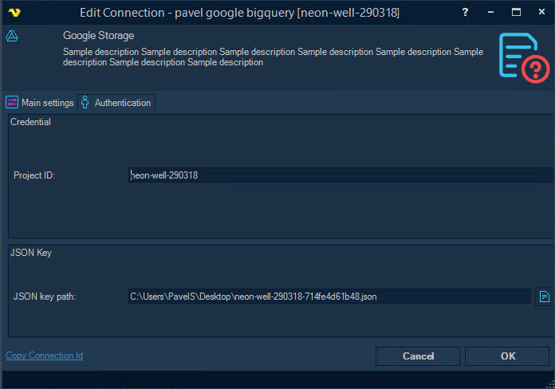
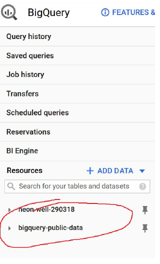
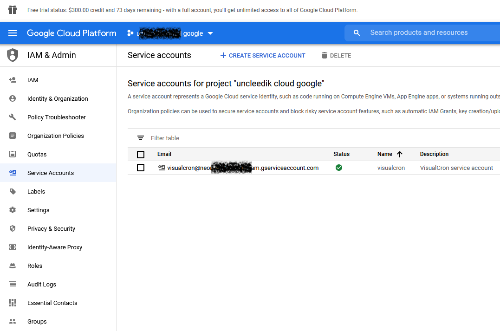
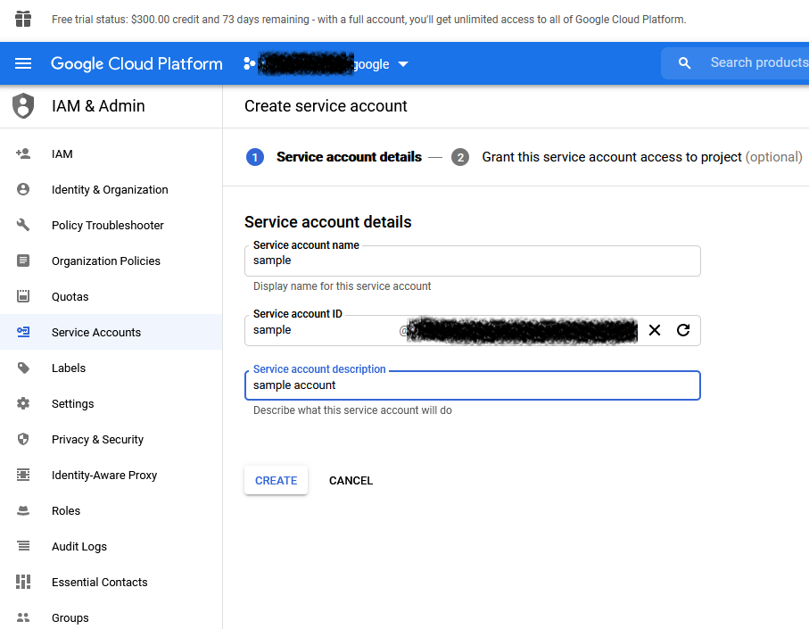
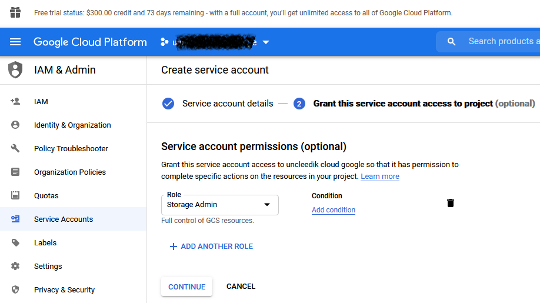
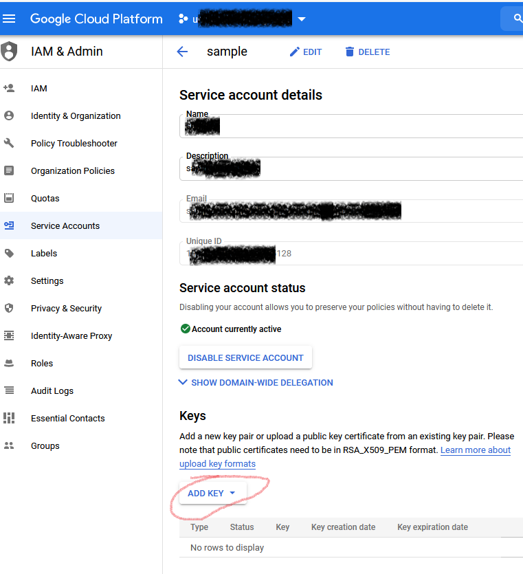

## Connection - Google Cloud

The Google Cloud Connection is used in the following Tasks:

* BigQuery - Run query
* BigQuery - Fill table
* Google Storage Tasks

**Project ID**

Can be bigquery_public_data (when working on public data available in Google Bigquery) or user’s project. Can be found in BigQuery Console (see screenshot).

**JSON Key**
JSON auth file for service account. Should be in JSON format and can be downloaded as JSON file right when adding it to the account. There’s no way of getting it from the console once again, you will need to disable the previous key and add a new one. See information below how to retrieve the JSON file.
 
**How to create JSON file**
 
1. Go to Google Console IAM & Admin for specific project

2. Press + Create Service Account and fill account details

3. Select the proper role for this service account (under Cloud Storage group)

4. Open created service account and add key (I added new key, key type should be JSON)

5. As soon as key will be created, it will be downloaded automatically. This JSON file should be used to setup a *Google Cloud Storage Connection*.