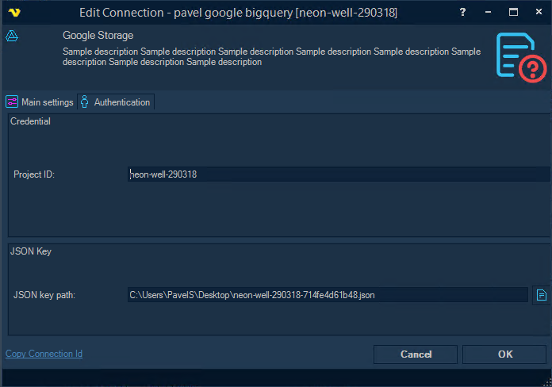
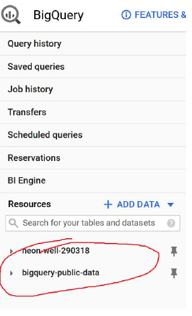
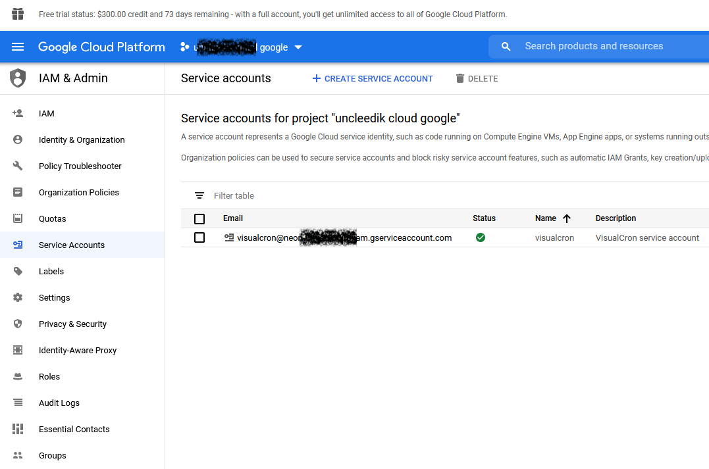
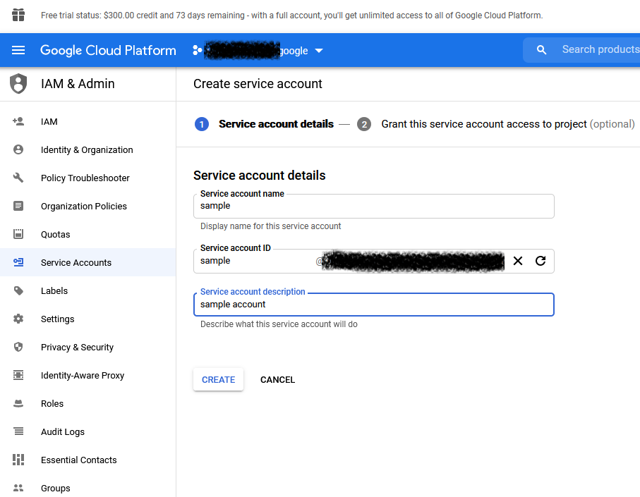
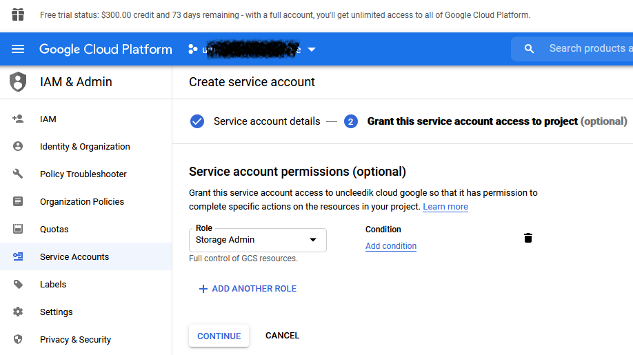
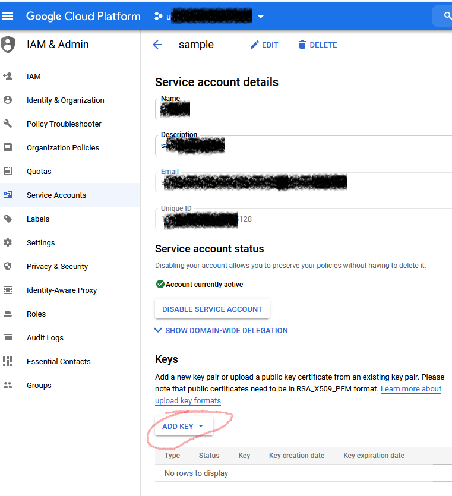

## Connection - Google Cloud

The Google Cloud Connection stores connect and authentication properties for Google Cloud services. It uses a Google service account JSON key file for authentication rather than OAuth credentials.

Google Cloud is a suite of cloud computing services offered by Google. VisualCron uses this connection to interact with Google Cloud Storage buckets and Google BigQuery datasets.

The Google Cloud Connection is used in the following Tasks:

* BigQuery - Run query
* BigQuery - Fill table
* Google Storage Tasks

**Manage Connections > Add > Google Cloud > Common settings** tab

**Name**

The name of the Connection to uniquely identify it.

**Group**

The group that the connection is a part of.

**Timeout**

The connection timeout in seconds. Connection will fail after this time period.

**Code page**

Code page being used.

**Manage Connections > Add > Google Cloud > Connection settings** tab

**Project ID**

The Google Cloud project identifier. This can be a public project such as `bigquery_public_data` (when working with public data in Google BigQuery) or your own project ID. The project ID can be found in the Google Cloud Console or BigQuery Console.

**JSON key path**

The file path to the service account JSON key file used to authenticate with Google Cloud. This file is downloaded from Google Cloud IAM when a service account key is created. It must be in JSON format. See the **How to create a JSON key file** section below for instructions.

:::tip Note

There is no way to retrieve the JSON key file from the Google Cloud Console after initial creation. If the file is lost, you must disable the existing key and create a new one.

:::
 
**How to create a JSON key file**

A service account JSON key file is required to authenticate VisualCron with Google Cloud services. Follow these steps to create one:

1. Go to Google Cloud IAM & Admin for your specific project.

2. Click **+ Create Service Account** and fill in the account details.

3. Select the appropriate role for the service account. For Google Cloud Storage access, select the relevant role under the **Cloud Storage** group.

4. Open the created service account, navigate to the **Keys** tab, and click **Add Key**. Select **JSON** as the key type.

5. The JSON key file will be downloaded automatically as soon as it is created. Enter the path to this file in the **JSON key path** field of the Connection settings tab.
