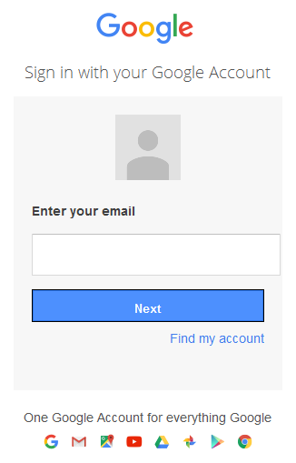
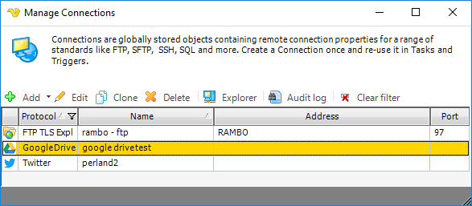
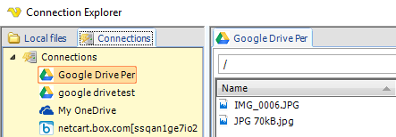

## Connection - Google Drive

The Google Drive Connection stores connect and login properties for the Google cloud service Google Drive.
 
Google Drive is a cloud service from Google. You can use VisualCron to sync files between that service and a local folder.
 
The Google Drive Connection is used in the following Cloud Tasks:

* [Cloud - Upload file(s)](../../client-user-interface/server/job-tasks/cloud-transfer-tasks/upload-file)
* [Cloud - List item(s)](../../client-user-interface/server/job-tasks/cloud-transfer-tasks/list-item)
* [Cloud - Download file(s)](../../client-user-interface/server/job-tasks/cloud-transfer-tasks/download-file)
* [Cloud - Create folder](../../client-user-interface/server/job-tasks/cloud-transfer-tasks/create-folder)
* [Cloud - Delete item(s)](../../client-user-interface/server/job-tasks/cloud-transfer-tasks/delete-item)
 
**Manage Connections > Add > Google Drive > Common settings** tab

**Name**

The name of the Connection to uniquely identifying it.

**Group**

The group that the connection is a part of

**Timeout**

The connection timeout in seconds. Connection will fail after this time period.
 
**Code page**

Code page being used.
 
**Manage Connections > Add > Google Drive > Connection settings** tab

**Use VisualCron registered app**

If you use your own application, you need to uncheck the *Use VisualCron registered app* box (checked as default). If you want to use your own app, then click the Setup account link to create or enter in your own *Client Id* and *Client secret* information.
 
**Client Id**

Client Id which you gets when registering the application at [Google Drive](https://console.developers.google.com/apis).
 
**Client secret**

Client secret which you gets when registering the application at [Google Drive](https://console.developers.google.com/apis).
 
**How to create a connection using your own Google Drive app**

If you e.g. want your own logo and/or use your own permissions, you may choose to use your own app.
If you use your own application you need to uncheck* Use VisualCron registered app* in the **Google Drive > Authentication** tab then click *Setup account* or go to: [https://console.developers.google.com/apis](https://console.developers.google.com/apis)
 
**How to create a connection using the VisualCron app**

In the **Google Drive > Authentication** tab, the *Use VisualCron registered app* box will be checked (default).

1. Click the *Authenticate* link. In the Google authentication window, enter your Google login credentials or approve handling (if you are already logged in to Google) of files in Google Drive.

3. Once the authentication is performed, click OK to save the connection
4. The connection can be tested by right-click and select *Explorer* in the **Server > Global objects > Connections** tab

5. Double-click on the Google Drive Connection in the **Tools > Explore > Connection Explorer > Connections** window to verify the current files in your Google Drive folder or in [https://drive.google.com/drive/my-drive](https://drive.google.com/drive/my-drive).

**Manage Connections > Add > Google Drive > Proxy** tab

**Proxy type**

Select the proxy type to be used.
 
**Address**

The host name or IP address of the proxy server.
 
**Port**

The port of the proxy server.
 
**Use credentials**

The credentials that are associated with the account.
 
**Domain**

The name of the domain to be created.
 
**Username**

The user name to access the proxy server.
 
**Password**

The password to access the proxy server.