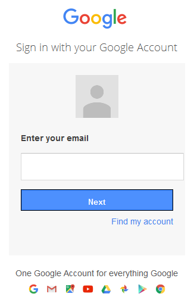
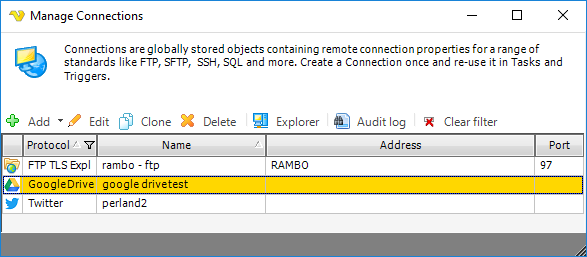
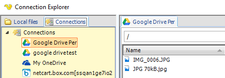

## Connection - Google Drive

The Google Drive Connection stores connect and login properties for the Google cloud service Google Drive.
 
Google Drive is a cloud storage and file synchronization service developed by Google. It allows users to store files in the cloud, share files, and collaborate. You can use VisualCron to transfer files between Google Drive and a local folder, or between Google Drive and other cloud services.
 
The Google Drive Connection is used in the following Cloud Tasks:

* [Cloud - Upload file(s)](../../client-user-interface/server/job-tasks/cloud-transfer-tasks/upload-file)
* [Cloud - List item(s)](../../client-user-interface/server/job-tasks/cloud-transfer-tasks/list-item)
* [Cloud - Download file(s)](../../client-user-interface/server/job-tasks/cloud-transfer-tasks/download-file)
* [Cloud - Create folder](../../client-user-interface/server/job-tasks/cloud-transfer-tasks/create-folder)
* [Cloud - Delete item(s)](../../client-user-interface/server/job-tasks/cloud-transfer-tasks/delete-item)
 
**Manage Connections > Add > Google Drive > Common settings** tab

**Name**

The name of the Connection to uniquely identify it.

**Group**

The group that the connection is a part of.

**Timeout**

The connection timeout in seconds. Connection will fail after this time period.
 
**Code page**

Code page being used.
 
**Manage Connections > Add > Google Drive > Connection settings** tab

**App key**

The App key (Client ID) obtained when registering your application at [Google Cloud Console](https://console.developers.google.com/apis).
 
**App secret**

The App secret (Client secret) obtained when registering your application at [Google Cloud Console](https://console.developers.google.com/apis).
 
**Redirect URL**

The OAuth redirect URL used during authentication. The default value is `http://localhost:9999`. This URL must match the redirect URI configured in your Google Cloud Console app settings.

**Auto-accept server certificates**

When checked, VisualCron automatically accepts server certificates without prompting. Enabled by default.

**How to create a Google Drive connection**

To use Google Drive with VisualCron, you must register an application in the Google Cloud Console and authenticate it with your Google account.

1. Click the *Create an account* link or go to: [https://console.developers.google.com/apis](https://console.developers.google.com/apis) to create and register your application.
2. Enable the Google Drive API for your project and create OAuth 2.0 credentials.
3. Copy the App key (Client ID) and App secret (Client secret) from your registered app and enter them in the **Connection settings** tab.
4. Set the Redirect URI in your Google Cloud Console app to match the **Redirect URL** field value (default: `http://localhost:9999`).
5. Click the *Authenticate* link. In the Google authentication window, enter your Google login credentials or approve access (if you are already logged in to Google) to allow VisualCron to handle files in your Google Drive.

6. Once the authentication is complete, click OK to save the connection.
7. The connection can be tested by right-clicking and selecting *Explorer* in the **Server > Global objects > Connections** tab.

8. Double-click on the Google Drive Connection in the **Tools > Explore > Connection Explorer > Connections** window to verify the current files in your Google Drive folder or browse directly at [https://drive.google.com/drive/my-drive](https://drive.google.com/drive/my-drive).

**Manage Connections > Add > Google Drive > Proxy** tab

**Proxy type**

Select the proxy type to be used.
 
**Address**

The host name or IP address of the proxy server.
 
**Port**

The port of the proxy server.
 
**Use credentials**

The credentials that are associated with the account.
 
**Domain**

The name of the domain to be created.
 
**Username**

The user name to access the proxy server.
 
**Password**

The password to access the proxy server.
