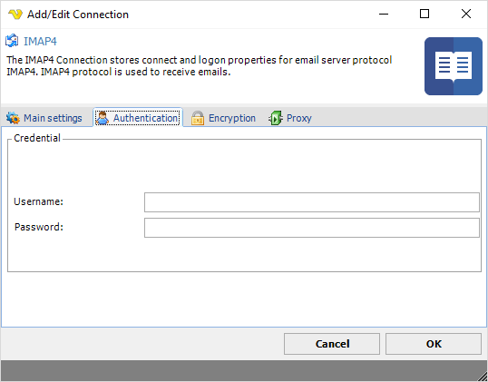

## Connection - IMAP4

The IMAP Connection stores connect and logon properties for the email server protocol IMAP4. The IMAP4 protocol is used to receive email. The IMAP Connection is used in the Email Trigger.
 
**Manage Connections > Add > IMAP4 > Main settings** tab

**Test**

It is possible to test the connection once you have set all settings. Click the Test button to start the test.
 
**Name**

The unique name for the Connection.
 
**Address**

The DNS name or IP address of the email server.
 
**Port**

The port used by the email server. Please note that it should match the port of the encryption. Normally encrypted connections uses port 993 while email servers with no encryption uses port 143.
 
**Timeout**

The connection timeout in seconds. Connection will fail after this time is passed.
 
**Code page**

The table of values that describes the desired character set. Currently this is overridden by the code page in the Task.
 
### Default settings for some servers:

**Office 365**

[https://support.office.com/en-nz/article/Settings-for-POP-and-IMAP-access-for-Office-365-for-business-or-Microsoft-Exchange-accounts-7fc677eb-2491-4cbc-8153-8e7113525f6c](https://support.office.com/en-nz/article/Settings-for-POP-and-IMAP-access-for-Office-365-for-business-or-Microsoft-Exchange-accounts-7fc677eb-2491-4cbc-8153-8e7113525f6c)
 
Main settings
* Address: outlook.office365.com
* Port: 993
 
Encryption
* Cryptographic protocol: SSL
 
**Gmail**

* Address: imap.gmail.com
* Port: 993
 
Encryption
* Cryptographic protocol: SSL
* SSL Version: 3
 
**Manage Connections > Add > IMAP4 > Authentication** tab

**Username**

The user name for the email account.
 
**Password**

The password for the email account.
 
**Alias**

Please note that Alias, accessing a shared mailbox is not supported in the IMAP protocol. Use Exchange Connection instead.
 
 
**Manage Connections > Add > IMAP4 > Encryption** tab

**Cryptographic protocol**

Encryption protocol to use; No encryption, SSL or TLS.
 
**Security mode**

Explicit or Implict encryption.
 
**Allowed SSL/TLS versions**

Some IMAP4 servers require certain versions of SSL/TLS. Check the versions that are allowed. Sometimes it is necessary to specify the specific allowed version.
 
**Manage Connections > Add > IMAP4 > Proxy** tab

**Proxy type**

Select the proxy type to be used.
 
**Address**

The host name or IP address of the proxy server.
 
**Port**

The port of the proxy server.
 
**Use credentials**

Text ...
 
**Domain**

The name of the domain to be created.
 
**Username**

The user name to access the proxy server.
 
**Password**

The password to access the proxy server.