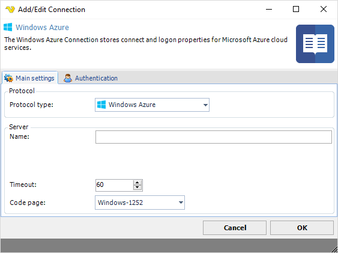
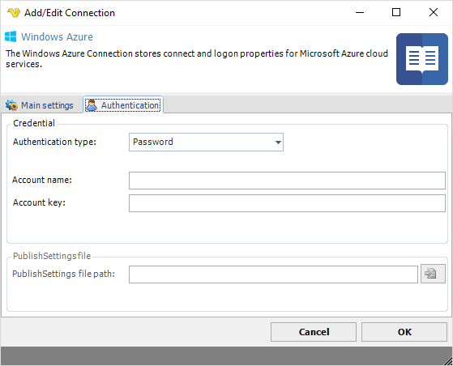

## Connection - Microsoft Azure

The Microsoft Azure Connection stores connect and logon properties for Microsoft Azure cloud services.
 
The Microsoft Azure Connection is used in the following Tasks:

**Cloud Tasks**
 
* [Cloud - Upload file(s)](clouduploadfiles)
* [Cloud - List item(s)](cloudlistitems)
* [Cloud - Download file(s)](clouddownloadfiles)
* [Cloud - Create folder](cloudcreatefolder)
* [Cloud - Delete item(s)](clouddeleteitems)
 
**Azure Tasks**

* [Azure - Start VM](azurestartvm)
* [Azure - Stop VM](azurestopvm)
* [Azure - Restart VM](azurerestartvm)
* [Azure - Update VM](azureupdatevm)
* [Azure - Create VM](azurecreatevm)
* [Azure - Start web site](azurestartwebsite)
* [Azure - Stop web site](azurestopwebsite)
* [Azure - Restart web site](azurerestartwebsite)
* [Azure - Remove web site](azureremovewebsite)
* [Azure - Create web site](azurecreatewebsite)
 
**Manage Connections > Add > Windows Azure > Main settings** tab

**Name**

The unique name for the Connection
 
**Address**

This field is not used.
 
**Timeout**

The connection timeout in seconds. Connection will fail after this time period.
 
**Code page**

Code page being used.
 
**Manage Connections > Add > Windows Azure > Authentication** tab

**Authentication type**

For Cloud files use Password and for Azure Tasks use Public key (publish settings file) for Classic - for newer RM handling please use Application. See later down how to download.
 
**Account name**

The Account name for the account. Please note that when using Azure Tasks (not Cloud) you need to use publish settings file for authentication.
 
**Account key**

The Account key for the account. Please note that when using Azure Tasks (not Cloud) you need to use publish settings file for authentication.
 
 
**Downloading publish settings file**
1. Open Powershell
2. Type connect-azaccount - logon
3. Type Get-AzurePublishSettingsFile

4. The browser will open. Select the subscription and click Validate and then click "Download Publish settings"

### Application auth

Create Application here: [https://portal.azure.com/#blade/Microsoft_AAD_RegisteredApps/ApplicationsListBlade](https://portal.azure.com/#blade/Microsoft_AAD_RegisteredApps/ApplicationsListBlade)
 
*In the Azure portal - go to subscriptions and add Contributor role to the application*

### Troubleshooting

**HTTP request failed with code 400, message is The value for one of the HTTP headers is not in the correct format.**

This probably means that you are using Blobs or "cold" storage - we do not support that at the moment.
 
**ResourceNotFound: No deployments were found. You need to select the right AzureSubscription.**

[https://stackoverflow.com/questions/35077602/why-does-new-azurereservedip-return-resourcenotfound-no-deployments-were-found](https://stackoverflow.com/questions/35077602/why-does-new-azurereservedip-return-resourcenotfound-no-deployments-were-found)
 
**No Such Host Is Known**

This means that the storage account name is wrong.

