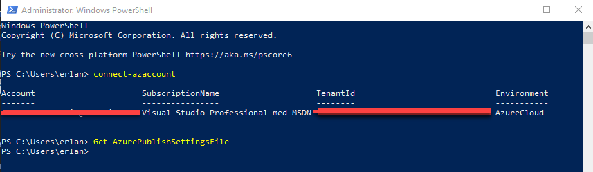
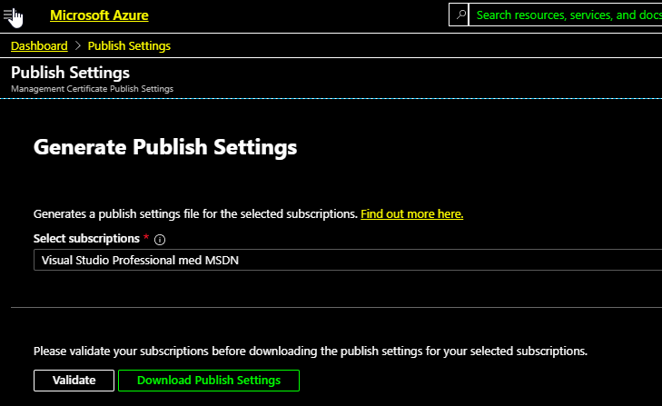
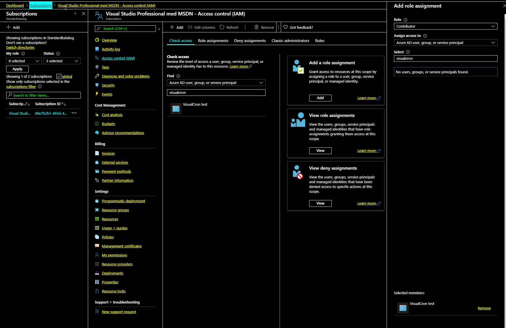

## Connection - Microsoft Azure

The Microsoft Azure Connection stores connect and logon properties for Microsoft Azure cloud services.
 
The Microsoft Azure Connection is used in the following Tasks:

**Cloud Tasks**
 
* [Cloud - Upload file(s)](../../client-user-interface/server/job-tasks/cloud-transfer-tasks/upload-file)
* [Cloud - List item(s)](../../client-user-interface/server/job-tasks/cloud-transfer-tasks/list-item)
* [Cloud - Download file(s)](../../client-user-interface/server/job-tasks/cloud-transfer-tasks/download-file)
* [Cloud - Create folder](../../client-user-interface/server/job-tasks/cloud-transfer-tasks/create-folder)
* [Cloud - Delete item(s)](../../client-user-interface/server/job-tasks/cloud-transfer-tasks/delete-item)
 
**Azure Tasks**

* [Azure - Start VM](../../client-user-interface/server/job-tasks/azure-tasks/start-vm)
* [Azure - Stop VM](../../client-user-interface/server/job-tasks/azure-tasks/stop-vm)
* [Azure - Restart VM](../../client-user-interface/server/job-tasks/azure-tasks/restart-vm)
* [Azure - Update VM](../../client-user-interface/server/job-tasks/azure-tasks/update-vm)
* [Azure - Create VM](../../client-user-interface/server/job-tasks/azure-tasks/create-vm)
* [Azure - Start web site](../../client-user-interface/server/job-tasks/azure-tasks/start-web-site)
* [Azure - Stop web site](../../client-user-interface/server/job-tasks/azure-tasks/stop-web-site)
* [Azure - Restart web site](../../client-user-interface/server/job-tasks/azure-tasks/restart-web-site)
* [Azure - Remove web site](../../client-user-interface/server/job-tasks/azure-tasks/remove-web-site)
* [Azure - Create web site](../../client-user-interface/server/job-tasks/azure-tasks/create-web-site)
 
**Manage Connections > Add > Windows Azure > Main settings** tab

**Name**

The unique name for the Connection

**Group**

The group that the connection is a part of
 
**Timeout**

The connection timeout in seconds. Connection will fail after this time period.
 
**Code page**

Code page being used.
 
**Manage Connections > Add > Windows Azure > Connection settings** tab

**Authentication type**

For Cloud files use Password and for Azure Tasks use Public key (publish settings file) for Classic - for newer RM handling please use Application. See later down how to download.
 
**Storage Account**

The Account name for the account. Please note that when using Azure Tasks (not Cloud) you need to use publish settings file for authentication.
 
**Account key**

The Account key for the account. Please note that when using Azure Tasks (not Cloud) you need to use publish settings file for authentication.
 
 
**Downloading publish settings file**
1. Open Powershell
2. Type connect-azaccount - logon
3. Type Get-AzurePublishSettingsFile

4. The browser will open. Select the subscription and click Validate and then click "Download Publish settings"

### Application auth

Create Application here: [https://portal.azure.com/#blade/Microsoft_AAD_RegisteredApps/ApplicationsListBlade](https://portal.azure.com/#blade/Microsoft_AAD_RegisteredApps/ApplicationsListBlade)
 
*In the Azure portal - go to subscriptions and add Contributor role to the application*

### Troubleshooting

**HTTP request failed with code 400, message is The value for one of the HTTP headers is not in the correct format.**

This probably means that you are using Blobs or "cold" storage - we do not support that at the moment.
 
**ResourceNotFound: No deployments were found. You need to select the right AzureSubscription.**

[https://stackoverflow.com/questions/35077602/why-does-new-azurereservedip-return-resourcenotfound-no-deployments-were-found](https://stackoverflow.com/questions/35077602/why-does-new-azurereservedip-return-resourcenotfound-no-deployments-were-found)
 
**No Such Host Is Known**

This means that the storage account name is wrong.

