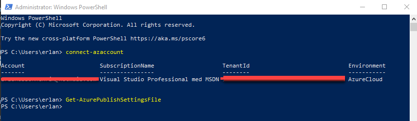
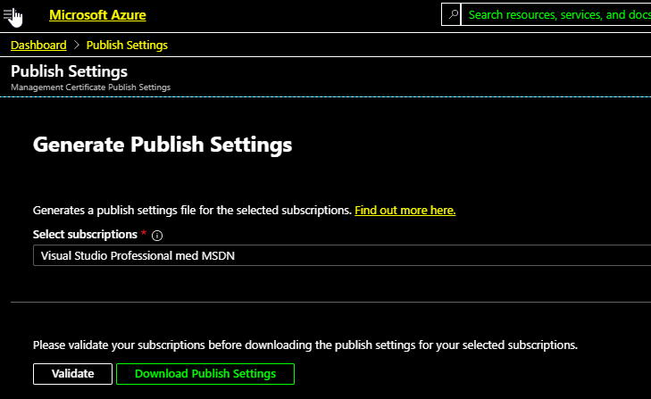
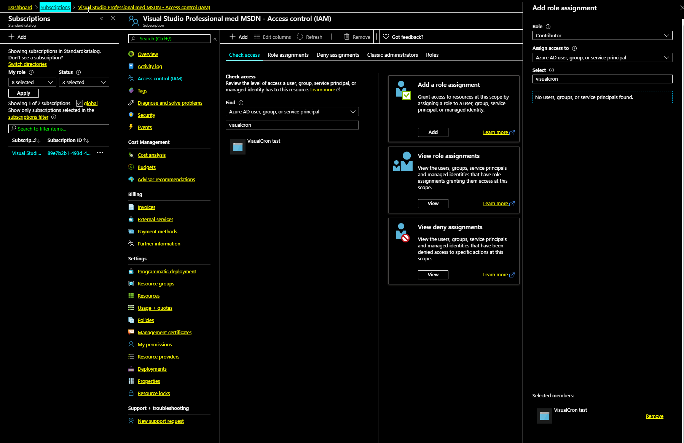

## Connection - Microsoft Azure

The Microsoft Azure Connection stores connect and logon properties for Microsoft Azure cloud services.
 
The Microsoft Azure Connection is used in the following Tasks:

**Cloud Tasks**
 
* [Cloud - Upload file(s)](../../client-user-interface/server/job-tasks/cloud-transfer-tasks/upload-file)
* [Cloud - List item(s)](../../client-user-interface/server/job-tasks/cloud-transfer-tasks/list-item)
* [Cloud - Download file(s)](../../client-user-interface/server/job-tasks/cloud-transfer-tasks/download-file)
* [Cloud - Create folder](../../client-user-interface/server/job-tasks/cloud-transfer-tasks/create-folder)
* [Cloud - Delete item(s)](../../client-user-interface/server/job-tasks/cloud-transfer-tasks/delete-item)
 
**Azure Tasks**

* [Azure - Start VM](../../client-user-interface/server/job-tasks/azure-tasks/start-vm)
* [Azure - Stop VM](../../client-user-interface/server/job-tasks/azure-tasks/stop-vm)
* [Azure - Restart VM](../../client-user-interface/server/job-tasks/azure-tasks/restart-vm)
* [Azure - Update VM](../../client-user-interface/server/job-tasks/azure-tasks/update-vm)
* [Azure - Create VM](../../client-user-interface/server/job-tasks/azure-tasks/create-vm)
* [Azure - Start web site](../../client-user-interface/server/job-tasks/azure-tasks/start-web-site)
* [Azure - Stop web site](../../client-user-interface/server/job-tasks/azure-tasks/stop-web-site)
* [Azure - Restart web site](../../client-user-interface/server/job-tasks/azure-tasks/restart-web-site)
* [Azure - Remove web site](../../client-user-interface/server/job-tasks/azure-tasks/remove-web-site)
* [Azure - Create web site](../../client-user-interface/server/job-tasks/azure-tasks/create-web-site)
 
**Manage Connections > Add > Microsoft Azure > Common settings** tab

**Name**

The name of the Connection to uniquely identify it.

**Group**

The group that the connection is a part of.
 
**Timeout**

The connection timeout in seconds. Connection will fail after this time period.
 
**Code page**

Code page being used.
 
**Manage Connections > Add > Microsoft Azure > Connection settings** tab

**Authentication type**

The authentication method used to connect to Azure. Available options:

* _Password_ - authenticates using a Storage Account name and key. Use this for Cloud Tasks (Azure Blob Storage).
* _Application_ - authenticates using an Azure Active Directory application (service principal) with an Application ID, Application key, and Tenant ID. Use this for both Cloud Tasks and Azure Tasks.
* _Shared Access Signature_ - authenticates using a SAS token. Use this for Cloud Tasks when a scoped, time-limited access token is preferred.

The fields displayed in the Credentials section change depending on the selected authentication type.

**Storage Account** _(Password authentication only)_

The Azure Storage Account name.

**Key** _(Password authentication only)_

The access key for the Storage Account.

**Application id** _(Application authentication only)_

The Application (client) ID of the registered Azure Active Directory app.

**Application key** _(Application authentication only)_

The client secret (application key) for the registered Azure Active Directory app.

**SAS token** _(Shared Access Signature authentication only)_

The Shared Access Signature token for the Azure Storage Account.

**Tenant Id** _(Application authentication only)_

The Directory (tenant) ID of the Azure Active Directory tenant where the application is registered.

**Account key**

The Account key for the account. Please note that when using Azure Tasks (not Cloud) you need to use publish settings file for authentication.
 
**Downloading publish settings file**
1. Open Powershell
2. Type connect-azaccount - logon
3. Type Get-AzurePublishSettingsFile

4. The browser will open. Select the subscription and click Validate and then click "Download Publish settings"

**Setup app** _(Application authentication only)_

Click this link to open the Azure portal to register or manage your Azure Active Directory application: [https://portal.azure.com/#blade/Microsoft_AAD_RegisteredApps/ApplicationsListBlade](https://portal.azure.com/#blade/Microsoft_AAD_RegisteredApps/ApplicationsListBlade)

In the Azure portal, navigate to your subscription and assign the **Contributor** role to the application.

**Upload BlockBlob block size (bytes)**

The block size in bytes used when uploading to Azure Block Blob storage. Minimum: 4096, maximum: 4,194,304 (4 MB), default: 4096.

**Use SSL**

When checked, the connection uses SSL encryption for data transfer.

**Manage Connections > Add > Microsoft Azure > Proxy** tab

**Proxy type**

Select the proxy type to be used.

**Address**

The host name or IP address of the proxy server.

**Port**

The port of the proxy server.

**Use credentials**

The credentials that are associated with the account.

**Domain**

The name of the domain to be created.

**Username**

The user name to access the proxy server.

**Password**

The password to access the proxy server.

### Troubleshooting

**HTTP request failed with code 400, message is The value for one of the HTTP headers is not in the correct format.**

This probably means that you are using Blobs or "cold" storage - we do not support that at the moment.
 
**ResourceNotFound: No deployments were found. You need to select the right AzureSubscription.**

[https://stackoverflow.com/questions/35077602/why-does-new-azurereservedip-return-resourcenotfound-no-deployments-were-found](https://stackoverflow.com/questions/35077602/why-does-new-azurereservedip-return-resourcenotfound-no-deployments-were-found)
 
**No Such Host Is Known**

This means that the storage account name is wrong.
