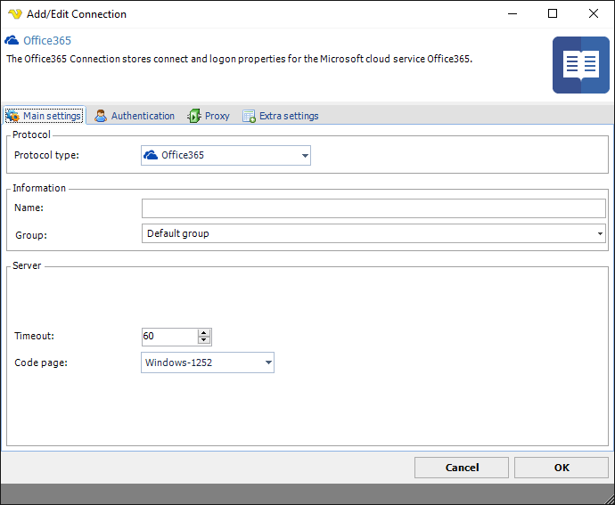
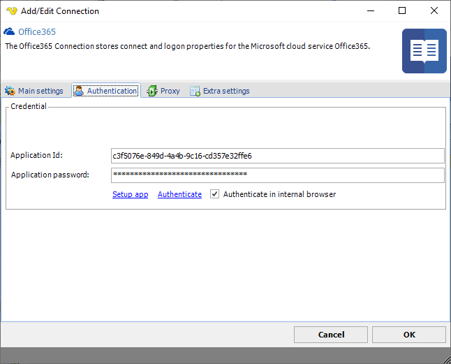
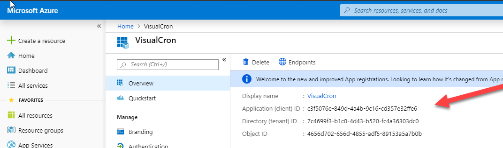
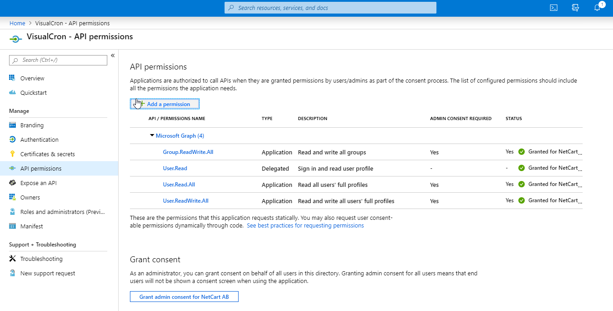
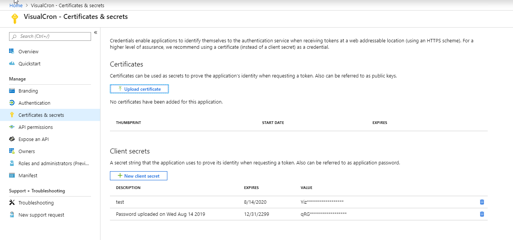
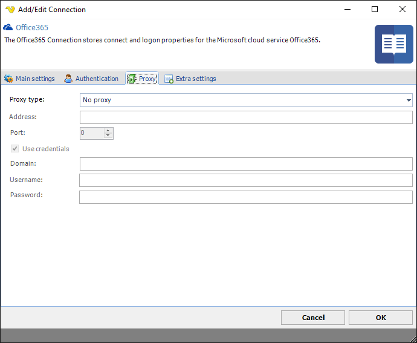
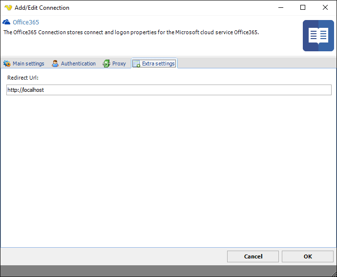
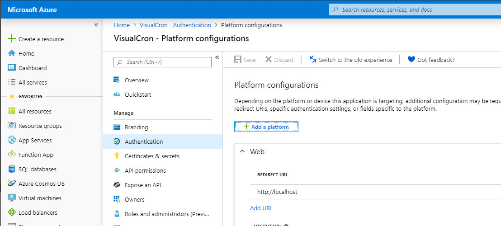

## Connection - Office365

The Office 365 Connection is used in the following places:
 
* Office Tasks
* Microsoft Teams Trigger
* Microsoft Teams Task

**Application Id**

The application Id is the id you get from when you setup your application in Azure:

**Application password**
 
**Setup app**
 
Needed API permissions:

**Authenticate**
 
You setup the password/client secret here:

**Redirect Url**

You need to match the existing one in the Azure portal:

### Troubleshooting
 
**Token null / empty**

Possible reasons for this error:
1.The Extra settings redirect uri is not matching the O365 redirect uri
2.There is a software already listening on the given url in extra settings (for example [http://localhost](http://localhost) is normally taken by a local web server as default port is 80)
3.There is a firewall on the VC server blocking the incoming redirect from the web browser
4.The authentication goes wrong – wrong password, aborted auth window, crash in O365 web page