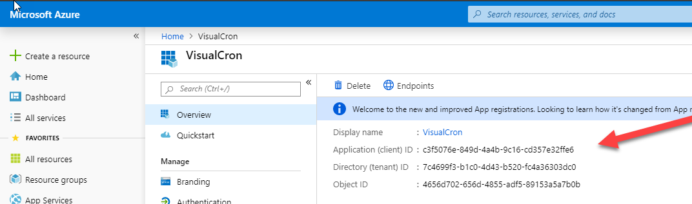
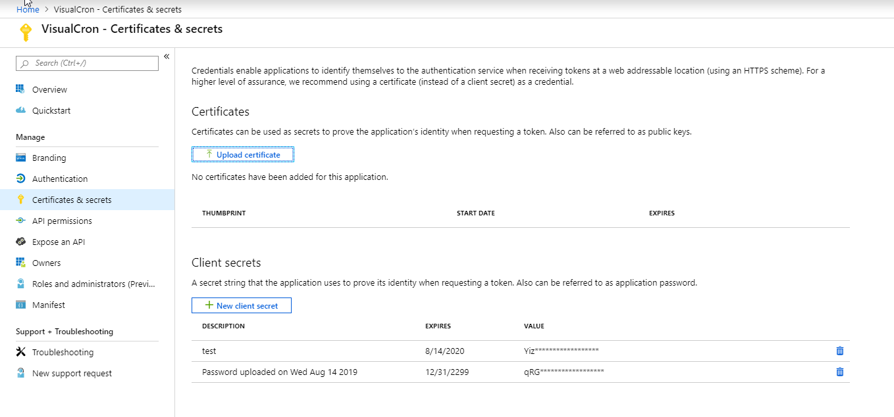
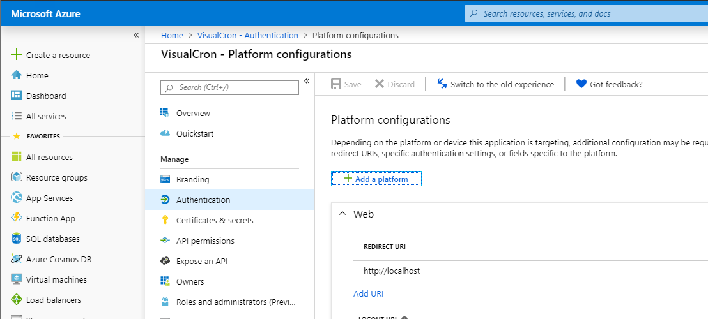
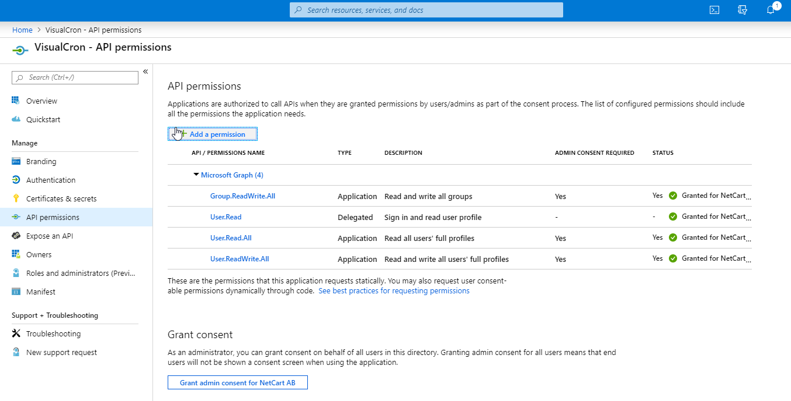
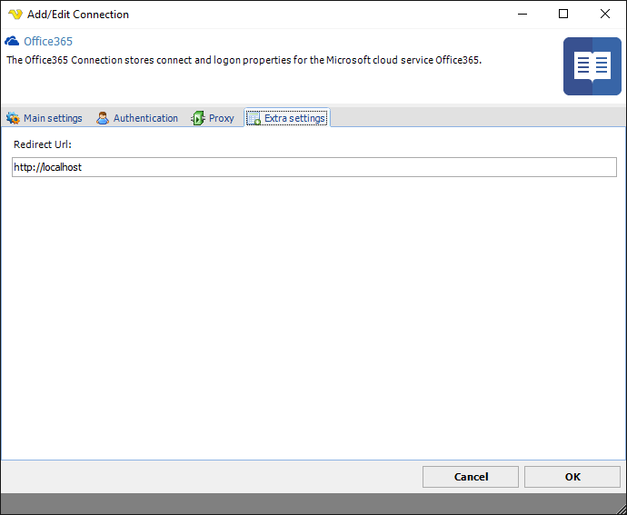
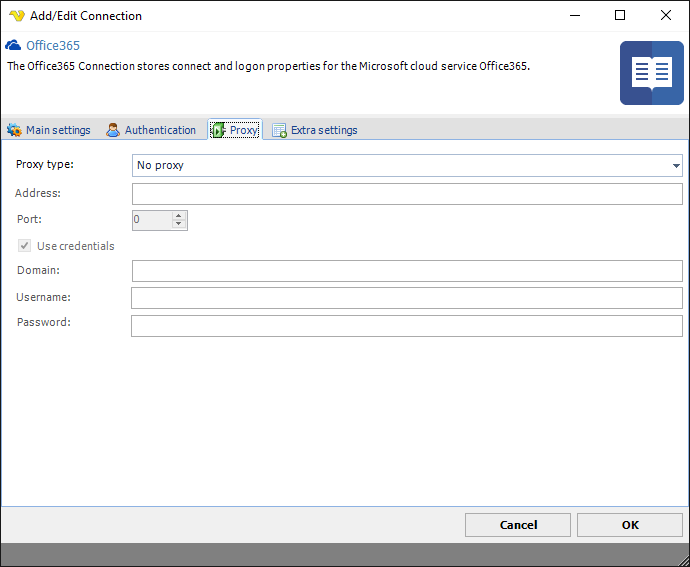

1---
sidebar_label: 'Connection - Office365'
hide_title: 'true'
---

## Connection - Office365

The Office 365 Connection stores connect and authentication properties for Microsoft Office 365 services. It uses OAuth authentication via an Azure Active Directory registered application.

The Office 365 Connection is used in the following places:
 
* Office Tasks
* Microsoft Teams Trigger
* Microsoft Teams Task

**Manage Connections > Add > Office365 > Common settings** tab

**Name**

The name of the Connection to uniquely identify it.

**Group**

The group that the connection is a part of.

**Timeout**

The connection timeout in seconds. Connection will fail after this time period.
 
**Code page**

Code page being used.

**Manage Connections > Add > Office365 > Connection settings** tab

The Connection settings tab contains two sections: **Credentials** and **App settings**.

### Credentials

**Client ID**

The Application (client) ID obtained when registering your application in Azure Active Directory. This value is displayed in the Azure portal under your registered app's overview.

**Client Secret**

The client secret created for the registered Azure Active Directory application.

 
**Redirect URI**

The redirect URI used during OAuth authentication. This value must match exactly the redirect URI configured for your registered app in the Azure portal.

**Auto-accept server certificates**

When checked, VisualCron automatically accepts server certificates without prompting. Enabled by default.

**Create an account**

Click this link to open the Azure portal to register or manage your Azure Active Directory application.

When setting up your application, ensure the following API permissions are granted:

**Authenticate**
 
Click this link to initiate the OAuth authentication flow. A browser window will open for you to sign in with your Microsoft account and grant VisualCron access to your Office 365 services. Once authentication is complete, the refresh token is stored in the connection.

### App settings

**Redirect Url**

The redirect URL used during OAuth authentication. Must match the redirect URI registered in the Azure portal.

**Tenant Id**

The Directory (tenant) ID of the Azure Active Directory tenant where the application is registered.

**Tenant Name**

The display name of the Azure Active Directory tenant.

**Tenant Primary Domain**

The primary domain of the Azure Active Directory tenant (e.g. `yourdomain.onmicrosoft.com`).

**Manage Connections > Add > Office365 > Proxy** tab

**Proxy type**

Select the proxy type to be used.

**Address**

The host name or IP address of the proxy server.

**Port**

The port of the proxy server.

**Use credentials**

The credentials that are associated with the account.

**Domain**

The name of the domain to be created.

**Username**

The user name to access the proxy server.

**Password**

The password to access the proxy server.

**Token null / empty**

Possible reasons for this error:

1. The Redirect URI in the App settings tab does not match the redirect URI configured in the Azure portal.
2. There is another application already listening on the redirect URL (for example, `http://localhost` on port 80 may be taken by a local web server).
3. A firewall on the VisualCron server is blocking the incoming redirect from the web browser.
4. The authentication failed — wrong password, aborted authentication window, or a crash in the Office 365 web page.
