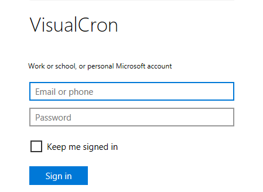
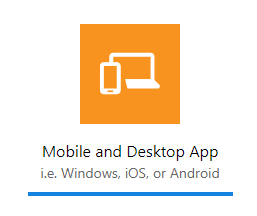
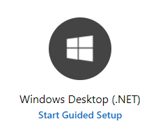
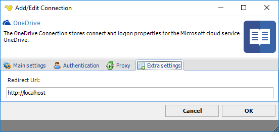

## Connection - OneDrive

The OneDrive Connection stores connect and logon properties for the Microsoft cloud service OneDrive.
 
You can use VisualCron to sync files between the OneDrive service and a local folder.
 
The OneDrive Connection is used in the Cloud Tasks:

* [Cloud - Upload file(s)](../../client-user-interface/server/job-tasks/cloud-transfer-tasks/upload-file)
* [Cloud - List item(s)](../../client-user-interface/server/job-tasks/cloud-transfer-tasks/list-item)
* [Cloud - Download file(s)](../../client-user-interface/server/job-tasks/cloud-transfer-tasks/download-file)
* [Cloud - Create folder](../../client-user-interface/server/job-tasks/cloud-transfer-tasks/create-folder)
* [Cloud - Delete item(s)](../../client-user-interface/server/job-tasks/cloud-transfer-tasks/delete-item)
 
**Manage Connections > Add > OneDrive > Main settings** tab

**Name**

The name of the Connection to uniquely identifying it.

**Group**

The group that the connection is a part of
 
**Timeout**

The connection timeout in seconds. Connection will fail after this time period.
 
**Code page**

Code page being used.
 
**Manage Connections > Add > OneDrive > Connection settings** tab

**Use VisualCron registered app**

If you use your own application, you need to uncheck the Use VisualCron registered app box (checked as default). If you want to use your own app, then click the Setup account link to create or enter in your own Application Id and Application password information.
 
**Application Id**

Application Id which you gets when registering application at **OneDrive**.
 
**Application password**

Application password which you gets when registering application at **OneDrive**.
 
**Setup app**

In order to connect authentication to an account, an app has to be created at the cloud provider. See [https://portal.azure.com/#blade/Microsoft_AAD_RegisteredApps/ApplicationsListBlade](https://portal.azure.com/#blade/Microsoft_AAD_RegisteredApps/ApplicationsListBlade)
 
**Authenticate**

Click on the Authenticate link to start authentication.

**How to create a connection using the VisualCron app**

In the **OneDrive > Authenticatio**n tab, the Use VisualCron registered app box shall be checked (default).

1. Click the *Authenticate* link. In the Microsoft authentication window, login using your Microsoft account

**How to create a connection using your own OneDrive app**

If you e.g. want your own logo and/or use your own permissions, you may choose to use your own app.
First, uncheck the *Use VisualCron registered app* box.
 
You can create the Microsoft OneDrive app either by click on the Setup app link or by sign in to the Microsoft Application Registration Portal: [https://apps.dev.microsoft.com/?mkt=en-US#/appList](https://apps.dev.microsoft.com/?mkt=en-US#/appList)
 
1. In the Microsoft Register your application page, click the Add an app button
2. Enter *Application Name* for the app, i.e. "VisualCron", check the *Guided Setup* box and press the *Create* button
3. Select type *Mobile and Desktop App*

4. Select technology *Windows Desktop (.NET)*

5. Go directly to *Test & Validate*. Scroll down to the bottom and click the View app registration button
6. Copy the Microsoft Application ID to **OneDrive > Authentication** tab Application ID field
7. In the Microsoft application, click the *Generate New Password* button
8. Copy the generated password to **OneDrive > Authentication** tab *Application password* field
9. In the Microsoft application, check the Redirect URL and, if necessary, update the **OneDrive > Extra settings > Redirect URL** information accordingly
10. Click the *Save* button in the Microsoft application
11. In the **OneDrive > Authentication** tab, click on the *Authenticate* link to test the authentication. In the Microsoft authentication window, login using your Microsoft account
 
**Manage Connections > Add > OneDrive > Extra settings** tab

**Create a OneDrive session (if not step 11, Authentication, above) is performed**

Before you can use the Connection in Tasks and Triggers you need to create a session and connect your OneDrive account to the Application you created. You do this by opening the Connection Explorer and double click on the OneDrive Connection. Enter the OneDrive account details and give the Application the permissions. You are now ready to use the Connection in Tasks and Triggers.