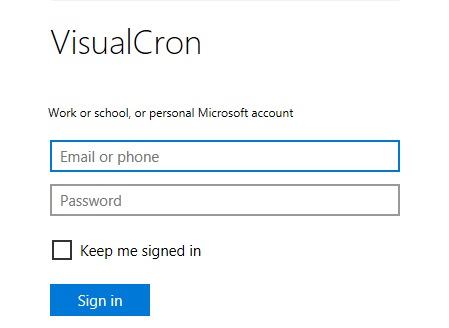

## Connection - OneDrive

The OneDrive Connection stores connect and login properties for the Microsoft cloud service OneDrive.

You can use VisualCron to sync files between the OneDrive service and a local folder, or to transfer files between OneDrive and other cloud services.

The OneDrive Connection is used in the following Cloud Tasks:

* [Cloud - Upload file(s)](../../client-user-interface/server/job-tasks/cloud-transfer-tasks/upload-file)
* [Cloud - List item(s)](../../client-user-interface/server/job-tasks/cloud-transfer-tasks/list-item)
* [Cloud - Download file(s)](../../client-user-interface/server/job-tasks/cloud-transfer-tasks/download-file)
* [Cloud - Create folder](../../client-user-interface/server/job-tasks/cloud-transfer-tasks/create-folder)
* [Cloud - Delete item(s)](../../client-user-interface/server/job-tasks/cloud-transfer-tasks/delete-item)
 
**Manage Connections > Add > OneDrive > Common settings** tab

**Name**

The name of the Connection to uniquely identify it.

**Group**

he group that the connection is a part of.
 
**Timeout**

The connection timeout in seconds. Connection will fail after this time period.
 
**Code page**

Code page being used.
 
**Manage Connections > Add > OneDrive > Connection settings** tab

**App Key**

The Application (client) ID obtained when registering your application in Azure Active Directory. See **How to create a OneDrive connection** below.

**App Secret**

The client secret obtained when registering your application in Azure Active Directory.

**Redirect Url**

The OAuth redirect URL used during authentication. This value must match the redirect URI configured for your app in the Azure portal. The default value is `http://localhost:9999`.

**Auto-accept server certificates**

When checked, VisualCron automatically accepts server certificates without prompting. Enabled by default.

**Create an account**

Click this link to open the Azure portal to register or manage your Azure Active Directory application: [https://portal.azure.com/#blade/Microsoft_AAD_RegisteredApps/ApplicationsListBlade](https://portal.azure.com/#blade/Microsoft_AAD_RegisteredApps/ApplicationsListBlade)

**Authenticate**

Click this link to initiate the OAuth authentication flow. A browser window will open for you to sign in with your Microsoft account and grant VisualCron access to your OneDrive. Once authentication is complete, click OK to save the connection.

**How to create a OneDrive connection**

To use OneDrive with VisualCron, you must register an application in the Azure Active Directory and authenticate it with your Microsoft account.

1. Click the *Create an account* link or go to: [https://portal.azure.com/#blade/Microsoft_AAD_RegisteredApps/ApplicationsListBlade](https://portal.azure.com/#blade/Microsoft_AAD_RegisteredApps/ApplicationsListBlade)
2. Register a new application and copy the **Application (client) ID** into the **App Key** field.
3. Under **Certificates & secrets**, create a new client secret and copy the value into the **App Secret** field.
4. Under **Authentication**, add a redirect URI and ensure it matches the **Redirect Url** field value (default: `http://localhost:9999`).
5. Click the *Authenticate* link and sign in with your Microsoft account to grant VisualCron access to your OneDrive.
6. Once authentication is complete, click OK to save the connection.

**Manage Connections > Add > OneDrive > Proxy** tab

**Proxy type**

Select the proxy type to be used.

**Address**

The host name or IP address of the proxy server.

**Port**

The port of the proxy server.

**Use credentials**

The credentials that are associated with the account.

**Domain**

The name of the domain to be created.

**Username**

The user name to access the proxy server.

**Password**

The password to access the proxy server.
