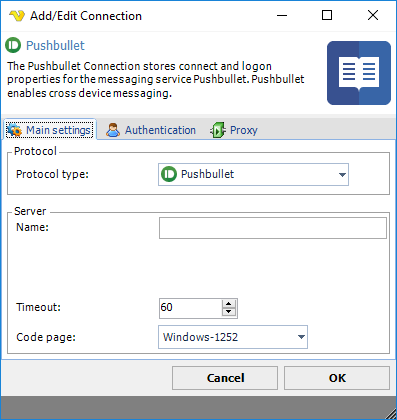
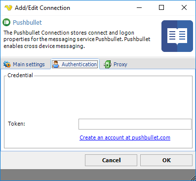

## Connection - Pushbullet

The Pushbullet Connection is used with the free service from [Pushbullet](https://www.pushbullet.com/) to send messages, files or SMS to any device.
 
The Pushbullet Connection is used in the following Tasks:

* [Pushbullet - Send message](pushbulletsendmessage)
* [Pushbullet - Send SMS](pushbulletsendsms)
* [Pushbullet - Send link](pushbulletsendlink)
* [Pushbullet - Send file](pushbulletsendfile)
* [Pushbullet - Upload file](pushbulletuploadfile)
 
**Manage Connections > Add > Pushbullet > Main settings** tab

**Name**

The name of the Connection to uniquely identifying it.
 
**Timeout**

The connection timeout in seconds. Connection will fail after this time period.
 
**Code page**

Code page being used.
 
**Manage Connections > Add > Pushbullet > Authentication** tab

**Token**

A string token you get when you create an account at [pushbullet.com](https://www.pushbullet.com/).
