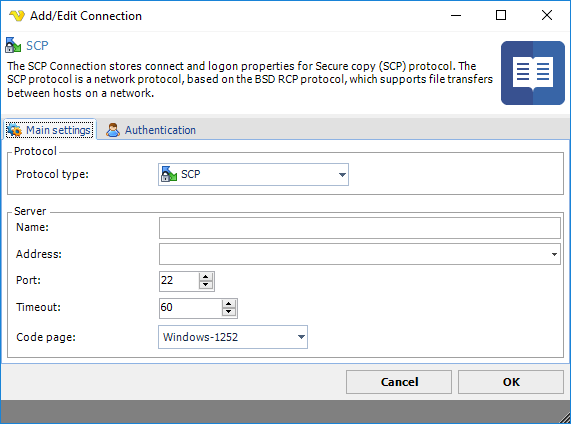
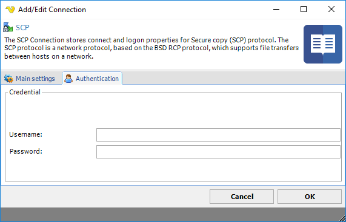

## Connection - SCP

The SCP Connection stores connect and logon properties for the Secure Copy (SCP) protocol. The SCP protocol is a [network protocol](networkprotocol), based on the [BSD](bsd) [RCP](rcp) protocol, which supports [file transfers](filetransfers) between hosts on a network.
 
SCP uses [Secure Shell](secureshell) (SSH) for data transfer and uses the same mechanisms for authentication, thereby ensuring the [authenticity](authenticity) and [confidentiality](confidentiality) of the [data in transit](dataintransit). A client can send (upload) files to a server, optionally including their basic attributes (permissions, timestamps). Clients can also request files or directories from a server (download). SCP runs over [TCP port](tcpport) 22 by default. Like RCP, there is no [RFC](rfc) that defines the specifics of the protocol.
 
In VisualCron, the SCP Connection is used in the [Net - FTP/FTPS/SFTP/SCP](netftpftpssftpscp) Task.
 
**Manage Connections > Add > SCP > Main settings** tab

**Name**

This is a descriptive name of the connection to distinguish from other connections.
 
**Address**

This is the host address to the server. It could be a DNS name or IP number.
 
**Port**

This is the remote connection port.
 
**Timeout**

The connection timeout in seconds. Connection will fail after this time is passed.
 
**Code page**

The table of values that describes the desired character set. Currently this is overridden by the code page in the Task.
 
**Manage Connections > Add > SCP > Authentication** tab

**Username**

The user name for the connection.
 
**Password**

The password for the connection.