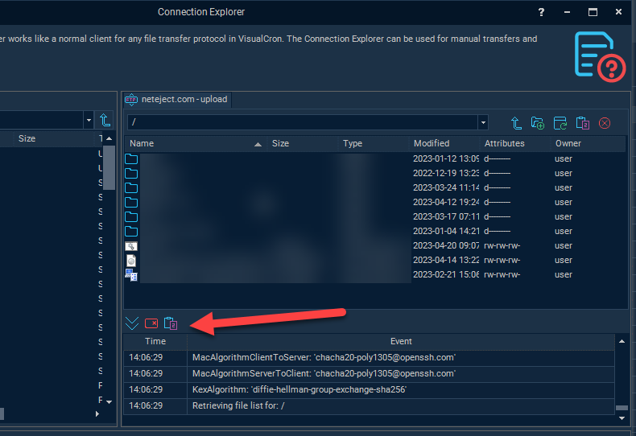
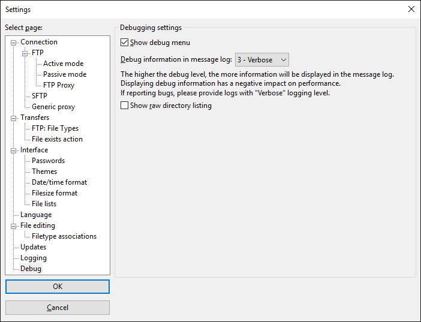

## Connection - SFTP

The SFTP Connection stores connect and logon properties for the transfer protocol SSH File Transfer Protocol (SFTP).
 
### About SFTP

SFTP (SSH File Transfer Protocol, often called Secure File Transfer Protocol) is a protocol that lets you transfer files securely over a SSH connection. SFTP is not compatible with FTP (File Transfer Protocol), which has it's own security enhancements such as FTPS, FTP over SSL. SFTP is built on top of SSH connection. SSH supports various authentication schemes such as password-based and public key. Public key authentication requires a private key which can be linked to from the Security tab. The VisualCron implementation supports 3-5 of SFTP protocol (versions 1, 2 are outdated and not used anywhere). Default port for SFTP is 22.
 
**Manage Connections > Add > SFTP > Common settings** tab

**Protocol type**

VisualCron is able to connect using regular FTP and FTPS (with implicit and explicit encryption). Regular FTP offer no security and information is not encrypted. VisualCron supports both SSL 3.0 and TLS (SSL 3.1). SSL and TLS are protocols layered above connection protocols (such as TCP/IP) but beneath application protocols (such as FTP) that provide encrypted, authenticated communications between a client and a server.
 
**Brute force test**

When using FTP and you are unsure of connection properties you can use the Brute force test tool to test all connection combinations. Note, brute force test option is only available for FTP protocol.

**Name**

This is a descriptive name of the connection to distinguish from other connections.

**Group**

The group that the connection is a part of
 
**Timeout**

The connection timeout in seconds. Connection will fail after this time is passed.
 
**Code page**

The table of values that describes the desired character set.

**Address**

This is the host address to the server. It could be a DNS name or IP number.
 
**Port**

This is the remote connection port. 

**Authentication type**

Authentication type can either by Password or Public key. For the FTP protocol only password authentication is available. When using SFTP together with public key authentication you have to specify a path to a private key file.
 
**Username**

The user name for the connection.
 
**Password**

The password for the connection.
 
**Public key vs password authentication**

Public key authentication means that you specify the private key and any password for that key. Private keys can be loaded in SSH1, OpenSSH, Binary, Putty, IETF (Putty and IETF use different formats here) formats.
 
**Private key group**

These options are only used when using Public key authentication.
 
**Private key path**

This is the private key you have received from server administrator. Click the File icon to browse for the private key.
 
**Password**

The password for the public key.
 
**Override authentication**

By authentication, normally both Password and Keyboard authentication are suggested. Some servers do not support the VisualCron _Auto authentication_. Uncheck this and check the specified type of authentication you want to use.
 
**Manage Connections > Add > SFTP > Encryption** tab

Some SFTP servers require specific encryption for communication between Client and Server. 4 types of encryption can be adjusted in VisualCron:
 
* Encryption algorithm
* Key exchange algorithm
* MAC algorithm
* Public key algorithms
 
By default, these are auto-negotiated by VisualCron but sometimes the remote server does provide the proper information to VisualCron and you need to, in detail, adjust which algorithms should be used. For each encryption type you can check "Auto adjust ciphers". When checked, VisualCron will try to find the right setting. If you uncheck you can select yourself.
 
For any issues with auto-setting please refer to the _Other Connection error->Set correct Encryption settings section_ below.

**Manage Connections > Add > SFTP > Extra settings** tab

**Transfer type**

Select if you want to transfer through binary (default) or ASCII mode.
 
**Sync data channel**

[FTP](connection-ftp) only option. This option specifies whether to synchronize data channel. Switch it on if component hangs when trying to establish data connection, i.e., on using commands list, upload, download.
 
**Data connection type**

[FTP](connection-ftp) only option.
 
**Max packet size**

Use this property to specify the maximal length of packet in bytes. The default value is 262144, i.e., 256 KBytes.
 
**Auto adjust transfer block**

Use this property to enable or disable automatic adjustment of pipeline length and block sizes. By default automatic adjustment is enabled, and normally you don't need to disable it.
 
**Pipeline length**

Use this property to specify the number of upload or download requests sent before waiting for all requests to complete. The more requests are sent, the faster the transfer is. However, in case of error, all requests are discarded. Also, more pending requests means more memory used, so if speed is not critical and memory consumption is, set PipelineLength to 1. Default value is 10.
 
**Download block size**

Use this property to control the size of the single download request in bytes. The servers don't limit download request size, however the buffer is allocated to store the requests, so the larger the value is, the memory block is needed. If you have download speed problems you can try to set to 0 (which is automatic handling), alternatively if you are transferring large files you can use a value up to 2Mb (2097152).
 
**Upload block size**

Use this property to control the size of the single upload request in bytes. The servers don't limit upload request size, however the buffer is allocated to store the requests, so the larger the value is, the memory block is needed. If you have upload speed problems you can try to set to 0 (which is automatic handling), alternatively if you are transferring large files you can use a value up to 2Mb (2097152).
 
**SFTP version support**

Some SFTP servers do not support connections with specific SFTP versions. You can control in details what SFTP client versions that should be supported. [http://en.wikipedia.org/wiki/SSH_File_Transfer_Protocol](http://en.wikipedia.org/wiki/SSH_File_Transfer_Protocol)
 
### Troubleshooting

Authentication types:
* 2 - public key authentication
* 4 - password authentication
* 16 - keyboard-interactive authentication
 
**Authentication type 16 failed along with error 114**

Try unchecking "Auto authentication" along with unchecking "Password authentication". The problem could also be that password or username is wrong.
 
**Authentication type 4 failed along with error 114**

Try unchecking "Auto authentication" along with unchecking "Keyboard authentication". The problem could also be that password or username is wrong.
 
**Authentication type 2 failed along with error 114**

Public key authentication is failing - maybe you are using the wrong private key or server uses password authentication.
 
**Authentication failed for type 16 and 4 along with error 114**

Currently you are using password authentication but it seems like the server requires public key authentication.
 
**SFTP error 6**

A pseudo-error which indicates that the client has no connection to the server
 
**SFTP error 7 in combination with error 10058**

Try unchecking Auto adjust MAC algorithms in Connection->Encryption. See Other Connection error->Set correct Encryption settings
 
**SFTP error 11 in combination with error 10058**

Try these solutions, one at a time:
1. open Authentication tab of Connection and uncheck "Auto authentication" and uncheck "Keyboard authentication".
2. open Encryption tab of Connection and uncheck "Auto adjust ciphers"
 
**SFTP error 96273 / Failed to retrieve file list: SFTP component not connected**

Possible causes;
* Wrong key exchange algorithm is used. See Other Connection error->Set correct Encryption settings.
* Alternatively try setting one SFTP version at a time, starting from 2, ending at 6.
* Username is empty
* If the Connection Explorer is working but Task not please check Task settings. Make sure that you use the correct directory back slash for example: \. We recommend that you use the button for selection instead of typing folders manually.
 
**SFTP error 96258**

Please make sure that you selected a private key if needed.
 
**SFTP error 102**

Go to Connection->Extra settings and alter these values:

Max packet size: 8096
Pipeline length: 16
Download block size: 2048
Upload block size: 2048
 
**SFTP error 103**

Wrong key exchange or mac algorithm is used. See Other Connection error->Set correct Encryption settings
 
**SFTP error 10061**

Try checking Encryption->Use compression. Also see Other Connection error->Set correct Encryption settings
 
**Failed to upload/download full file (only part) (SFTP component not connected) / timeout when upload**

If only part of file is uploaded or downloaded (or only small files are fully transferred) you can try to uncheck Auto adjust transfer block in Extra settings of the Connection. If you are having upload issues you can also increase Upload block size to 65536.You can also try to set Pipeline length to 1.
 
Other error codes

[https://www.secureblackbox.com/kb/help/ref_err_sftperrorcodes.html](https://www.secureblackbox.com/kb/help/ref_err_sftperrorcodes.html)
 
**Public key errors**

* 3329 (0x0D01)        Public key is invalid - usually indicate that there is something wrong with the format of the file
* 3330 (0x0D02)        Private key is invalid - usually indicate that there is something wrong with the format of the file
* 3331 (0x0D03)        Error of reading from file
* 3332 (0x0D04)        Error of writing to file
* 3333 (0x0D05)        Algorithm is unsupported
* 3334 (0x0D06)        Internal error
* 3335 (0x0D07)        Buffer is too small
* 3336 (0x0D08)        There is no private key
* 3337 (0x0D09)        Wrong password for private key
* 3338 (0x0D0A)        PEM algorithm is unsupported
 
**Other Connection error->Set correct Encryption settings**

**OPTION 1**

1. open the Connection Explorer
2. try to connect to the SFTP connection
3. Copy the log by pressing the button below

4. Paste the content into a mail and send to support@visualcron.com
  
**OPTION 2 (_Legacy_)**

1. try to first make it connect with free tool FileZilla
2. then enable verbose debugging in FileZIlla

3. analyze the verbose output and look for similar:

**Key exchange algorithm**

_Trace:	Doing Diffie-Hellman group exchange_

_Trace:	Doing Diffie-Hellman key exchange with hash SHA-256_

**Encryption algorithm**

_Trace:	Initialised AES-256 SDCTR client->server encryption_

**MAC algorithm**

_Trace:	Initialised HMAC-SHA-256 client->server MAC algorithm_
 
4. Open the Connection in VisualCron and try to find matching settings in the Encryption tab:

