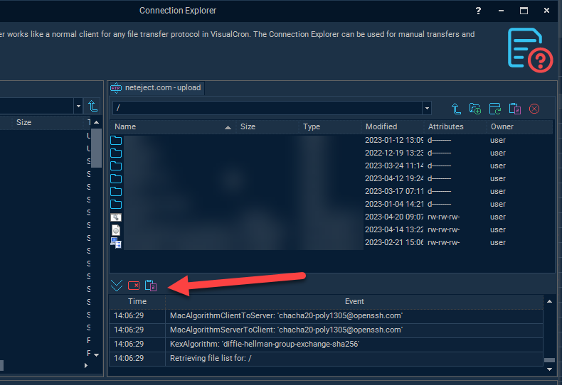
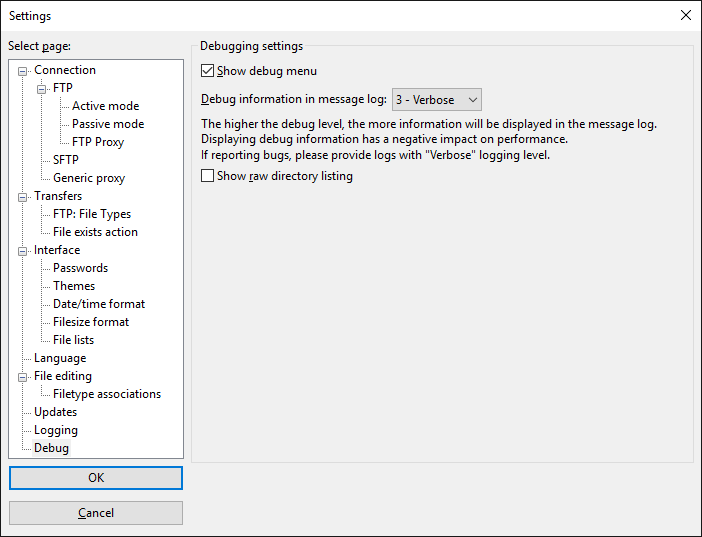

## Connection - SFTP

The SFTP Connection stores connect and logon properties for the SSH File Transfer Protocol (SFTP).
 
### About SFTP

SFTP (SSH File Transfer Protocol, often called Secure File Transfer Protocol) is a protocol that lets you transfer files securely over an SSH connection. SFTP is not compatible with FTP (File Transfer Protocol), which has its own security enhancements such as FTPS. SFTP is built on top of SSH and supports password-based and public key authentication. Public key authentication requires a private key which is configured in the Connection settings. The VisualCron implementation supports SFTP protocol versions 3–5. The default port for SFTP is 22.
 
**Manage Connections > Add > SFTP > Common settings** tab

**Protocol type**

VisualCron is able to connect using regular FTP and FTPS (with implicit and explicit encryption). Regular FTP offer no security and information is not encrypted. VisualCron supports both SSL 3.0 and TLS (SSL 3.1). SSL and TLS are protocols layered above connection protocols (such as TCP/IP) but beneath application protocols (such as FTP) that provide encrypted, authenticated communications between a client and a server.
 
**Brute force test**

When using FTP and you are unsure of connection properties you can use the Brute force test tool to test all connection combinations. Note, brute force test option is only available for FTP protocol.

**Name**

The name of the Connection to uniquely identify it.

**Group**

The group that the connection is a part of.

**Timeout**

The connection timeout in seconds. Connection will fail after this time is passed.

**Code page**

The table of values that describes the desired character set.

**Manage Connections > Add > SFTP > Connection settings** tab

**Address**

The host address of the SFTP server. Can be a DNS name or IP address.
 
**Port**

The remote connection port. The default port for SFTP is 22.

**Authentication type**

The method used to authenticate with the SFTP server. Available options:

* _Password_ - authenticate using a username and password
* _Public key_ - authenticate using a private key file; the SSH key fields are shown below the password field when this option is selected
 
**Username**

The user name for the connection.
 
**Password**

The password for the connection. When Authentication type is _Public key_, this field contains the passphrase for the private key (if the key is passphrase-protected).
 
**Public key vs password authentication**

Public key authentication means that you specify the private key and any password for that key. Private keys can be loaded in SSH1, OpenSSH, Binary, Putty, IETF (Putty and IETF use different formats here) formats.
 
**SSH key** _(Public key authentication only)_

Select the private key to use for authentication. Private keys can be in SSH1, OpenSSH, Binary, PuTTY, or IETF format. Click the file icon to browse for the private key file.
 
**Override authentication**

By default, VisualCron uses auto authentication which tries both password and keyboard-interactive methods. Some servers do not support auto authentication. Uncheck **Auto authentication** and select the specific authentication method(s) to use.

* _Auto authentication_ - VisualCron automatically negotiates the authentication method; when checked, the individual method checkboxes below are disabled
* _Password authentication_ - enable password-based authentication; only available when Auto authentication is unchecked
* _Keyboard authentication_ - enable keyboard-interactive authentication; only available when Auto authentication is unchecked
 
**Manage Connections > Add > SFTP > Encryption** tab

Some SFTP servers require specific encryption settings for communication between client and server. Four types of encryption can be adjusted in VisualCron:

* Encryption algorithm
* Key exchange algorithm
* MAC algorithm
* Public key algorithm
 
By default, these are auto-negotiated by VisualCron. When **Auto adjust ciphers** is checked for an algorithm type, VisualCron selects the settings automatically. Uncheck to manually select which algorithms are allowed using the **Select all** and **Deselect all** buttons.

In some cases, not all ciphers presented in VisualCron will be used during negotiation because the remote server must explicitly support them. If the server is not configured to allow certain ciphers, it will not choose them during the handshake even if they are enabled in VisualCron. Ensuring the server is configured with matching cipher support is required for a successful connection.

For troubleshooting encryption issues, refer to the _Set correct Encryption settings_ section below.

**Manage Connections > Add > SFTP > Extra settings** tab

**Transfer type**

Select whether to transfer files in Binary (default) or ASCII mode.

**KeepAlive**

The interval (in seconds) for sending keepalive signals to maintain the connection.
 
**Max packet size**

Use this property to specify the maximal length of packet in bytes. The default value is 262144, i.e., 256 KBytes.
 
**Auto adjust transfer block**

When checked, VisualCron automatically adjusts pipeline length and block sizes for optimal transfer performance. When unchecked, the Download block size, Upload block size, and Pipeline length fields are enabled for manual configuration.

**Download block size**

The size in bytes of a single download request. If you have download speed problems, try setting to 0 (automatic) or increase up to 2 MB (2097152) for large files. Default: 8192.

**Upload block size**

The size in bytes of a single upload request. If you have upload speed problems, try setting to 0 (automatic) or increase up to 2 MB (2097152) for large files. Default: 32768.

**Pipeline length**

The number of upload or download requests sent before waiting for all requests to complete. Higher values increase transfer speed but use more memory and discard more data on error. Default: 32.

**Use compression**

When checked, enables compression for the SSH connection.

**SBB debug**

When checked, enables verbose debug logging from the underlying SSH component.

**SFTP version support**

Some SFTP servers do not support all protocol versions. Check the versions that should be attempted (0–6). For more information, see [SSH File Transfer Protocol versions](http://en.wikipedia.org/wiki/SSH_File_Transfer_Protocol).

**Log sent messages to task output**

When checked, all messages sent from VisualCron to the SFTP server are logged in the Task output.

**Log received messages to task output**

When checked, all messages received from the SFTP server are logged in the Task output.

**Manage Connections > Add > SFTP > Proxy** tab

**Proxy type**

Select the proxy type to be used.

**Address**

The host name or IP address of the proxy server.

**Port**

The port of the proxy server.

**Use credentials**

Enable to provide credentials for authenticating with the proxy server.

**Domain**

The domain of the proxy server.

**Username**

The user name to access the proxy server.

**Password**

The password to access the proxy server.
 
### Troubleshooting

Authentication type codes:
* 2 - public key authentication
* 4 - password authentication
* 16 - keyboard-interactive authentication
 
**Authentication type 16 failed along with error 114**

Try unchecking **Auto authentication** and unchecking **Keyboard authentication**. The problem could also be that the password or username is wrong.
 
**Authentication type 4 failed along with error 114**

Try unchecking **Auto authentication** and unchecking **Password authentication**. The problem could also be that the password or username is wrong.
 
**Authentication type 2 failed along with error 114**

Public key authentication is failing — the wrong private key may be in use, or the server requires password authentication.
 
**Authentication failed for type 16 and 4 along with error 114**

The connection is attempting password authentication but the server requires public key authentication.
 
**SFTP error 6**

A pseudo-error indicating that the client has no connection to the server.
 
**SFTP error 7 in combination with error 10058**

Try unchecking **Auto adjust MAC algorithms** in the **Encryption** tab. See _Set correct Encryption settings_ below.
 
**SFTP error 11 in combination with error 10058**

Try these solutions one at a time:
1. In the **Connection settings** tab, uncheck **Auto authentication** and uncheck **Keyboard authentication**.
2. In the **Encryption** tab, uncheck **Auto adjust ciphers**.
 
**SFTP error 96273 / Failed to retrieve file list: SFTP component not connected**

Possible causes:
* Wrong key exchange algorithm is in use. See _Set correct Encryption settings_ below.
* Try setting one SFTP version at a time in **Extra settings**, starting from version 2 through 6.
* Username is empty.
* If the Connection Explorer works but a Task does not, check the Task settings and ensure the correct directory path is used (use the browse button rather than typing paths manually).
 
**SFTP error 96258**

Ensure that a private key is selected if public key authentication is required.
 
**SFTP error 102**

In the **Extra settings** tab, set these values:
* Max packet size: 8096
* Pipeline length: 16
* Download block size: 2048
* Upload block size: 2048
 
**SFTP error 103**

Wrong key exchange or MAC algorithm is in use. See _Set correct Encryption settings_ below.

**SFTP error 10061**

Try checking **Use compression** in the **Extra settings** tab. Also see _Set correct Encryption settings_ below.
 
**Failed to upload/download full file (only part transferred) / timeout on upload**

Try unchecking **Auto adjust transfer block** in the **Extra settings** tab. For upload issues, try increasing **Upload block size** to 65536. You can also try setting **Pipeline length** to 1.

Other error codes: [https://www.secureblackbox.com/kb/help/ref_err_sftperrorcodes.html](https://www.secureblackbox.com/kb/help/ref_err_sftperrorcodes.html)
 
**Public key errors**

* 3329 (0x0D01) - Public key is invalid; usually indicates a problem with the file format
* 3330 (0x0D02) - Private key is invalid; usually indicates a problem with the file format
* 3331 (0x0D03) - Error reading from file
* 3332 (0x0D04) - Error writing to file
* 3333 (0x0D05) - Algorithm is unsupported
* 3334 (0x0D06) - Internal error
* 3335 (0x0D07) - Buffer is too small
* 3336 (0x0D08) - There is no private key
* 3337 (0x0D09) - Wrong password for private key
* 3338 (0x0D0A) - PEM algorithm is unsupported
 
**Set correct Encryption settings**

**OPTION 1**

1. Open the Connection Explorer.
2. Try to connect to the SFTP connection.
3. Copy the log by pressing the button below.

4. Paste the content into an email and send it to support@visualcron.com.
  
**OPTION 2 (_Legacy_)**

1. Try to first make the connection work using the free tool FileZilla.
2. Enable verbose debugging in FileZilla.
   

3. Analyze the verbose output and look for entries similar to:

**Key exchange algorithm**

_Trace: Doing Diffie-Hellman group exchange_

_Trace: Doing Diffie-Hellman key exchange with hash SHA-256_

**Encryption algorithm**

_Trace: Initialised AES-256 SDCTR client->server encryption_

**MAC algorithm**

_Trace: Initialised HMAC-SHA-256 client->server MAC algorithm_
 
4. Open the Connection in VisualCron and find the matching settings in the **Encryption** tab.

