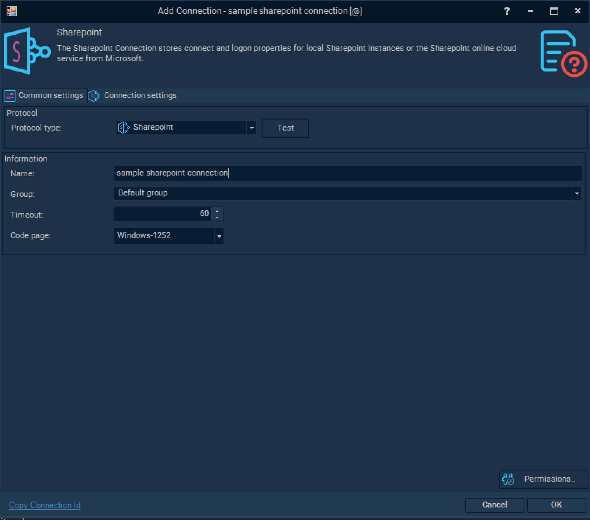
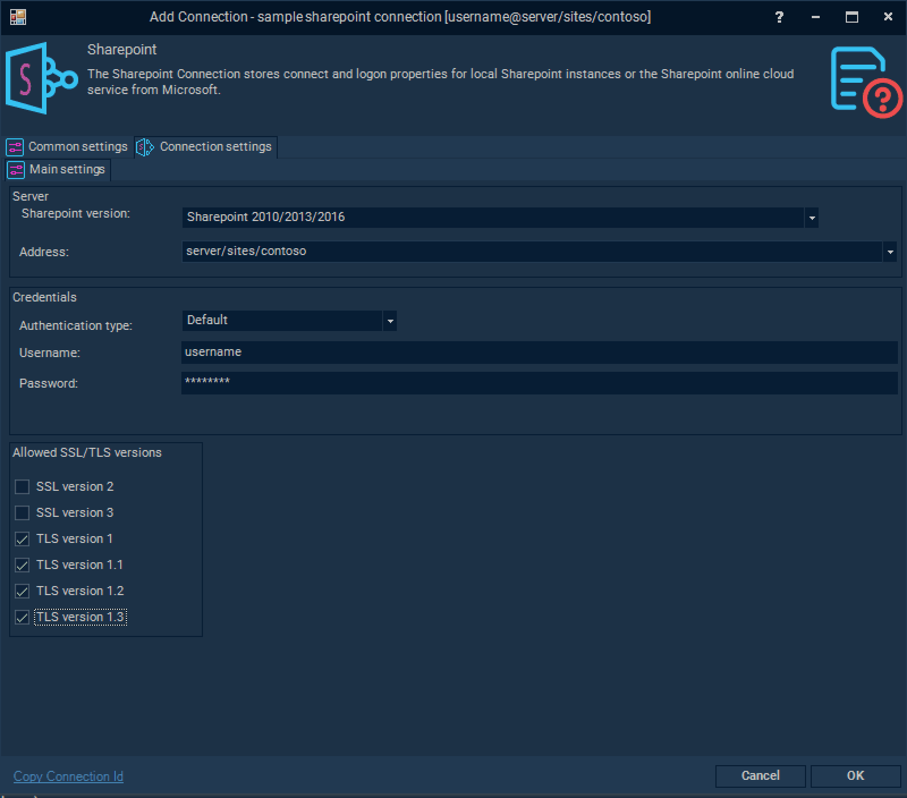
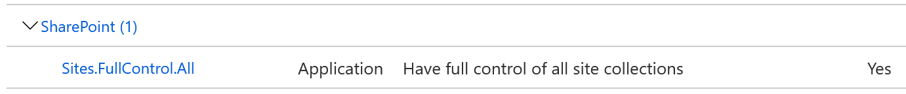
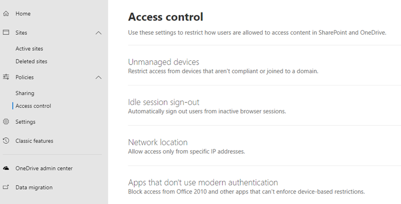

## Connection - Sharepoint

The SharePoint Connection stores connect and logon properties for local SharePoint
instances or the SharePoint online cloud service from Microsoft. 

It is recommended for using On Prem server (Sharepoint 2016, etc), the "Sharepoint" connection.

It is recommended for using Sharepoint within the O365 environment, the "Sharepoint Online" connection. 

Overall, the SharePoint Connection is used for the SharePoint Tasks:

* [SharePoint - Create list](../../client-user-interface/server/job-tasks/sharepoint-tasks/create-list)
* [SharePoint - Delete list(s)](../../client-user-interface/server/job-tasks/sharepoint-tasks/delete-list)
* [SharePoint - Describe list](../../client-user-interface/server/job-tasks/sharepoint-tasks/describe-list)
* [SharePoint - Get list(s)](../../client-user-interface/server/job-tasks/sharepoint-tasks/get-list)
* [SharePoint - Update list](../../client-user-interface/server/job-tasks/sharepoint-tasks/update-list)
* [SharePoint - Add list item](../../client-user-interface/server/job-tasks/sharepoint-tasks/add-list-item)
* [SharePoint - Update list item](../../client-user-interface/server/job-tasks/sharepoint-tasks/update-list-item)
* [SharePoint - Delete list item(s)](../../client-user-interface/server/job-tasks/sharepoint-tasks/delete-list-item)
* [SharePoint - Get list item(s)](../../client-user-interface/server/job-tasks/sharepoint-tasks/get-list-item)
* [SharePoint - Upload file(s)](../../client-user-interface/server/job-tasks/sharepoint-tasks/upload-file)
* [SharePoint - Download file(s)](../../client-user-interface/server/job-tasks/sharepoint-tasks/download-file)
* [SharePoint - List file(s)](../../client-user-interface/server/job-tasks/sharepoint-tasks/list-file)
* [SharePoint - Delete file(s)](../../client-user-interface/server/job-tasks/sharepoint-tasks/delete-file)

### SharePoint Instance

**Manage Connections > Add > SharePoint > Common settings** tab



**Name**

The unique name for the Connection.

**Group**

Connection's group name.

**Timeout**

The connection timeout in seconds. Connection will fail after this time period.

**Code page**

Code page being used.

**Manage Connections > Add > SharePoint > Connection settings** tab



**SharePoint version**

Select between SharePoint Online or a local installation (SharePoint 2010/2013/2016).

**Address**

SharePoint site's address (either on-premises or online). For SharePoint Online, use
the site address from the SharePoint admin console — not the admin URL itself
(e.g. `https://yourtenant.sharepoint.com/sites/yoursitename`).

**Authentication type**

Select the type of authentication on the SharePoint server:

- **Default** — Windows authentication. Uses the running service account if the
  username matches; otherwise uses the supplied credentials.
- **Basic** — Standard username and password credentials.
- **Form** — Forms-based authentication using a username and password login form.
- **Anonymous** — No credentials required.
- **ADFS** — Active Directory Federation Services authentication. Requires username,
  password, and an STS URL (entered in the STS URL field).
- **AppOnly** — App-only client credentials using an Azure AD-registered application.
  The **Username** field is the **Client Id** and the **Password** field is the
  **Client Secret**. Requires a Tenant Id.
- **Azure AD Application (Certificate)** — Certificate-based Azure AD authentication.
  The **Username** field is the **App ID**. Requires a certificate and a Tenant Id.

**Username**

The username for the server. When using **AppOnly**, enter the Client Id. When using
**Azure AD Application (Certificate)**, enter the App ID.

**Password**

The password for the server. When using **AppOnly**, enter the Client Secret. Not
used for **Azure AD Application (Certificate)**.

**STS URL**

*(ADFS authentication only)* The URL to the ADFS Security Token Service endpoint.

**Certificate**

*(Azure AD Application (Certificate) authentication only)* Select a VisualCron
[certificate](../server/global-certificates) whose public key has been uploaded to
the Azure AD application's certificate credentials.

**Tenant Id**

*(AppOnly and Azure AD Application (Certificate) authentication only)* The Azure AD
Tenant ID (GUID) for your Microsoft 365 organization. Found in Microsoft Entra under
the application's Overview page as **Directory (tenant) ID**.

---

### SharePoint Online Instance

SharePoint Online (`Protocol type: SharePoint Online`) is a dedicated connection type
for Microsoft 365 cloud environments. It always authenticates via Azure AD OAuth.

To register a new application or use an existing one, log into
[Microsoft Entra](https://entra.microsoft.com) and navigate to **App registrations**.
You can create a new registration or select an existing app. From the application's
**Overview** page, note the **Application (client) ID** (Client Id) and
**Directory (tenant) ID** (Tenant Id) — these are entered into the VisualCron
connection settings.

**Manage Connections > Add > SharePoint Online > Common settings** tab

**Address**

Use the site address from the SharePoint admin console — not the admin URL itself (e.g. `https://yourtenant.sharepoint.com/sites/yoursitename`).


Select the appropriate authentication type from the **Authentication type** dropdown.


#### Basic (Delegated user credentials)


**Username**

The SharePoint Online user's email address (e.g. `user@yourtenant.onmicrosoft.com`).

**Password**

The SharePoint Online user's password.

**Tenant Id**

The Azure AD Tenant ID (GUID) for your Microsoft 365 organization.

**Application Id**

The Application (Client) ID of the Azure AD app registration configured for
delegated access.

#### AppOnly (Client credentials)


**Username**

The Client Id of the Azure AD app registration.

**Password**

The Client Secret of the Azure AD app registration.

**Tenant Id**

The Azure AD Tenant ID (GUID) for your Microsoft 365 organization.

#### Certificate


**Client Id**

The Application (Client) ID of the Azure AD app registration. Found in Microsoft Entra
under the application's Overview page as **Application (client) ID**.

**Tenant Id**

The Azure AD Tenant ID (GUID) for your Microsoft 365 organization. Found in Microsoft
Entra under the application's Overview page as **Directory (tenant) ID**.

**Certificate**

Select a VisualCron [certificate](../server/global-certificates) whose public key
(.cer file) has been uploaded to the Azure AD application's Certificates & Secrets.

You can use an existing or new Azure AD application to access your SharePoint Online
sites. Please note that certificate-only credentials are accepted. Create an application
on Azure AD and import the certificate to both the Azure AD application credentials and
VisualCron. Only Certificate applications will be granted access to the SharePoint site;
otherwise you will receive an HTTP 401 error. 

The application should be given proper API permissions. An example of full permissions
is provided below:



#### Setting up a Certificate for SharePoint Online

The following steps walk through creating a certificate, importing it into VisualCron,
uploading it to Microsoft Entra, and configuring the connection.

**Step 1 — Create the certificate**

Open Windows PowerShell as Administrator and run the following to create a self-signed
certificate:

```powershell
$cert = New-SelfSignedCertificate `
  -Subject "CN=YourCertName" `
  -CertStoreLocation "Cert:\CurrentUser\My" `
  -KeyExportPolicy Exportable `
  -KeySpec Signature `
  -KeyLength 2048 `
  -NotAfter (Get-Date).AddYears(3) `
  -FriendlyName "YourCertName"
```

This script can be adapted to any environment — it is provided as a sample for
testing purposes.

**Step 2 — Export the certificate files**

Run the following to export the certificate as a .pfx file (you will be prompted
for a password):

```powershell
Export-PfxCertificate -Cert $cert -FilePath "C:\Temp\MySPOApp.pfx" `
  -Password (Read-Host -AsSecureString "Enter password")
```

To export the public key as a .cer file:

```powershell
Export-Certificate -Cert $cert -FilePath "C:\Temp\MySPOApp.cer"
```

Both files will be saved to the specified path (e.g. `C:\Temp\`).

**Step 3 — Import the certificate into VisualCron**

In the VisualCron client, navigate to **Global Objects > Certificates > Import Certificate** and select
the .pfx file. VisualCron will prompt for the password set during export. Once
entered, the certificate will appear in the VisualCron certificate list.

**Step 4 — Collect Client ID and Tenant ID from Microsoft Entra**

Log into Microsoft Entra, navigate to **App registrations**, and open your SharePoint
application. From the Overview page, collect the following values:

- **Application (client) ID** — used as the Client Id in VisualCron
- **Directory (tenant) ID** — used as the Tenant Id in VisualCron

**Step 5 — Upload the certificate to Microsoft Entra**

In the same app registration, navigate to **Certificates & Secrets > Certificates**
and click **Upload certificate**. Upload the .cer file created in Step 2.

**Step 6 — Set API permissions**

In the app registration, navigate to **API Permissions** and ensure the following
SharePoint permissions are granted (Application type):

- `Sites.FullControl.All`
- `Sites.Manage.All`
- `Sites.Read.All`
- `Sites.ReadWrite.All`

Grant admin consent for all required permissions.

**Step 7 — Configure the connection in VisualCron**

In the VisualCron client, open the SharePoint Online connection settings
(**Connection settings** tab) and fill in:

- **Address** — The SharePoint site URL from the SharePoint admin console (e.g. `https://yourtenant.sharepoint.com/sites/yoursitename`)
- **Authentication type** — Certificate
- **Client Id** — The Application (client) ID from Step 4
- **Tenant Id** — The Directory (tenant) ID from Step 4
- **Certificate** — The certificate imported in Step 3

Click **Test** to verify the connection.

### Setting up a Secret for Sharepoint Online

To generate a Client Secret, navigate within the Microsoft Tenant to **Certificates & Secrets > Client secrets** and click **New client secret**. Set a description and expiry, then click **Add**. Copy the secret **Value** immediately — it will not be shown again.

To set API permissions, navigate to **API Permissions** and add the following
SharePoint **Application** permissions:

- `Sites.FullControl.All`
- `Sites.Manage.All`
- `Sites.Read.All`
- `Sites.ReadWrite.All`

Click **Grant admin consent** to apply the permissions.

### Troubleshooting and Sources

More information about AppOnly and Certificates can be found [here](https://docs.microsoft.com/en-us/sharepoint/dev/solution-guidance/security-apponly-azuread)(with PowerShell script sample for generating a certificate).

*Cannot contact web site 'https://xxx.sharepoint.com/' or the web site does not
support SharePoint Online credentials. The response status code is 'Unauthorized'*

Allow access for Apps that don't use modern authentication.


