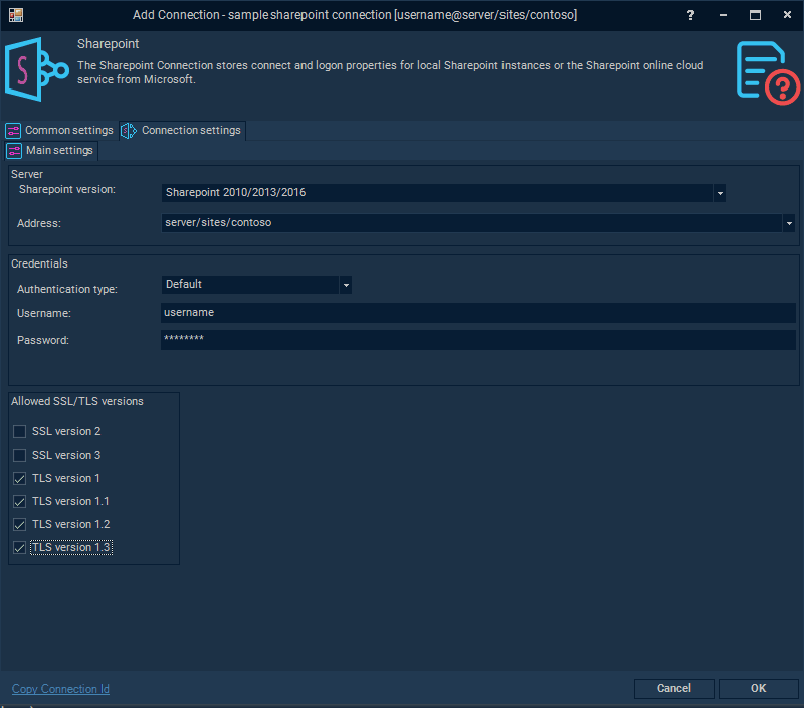
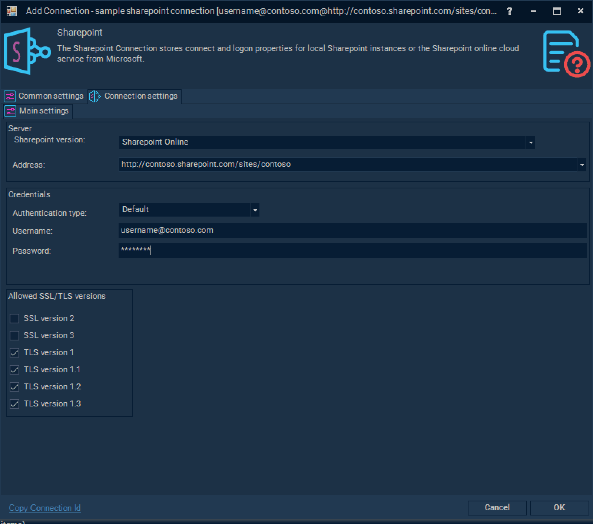

## Connection - Sharepoint

The SharePoint Connection stores connect and logon properties for local SharePoint instances or the SharePoint online cloud service from Microsoft.
 
The SharePoint Connection is used for the SharePoint Tasks:

* [SharePoint - Create list](sharepointcreatelist)
* [SharePoint - Delete list(s)](sharepointdeletelists)
* [SharePoint - Describe list](sharepointdescribelist)
* [SharePoint - Get list(s)](sharepointgetlists)
* [SharePoint - Update list](sharepointupdatelist)
* [SharePoint - Add list item](sharepointaddlistitem)
* [SharePoint - Update list item](sharepointupdatelistitem)
* [SharePoint - Delete list item(s)](sharepointdeletelistitems)
* [SharePoint - Get list item(s)](sharepointgetlistitems)
* [SharePoint - Upload file(s)](sharepointuploadfiles)
* [SharePoint - Download file(s)](sharepointdownloadfiles)
* [SharePoint - List file(s)](sharepointlistfiles)
* [SharePoint - Delete file(s)](sharepointdeltefiles)
 
**Manage Connections > Add > SharePoint > Common settings** tab


**Name**

The unique name for the Connection.
 
**Group**

Connection's group name.
 
**Timeout**

The connection timeout in seconds. Connection will fail after this time period.
 
**Code page**

Code page being used.
 
**Manage Connections > Add > SharePoint > Connection settings** tab



**SharePoint version**

Select between SharePoint Online or a local installation (SharePoint 2010/2013/2016),
 
**Address**

SharePoint site's address (either on-premises or online).
 
**Authentication type**

Select type of authentication on the SharePoint server. Default (Windows), Basic, Anonymous or Forms.
 
**Username**

The username for the server.
 
**Password**

The password for the server.
 
### SharePoint Online Instance



**Username**

SharePoint Online Credentials username
 
**Password**

SharePoint Online Credentials password


**Username**

Application ID.
 
**Password**

Application Secret.
 
New application can be registered using following URL of you SharePoint site's admin section [https://xxx-admin.sharepoint.com/_layouts/15/AppRegNew.aspx](https://xxx-admin.sharepoint.com/_layouts/15/AppRegNew.aspx), where *xxx* is you tenant name.
You can use existing application from your Azure AD registered applications on your Azure Tenant.


Please note Client Id and Client Secret information to be filled in the Connection for this Authentication type.
During next step you should give your app all necessary permissions to access your site. This can be done using URL [https://xxx-admin.sharepoint.com/_layouts/15/AppInv.aspx](https://xxx-admin.sharepoint.com/_layouts/15/AppInv.aspx)


Please fill in **Client Id** press **Lookup** to get your app's information here. Be sure to provide correct permissions, information about permissions and scope can be found [here](https://www.visualcron.com/doc/HTML/Permissions%20help%20https://docs.microsoft.com/en-us/sharepoint/dev/sp-add-ins/add-in-permissions-in-sharepoint)
Full access permission to all sites at your tenant looks like this:

```
<AppPermissionRequests AllowAppOnlyPolicy="true">  
  <AppPermissionRequest Scope="http://sharepoint/content/sitecollection" Right="FullControl" />
</AppPermissionRequests>
```


You can view registered applications using URL [https://xxx-admin.sharepoint.com/_layouts/15/AppPrincipals.aspx](https://xxx-admin.sharepoint.com/_layouts/15/AppPrincipals.aspx)


You can use existing or new Azure AD application to access your SharePoint Online sites. Please note that certificate only credentials are accepted. Create application on Azure AD and import [certificate](certificate) to both Azure AD application credentials and VisualCron. Only Certificate applications will be granted to access SharePoint site, otherwise you will be getting HTTP 401 error. More information about AppOnly and Certificates could be found [here](https://docs.microsoft.com/en-us/sharepoint/dev/solution-guidance/security-apponly-azuread) (*with Powershell script sample generating a certificate*).

Application should be given proper API permissions as well. An example of full permissions provided below:


### Troubleshooting
 
*Cannot contact web site 'https://xxx.sharepoint.com/' or the web site does not support SharePoint Online credentials. The response status code is 'Unauthorized'
Allow access for Apps that don't use *modern authentication.*

