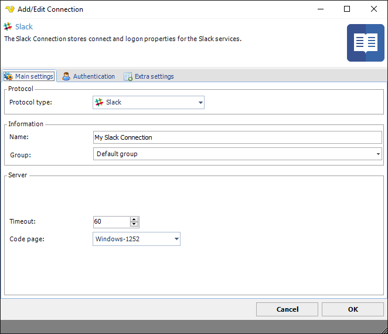
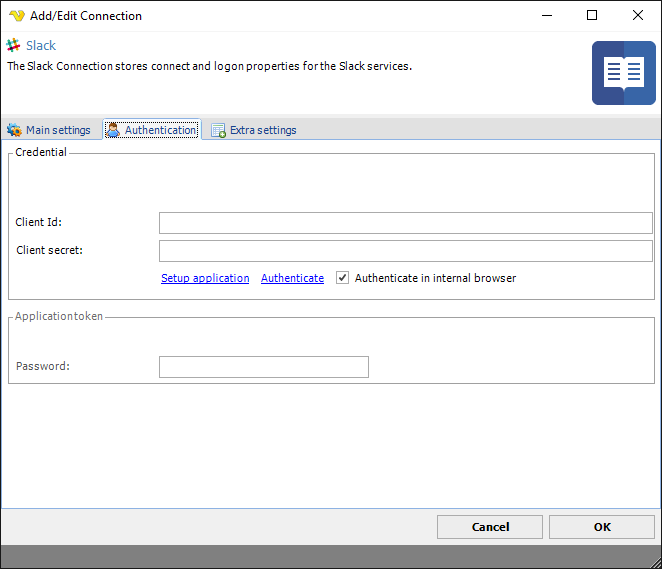
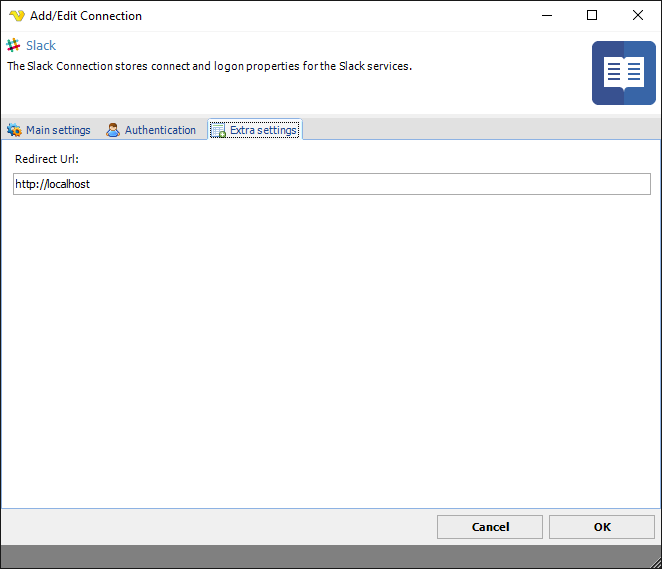
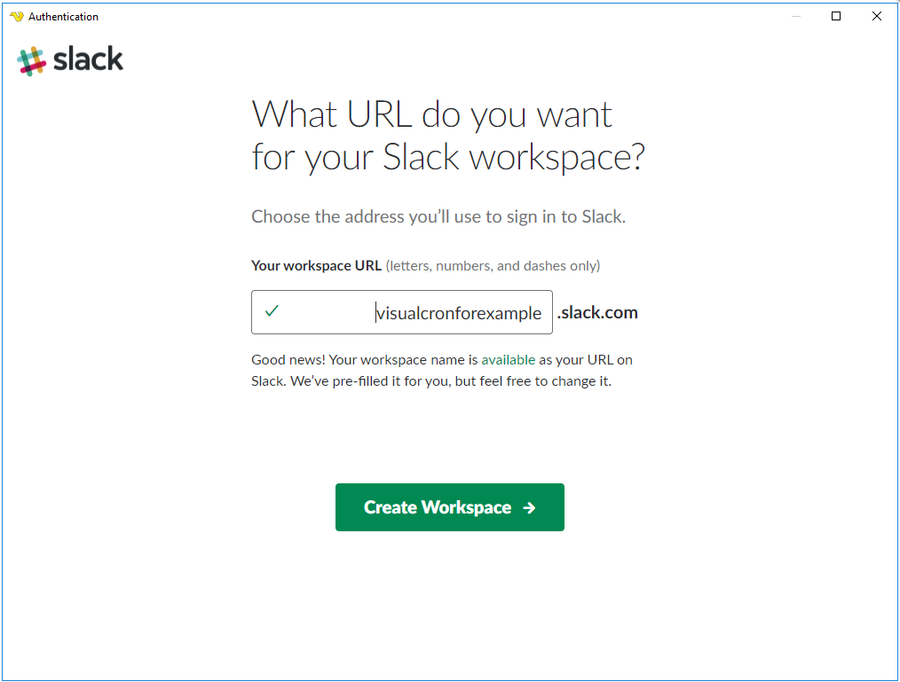
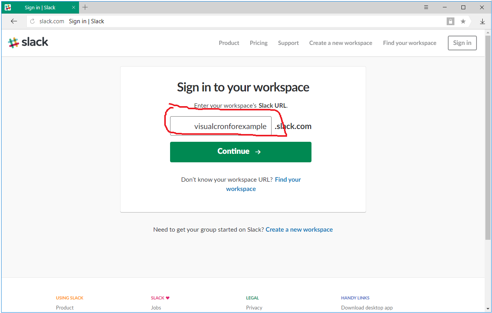
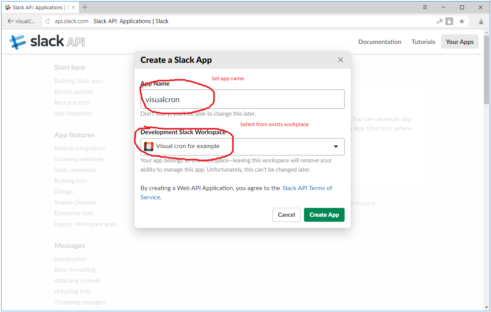
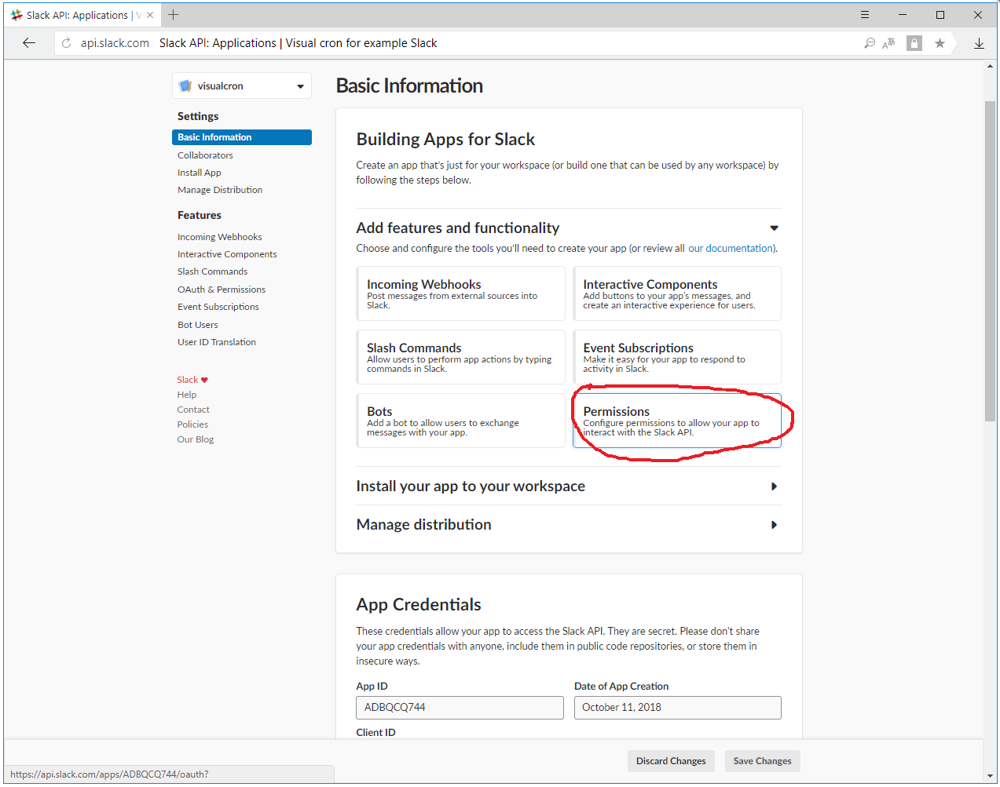
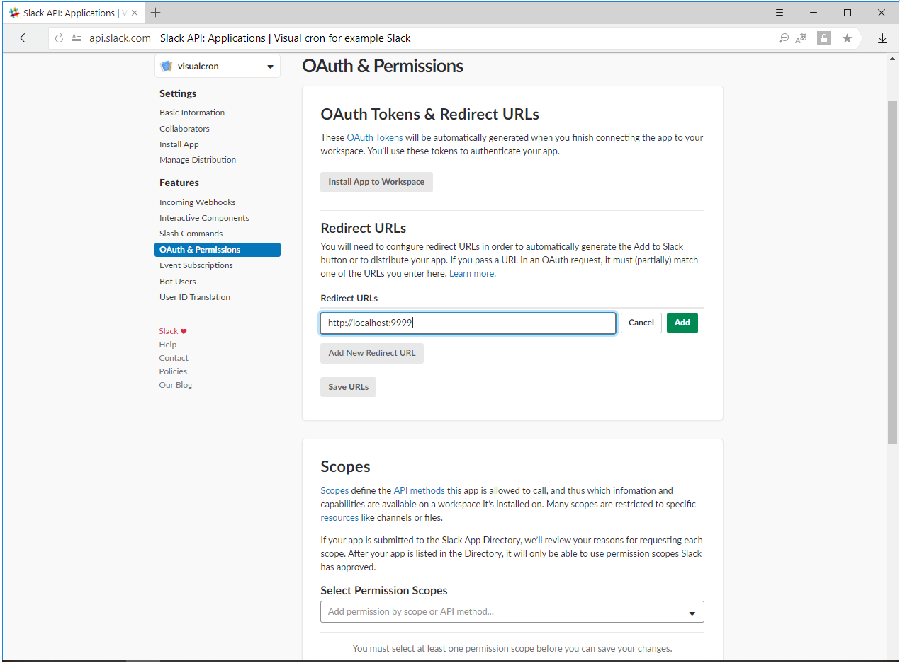
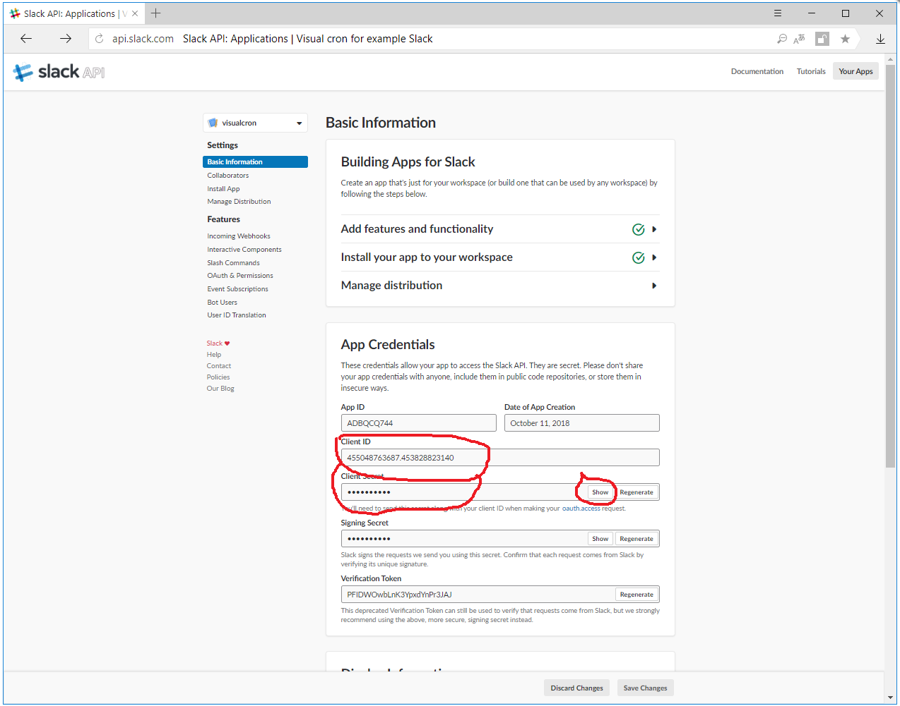
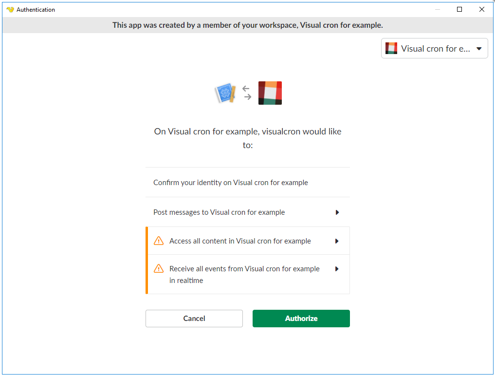

## Connection - Slack

**Slack** is a cloud-based set of proprietary team collaboration tools and services. The Slack Connection is used in:
 
* [Slack - Trigger](../../client-user-interface/server/event-trigger-slack)
* [Slack - Send message Task](../../client-user-interface/server/job-tasks/messaging-tasks/slack-send-message)
 
**Teams**

Slack teams allow communities, groups, or teams to join through a specific URL or invitation sent by a team admin or owner. Although Slack was meant for organizational communication, it has been slowly turning into a community platform, a function for which users had previously used message boards or social media such as Facebook or LinkedIn groups. Many of these communities are categorized by topics which a group of people may be interested in discussing.
 
**Messaging**

Public channels allow team members to communicate without the use of email or group SMS (texting). They are open to everyone in the chat, provided they have first been invited to join the client. Private channels allow for private conversation between smaller sects of the overall group. These can be used to break up large teams into their own respective projects. Direct messages allow users to send private messages to a specific user rather than a group of people.[26] Direct messages can include up to nine people (the originator plus eight people). Once started this direct message group can be converted to a private channel.
 
**Manage Connections > Add > Slack > Main settings** tab

**Manage Connections > Add > Slack > Authentication** tab

**Client Id**

This needs to match the Client Id in online Slack settings.
 
**Client secret**

This needs to match the Client secret settings in online Slack settings.
 
**Setup application**

Setup application links opens Slack workspace creation link. See images below how to create a workspace
 
**Authenticate**

When you have created a workspace or have an existing you click on Authenticate. See images below about authentication.
 
**Application token**

More details..
 
 
**Manage Connections > Add > Slack > Extra settings** tab

**Redirect Url**

This setting is for first time authentication only. We recommend using [http://localhost:9999](http://localhost:9999) which should match Redirect Url settings in Slack. See images below.
 
### Setting up Slack -> Create workspace

### Setting up Slack -> Sign in

### Setting up Slack -> Create Slack app

### Setting up Slack -> Edit permissions

### Setting up Slack -> Set Redirect URLs

### Setting up Slack -> Set Basic information

### Setting up Slack -> Authorize permissions for VisualCron

### Troubleshooting
 
*"Missing scope" error*

Make sure the following oauth scopes are setup:

* chat:write
* chat:write.public
* incoming-webhook